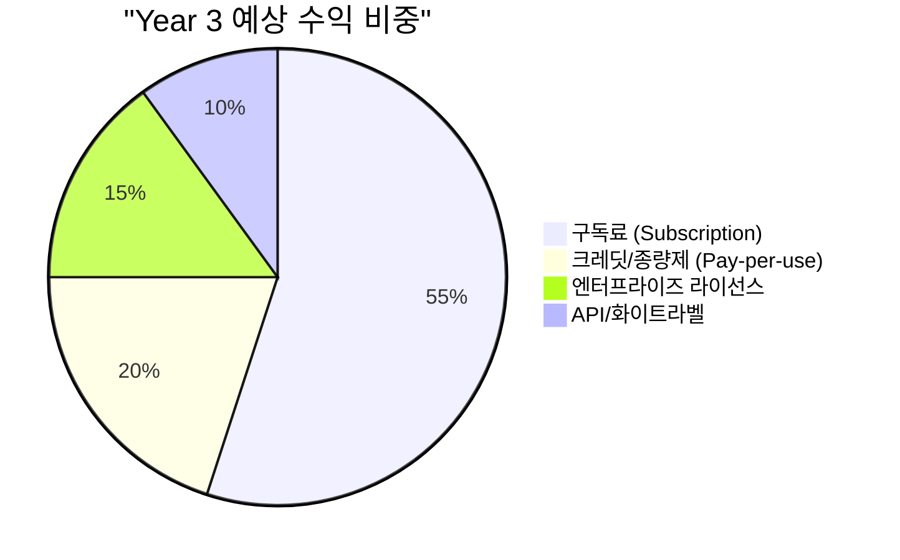
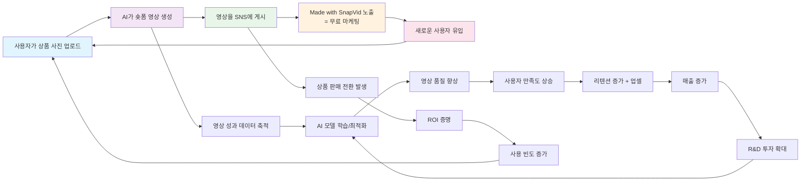
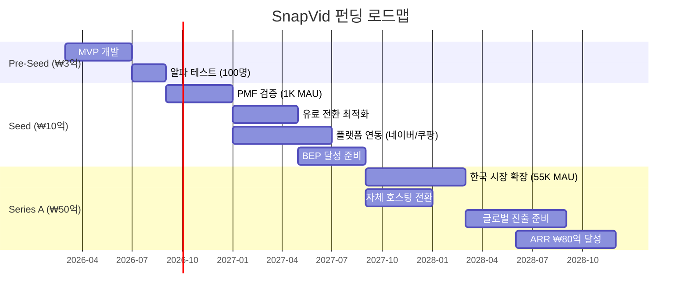

# SnapVid 비즈니스 모델

> **작성일:** 2026-02-08
> **기반 문서:** MARKET_RESEARCH.md, TECH_RESEARCH.md, USER_RESEARCH.md
> **단계:** 스타트업 MVP → 성장 → 스케일

---

## 1. 비즈니스 모델 캔버스

### 1.1 Lean Canvas

| 구분 | 내용 |
|------|------|
| **Problem** | 1. 숏폼 영상 수요 3~5배 폭증 vs 제작 리소스 정체 (상품당 2.5~7시간 소요) 2. 이커머스 특화 엔드투엔드 AI 영상 생성 도구 시장 공백 3. 플랫폼별(TikTok/Reels/Shorts/네이버클립/쿠팡) 최적화 부담 |
| **Solution** | 상품 사진 1장 → 15~30초 숏폼 마케팅 영상 2분 이내 자동 생성. 하이브리드 엔진(AI 생성 + 원본 합성)으로 상품 정체성 보존. 멀티플랫폼 원클릭 배포 |
| **Key Metrics** | Activation Rate (첫 영상 생성 완료율), Time-to-First-Video (<2분), Week 1 Retention (>30%), Free→Paid 전환율 (B2C >2%, B2B >5%), MRR, LTV/CAC Ratio (>3x) |
| **Unique Value Proposition** | "상품 사진 1장, 2분 안에 TikTok 영상 완성" — 이커머스 네이티브 엔드투엔드 영상 생성 파이프라인. 상품 정체성 보존 + 크로스 플랫폼 자동 최적화 |
| **Unfair Advantage** | 1. 한국 이커머스 생태계(네이버/쿠팡) 네이티브 연동 (글로벌 도구 대응 불가) 2. 하이브리드 엔진(AI+원본 합성)으로 상품 일관성 해결 3. PLG 구조(영상 자체가 바이럴 채널) |
| **Channels** | B2C: PLG(제품 내재 바이럴), 셀러 커뮤니티 시딩, 인플루언서 무료 플랜 / B2B: SEO, LinkedIn 아웃바운드, 케이스 스터디, 파트너(카페24/Shopify 앱스토어) |
| **Customer Segments** | 1차: 한국 1인 셀러 (40~55만) → 2차: 중소 브랜드 마케터·에이전시 → 3차: 대기업·글로벌 셀러 |
| **Cost Structure** | AI API 비용(영상당 ~$0.93), 인프라(클라우드/CDN), 인건비(개발 6~8명), 마케팅 비용 |
| **Revenue Streams** | Freemium 구독(월정액), 크레딧 종량제, 엔터프라이즈 라이선스, API/화이트라벨 |

### 1.2 비즈니스 모델 유형

**Freemium + Usage-based Hybrid SaaS**

이 모델을 선택한 근거:

1. **B2C 바이럴 획득 + B2B 수익 극대화 동시 달성**: USER_RESEARCH에서 확인된 "B2C가 바이럴을, B2B가 수익을 만든다" 전략을 실현하려면, B2C는 무료 티어로 바이럴 계수(K-factor)를 1 이상으로 끌어올리고, B2B는 사용량 기반 과금으로 ARPU를 극대화해야 한다.

2. **가격 민감도 스펙트럼 대응**: 1인 셀러(월 5~10만 원 한도)부터 대기업(월 500~700만 원 예산)까지 7개 페르소나의 가격 수용 범위가 100배 이상 차이. 단일 가격 모델로는 대응 불가.

3. **PLG(Product-Led Growth) 최적 구조**: 생성된 영상이 SNS에 올라가는 순간 서비스 자체가 마케팅 채널이 되는 구조. Canva, Loom과 동일한 성장 패턴으로, PLG SaaS의 CAC는 전통 SaaS 대비 약 60% 낮음 (OpenView SaaS Benchmarks, 2024).

4. **SaaS 벤치마크 근거**: Usage-based 기업의 NDR(Net Dollar Retention)이 seat-based 대비 ~120% vs ~110% (OpenView, 2024). 고객 성장에 따라 자연스러운 매출 확장이 가능.

---

## 2. 수익 모델

### 2.1 수익 구조 개요



| 수익원 | Year 1 비중 | Year 3 비중 | 설명 |
|--------|:-----------:|:-----------:|------|
| 구독료 | 70% | 55% | 코어 수익. Starter/Pro 월정액 |
| 크레딧/종량제 | 20% | 20% | 무료 티어 초과분, 대량 사용자 |
| 엔터프라이즈 | 5% | 15% | 대기업 연간 계약, 커스텀 SLA |
| API/화이트라벨 | 5% | 10% | 에이전시 화이트라벨, 플랫폼 연동 |

### 2.2 수익원별 상세

#### 구독료 (Subscription)

- **과금 방식**: 월정액 + 영상 생성 쿼터 (월 N개 포함)
- **연간 결제 시 20% 할인**: SaaS 벤치마크 평균 연간 할인율 25% (ProfitWell, 2023)이나, 마진 보호를 위해 20%로 설정
- **업그레이드 트리거**: 쿼터 소진 시 인앱 프롬프트, 고급 기능(4K, 배치, 분석) 필요 시 자연 업셀
- **목표 ARPU**: B2C ₩15,000~30,000/월, B2B ₩99,000~500,000/월

#### 크레딧/종량제 (Pay-per-use)

- **과금 방식**: 기본 쿼터 초과 시 크레딧 차감 (1크레딧 = 영상 1건)
- **크레딧 단가**: ₩2,000~3,000/건 (구매 볼륨에 따라 역체감)
- **크레딧 패키지**: 10건(₩25,000), 50건(₩100,000), 200건(₩350,000)
- **적합 세그먼트**: 비정기 사용자, 시즌 마케팅 집중 사용, 무료 티어 사용자의 추가 생성

#### 엔터프라이즈 라이선스

- **과금 방식**: 연간 계약, 커스텀 협상
- **포함 사항**: 전용 인스턴스, SLA(99.9% 가용성), SSO/RBAC, PIM/DAM 연동, 전담 CSM
- **목표 ACV**: ₩12,000,000~60,000,000/년 ($9K~$46K)
- **적합 세그먼트**: 박준혁 페르소나(대기업 CMO), SKU 400+ 기업

#### API 라이선스 / 화이트라벨

- **API**: 건당 $1~3 (외부 개발자/플랫폼 연동용)
- **화이트라벨**: 에이전시가 자사 브랜드로 클라이언트에게 제공. 월 ₩300,000~1,000,000 + 건당 추가 과금
- **적합 세그먼트**: 이서연 페르소나(에이전시 디렉터), 커머스 플랫폼 사업자

---

## 3. 가격 정책 (Pricing Strategy)

### 3.1 가격 철학

**Value-based Pricing + Competitive Anchoring**

가격 설계의 3대 원칙:

1. **고객이 절약하는 비용의 1/10 이하**: 외주 비용(건당 15~50만 원) 대비 90% 이상 절감. 건당 ₩2,000~5,000 수준은 고객 관점에서 "당연히 해야 하는" 가격대
2. **심리적 가격대 활용**: B2C는 ₩9,900(만원 이하), B2B는 ₩99,000(십만원 이하)
3. **성장과 함께 가격 상승**: 사용량이 늘수록 높은 티어로 자연 이동. 1인 셀러 → 팀 → 에이전시 성장에 맞춘 가격 구조

### 3.2 티어 설계

#### Free (프리미엄)

| 항목 | 내용 |
|------|------|
| **가격** | ₩0 |
| **영상 생성** | 월 3건 |
| **해상도** | 1080×1920 (HD) |
| **영상 길이** | 최대 15초 |
| **워터마크** | "Made with SnapVid" 포함 (제거 불가) |
| **스타일/템플릿** | 기본 5개 |
| **출력 포맷** | 9:16 단일 |
| **BGM** | 기본 라이브러리(20곡) |
| **목적** | PLG 바이럴 엔진. K-factor >1 달성을 위한 무료 층 |
| **타겟 페르소나** | 최유진(1인 셀러) 탐색 단계 |

#### Starter (개인 셀러)

| 항목 | 내용 |
|------|------|
| **가격** | ₩9,900/월 (연간 ₩7,900/월) |
| **영상 생성** | 월 30건 |
| **해상도** | 1080×1920 (HD) |
| **영상 길이** | 최대 30초 |
| **워터마크** | 선택(포함 시 +5건/월 보너스) |
| **스타일/템플릿** | 전체 50+ 개 |
| **출력 포맷** | 멀티(TikTok/Reels/Shorts 동시) |
| **BGM** | 전체 라이브러리(200+곡) + AI 생성 |
| **카피라이팅** | AI 자동 생성 (한국어) |
| **TTS/내레이션** | 한국어 기본 음성 3종 |
| **추가 기능** | 스마트스토어 연동 |
| **타겟 페르소나** | 최유진(1인 셀러), 오성호(도매) 초기 |

#### Pro (에이전시/중소기업)

| 항목 | 내용 |
|------|------|
| **가격** | ₩49,000/월 (연간 ₩39,000/월) |
| **영상 생성** | 월 150건 |
| **해상도** | 최대 4K |
| **영상 길이** | 최대 60초 |
| **워터마크** | 없음 |
| **브랜드 키트** | 3개 브랜드 (로고/폰트/컬러) |
| **출력 포맷** | 전체 (9:16, 1:1, 4:5, 16:9) |
| **A/B 테스트** | 영상당 3개 변형 |
| **배치 생성** | 최대 50장 일괄 업로드 |
| **다국어** | 5개 언어 자막/TTS |
| **API 접근** | 기본 API (월 500콜) |
| **팀 협업** | 최대 5명 |
| **추가 기능** | Shopify/카페24 연동, 성과 분석 대시보드, 승인 워크플로우 |
| **타겟 페르소나** | 김민수(중소 브랜드), 이서연(에이전시), Sarah(글로벌), 장하늘(인플루언서) |

#### Enterprise (대기업/유통)

| 항목 | 내용 |
|------|------|
| **가격** | ₩990,000~/월 (연간 계약, 커스텀 협상) |
| **영상 생성** | 무제한 (Fair Use Policy) |
| **해상도** | 4K + 커스텀 |
| **브랜드 키트** | 무제한 |
| **배치 생성** | 무제한 (대기열 우선) |
| **다국어** | 20+ 언어 |
| **API** | 전용 API 엔드포인트, 무제한 콜 |
| **팀 협업** | 무제한 시트, RBAC |
| **보안** | SSO(SAML), DPA, SOC2 준비, 국내 데이터 저장 |
| **연동** | PIM/DAM(Bynder 등), ERP, 커스텀 연동 |
| **컴플라이언스** | 금지 문구 자동 감지, 법무 리뷰 워크플로우, AI 라벨 자동 삽입 |
| **전담 지원** | CSM + 기술 지원 전담 |
| **타겟 페르소나** | 박준혁(대기업 CMO), 오성호(도매/유통, 대형) |

### 3.3 경쟁사 가격 비교

| 서비스 | Free | Starter/Basic | Pro/Business | Enterprise | 핵심 차이 |
|--------|:----:|:------------:|:------------:|:----------:|----------|
| **SnapVid** | 월 3건 | **₩9,900/월** (30건) | **₩49,000/월** (150건) | **₩990,000~/월** | 이커머스 특화, 한국 플랫폼 연동 |
| CapCut Pro | 무료(기본) | ₩10,400/월 | - | - | 범용 편집, AI 생성 아님 |
| Canva Pro | 무료(제한) | - | ₩16,900/월 | ₩39,000/월/인 | 디자인 올인원, 영상 특화 X |
| Runway | - | ₩15,600/월 | ₩36,400/월 | ₩98,800/월 | 범용 AI 영상, 이커머스 특화 X |
| HeyGen | - | ₩31,200/월 | ₩62,400/월 | 커스텀 | 아바타 특화, 상품 영상 X |
| Synthesia | 무료(1건) | ₩28,600/월 | ₩87,100/월 | 커스텀 | 교육/설명 특화, 상품 영상 X |
| Creatify | 무료(워터마크) | ₩37,700/월 | ₩102,700/월 | 커스텀 | 상품 URL→영상, 가장 유사 경쟁 |
| InVideo | 무료(워터마크) | ₩19,500/월 | ₩39,000/월 | 커스텀 | 범용 영상, 스톡 의존 |

> **가격 기준**: 2025 Q1 각 서비스 공식 가격 페이지. 환율 ₩1,300/USD 적용.

### 3.4 가격 정당성 (Value-based Pricing 근거)

**고객이 절약하는 비용 대비 SnapVid 가격**:

| 비교 대상 | 현재 비용 | SnapVid 비용 | 절감율 | 추가 가치 |
|----------|----------|-------------|:------:|----------|
| 외주 프리랜서 (숏폼 1건) | ₩100,000~500,000 | ₩2,000~3,300 (건당) | **95~99%** | 납기 3~5일 → 2분 |
| 인하우스 1인 (월급 대비) | 월 ₩4,000,000 (신입 기준) | ₩49,000 | **98.8%** | 1인이 월 150건 생성 가능 |
| CapCut 수동 편집 (시간 비용) | 건당 2.5시간 × ₩20,000/시간 = ₩50,000 | ₩2,000~3,300 | **93~96%** | 편집 기술 불필요 |
| 에이전시 리테이너 (월 8건) | ₩3,000,000~10,000,000 | ₩49,000 (월 150건) | **98~99.5%** | 건수 제한 없음 |

**ROI 계산 예시 (김민수 페르소나 - 중소 브랜드 마케터)**:
- 현재: 주 3개 영상 × 3시간 = 9시간/주, 외주 비정기 50~80만/월
- SnapVid Pro: ₩49,000/월로 주 8~10개 영상, 생성 시간 주 1시간 이내
- **시간 절약**: 주 8시간 = 월 32시간 × ₩25,000/시간 = **₩800,000/월 시간 가치**
- **외주 절감**: **₩500,000~800,000/월**
- **총 절감**: **₩1,300,000~1,600,000/월** vs SnapVid 비용 ₩49,000 = **ROI 2,600~3,200%**

---

## 4. 단위 경제학 (Unit Economics)

### 4.1 핵심 지표 정의

| 지표 | 정의 | Year 1 목표 | Year 3 목표 | 벤치마크 |
|------|------|:----------:|:----------:|----------|
| **CAC** (Customer Acquisition Cost) | 신규 유료 고객 1명 획득 비용 | B2C: ₩15,000 / B2B: ₩300,000 | B2C: ₩10,000 / B2B: ₩200,000 | SaaS 평균 B2C: $29, B2B SMB: $200~500 |
| **LTV** (Lifetime Value) | 고객 1명의 전체 생애 매출 | B2C: ₩120,000 / B2B: ₩2,400,000 | B2C: ₩300,000 / B2B: ₩6,000,000 | - |
| **LTV/CAC Ratio** | 고객 가치 대비 획득 비용 | 3~5x | 8~15x | 건강한 SaaS: >3x |
| **Payback Period** | CAC 회수 기간 | B2C: 1.5개월 / B2B: 3개월 | B2C: 1개월 / B2B: 2개월 | 건강한 SaaS: <12개월 |
| **Gross Margin** | 매출 - 직접 원가 | 65~70% | 78~82% | SaaS 평균: 70~80% |
| **Monthly Churn Rate** | 월간 고객 이탈률 | B2C: 8% / B2B: 3% | B2C: 5% / B2B: 2% | SaaS 평균 B2C: 5~7%, B2B: 2~3% |
| **NDR** (Net Dollar Retention) | 기존 고객 매출 유지·확장율 | 105% | 120% | 우수 SaaS: >110% |

### 4.2 영상 1건당 원가 분해

> TECH_RESEARCH 옵션 C(균형) 기준. 30초 숏폼 영상 (3개 10초 클립 연결 + 자막 + BGM + 내레이션)

| 단계 | 기술 | 비용/건 (USD) | 비용/건 (KRW) | 비중 |
|------|------|:------------:|:------------:|:----:|
| 이미지 분석 | Claude Vision | $0.005 | ₩7 | 0.5% |
| 배경 제거 | Remove.bg API | $0.200 | ₩260 | 21.5% |
| 이미지 향상 | Real-ESRGAN (자체) | $0.000 | ₩0 | 0.0% |
| Image-to-Video (×3 클립) | Runway Gen-4 Turbo | $0.500 | ₩650 | 53.8% |
| 카피라이팅 | GPT-4o | $0.010 | ₩13 | 1.1% |
| TTS 내레이션 (30초) | Typecast | $0.100 | ₩130 | 10.8% |
| BGM | Udio API | $0.100 | ₩130 | 10.8% |
| 자막 생성 | Deepgram | $0.010 | ₩13 | 1.1% |
| 영상 조합 | FFmpeg (자체) | $0.000 | ₩0 | 0.0% |
| 인프라 (서버/CDN/스토리지) | AWS/GCP | $0.005 | ₩7 | 0.5% |
| **합계** | | **$0.93** | **₩1,210** | **100%** |

**스케일에 따른 원가 변화**:

| 월 영상 수 | API 모드 | 원가/건 | 월 총원가 | 비고 |
|:----------:|:--------:|:------:|:--------:|------|
| 1,000건 | API 전량 | $0.93 (₩1,210) | $930 (₩1,210K) | MVP 단계 |
| 5,000건 | API 전량 | $0.85 (₩1,105) | $4,250 (₩5,525K) | 볼륨 디스카운트 적용 |
| 10,000건 | 하이브리드 (배경제거 자체) | $0.65 (₩845) | $6,500 (₩8,450K) | SAM 2 자체 호스팅 전환 |
| 50,000건 | 자체 호스팅 중심 | $0.35 (₩455) | $17,500 (₩22,750K) | GPU 클러스터, 자체 I2V 모델 |
| 100,000건 | 자체 호스팅 | $0.20 (₩260) | $20,000 (₩26,000K) | 규모의 경제 달성 |

### 4.3 스케일별 시뮬레이션

#### 시나리오 1: 1K MAU (MVP, Year 1 Q1~Q2)

| 항목 | 수치 | 비고 |
|------|:----:|------|
| **MAU** | 1,000 | 한국 시장 초기 |
| 유료 전환율 | 3% | B2C 2% + B2B 5% 가중 평균 |
| 유료 고객 수 | 30 | Free 970 + Starter 20 + Pro 8 + Enterprise 2 |
| ARPU (Blended) | ₩45,000/월 | Starter×20 + Pro×8 + Enterprise×2 가중 |
| **월 매출 (MRR)** | **₩1,350,000** | |
| 무료 영상 생성 | 2,910건/월 | 970명 × 3건 |
| 유료 영상 생성 | 1,860건/월 | 20×30 + 8×150 + 2×30 |
| 총 영상 생성 | 4,770건/월 | |
| 영상 원가 | ₩5,772,000 | 4,770 × ₩1,210 |
| 인프라/운영 | ₩3,000,000 | 서버, CDN, 모니터링 |
| **월 총비용** | **₩8,772,000** | |
| **월 손익** | **-₩7,422,000** | 적자 (투자 소진 단계) |
| **Gross Margin** | **-450%** | 무료 사용자 비용이 지배적 |

> **주의**: 1K MAU 단계에서는 무료 사용자의 영상 생성 비용이 매출을 초과. 이는 PLG 투자 비용이며, 바이럴 효과로 CAC를 절감하는 전략.

#### 시나리오 2: 10K MAU (Growth, Year 1 Q4~Year 2)

| 항목 | 수치 | 비고 |
|------|:----:|------|
| **MAU** | 10,000 | 한국 시장 확장 |
| 유료 전환율 | 5% | PLG 효과 + 브랜드 인지도 상승 |
| 유료 고객 수 | 500 | Free 9,500 + Starter 300 + Pro 150 + Enterprise 50 |
| ARPU (Blended) | ₩65,000/월 | Pro/Enterprise 비중 증가 |
| **월 매출 (MRR)** | **₩32,500,000** | |
| 무료 영상 생성 | 28,500건/월 | 9,500 × 3건 |
| 유료 영상 생성 | 33,500건/월 | |
| 총 영상 생성 | 62,000건/월 | |
| 영상 원가 (하이브리드) | ₩52,700,000 | 62,000 × ₩850 (스케일 할인) |
| 인프라/운영 | ₩8,000,000 | |
| 인건비 | ₩40,000,000 | 10명 팀 |
| 마케팅 | ₩15,000,000 | |
| **월 총비용** | **₩115,700,000** | |
| **월 손익** | **-₩83,200,000** | 적자 지속 (성장 투자) |
| **Gross Margin** | **-57%** | 무료 티어 비용 포함 시 |
| **유료만 Gross Margin** | **57%** | 유료 매출 대비 유료 영상 원가 |

> **전환점 분석**: 유료 전환율 5% + ARPU ₩65K에서 유료 고객만의 Gross Margin은 57%로 건강. 무료 티어 비용이 전체를 압박하므로, **무료 티어 영상 품질을 약간 낮추거나(Hailuo 사용, 건당 ₩364)** 무료 쿼터를 조정하여 관리.

#### 시나리오 3: 100K MAU (Scale, Year 3)

| 항목 | 수치 | 비고 |
|------|:----:|------|
| **MAU** | 100,000 | 한국 + 글로벌 초기 |
| 유료 전환율 | 7% | 제품 성숙 + 네트워크 효과 |
| 유료 고객 수 | 7,000 | Free 93,000 + Starter 4,500 + Pro 2,000 + Enterprise 500 |
| ARPU (Blended) | ₩95,000/월 | Enterprise 비중 증가 |
| **월 매출 (MRR)** | **₩665,000,000** | 연 ₩79.8억 |
| 무료 영상 생성 | 279,000건/월 | 93,000 × 3건 |
| 유료 영상 생성 | 330,000건/월 | |
| 총 영상 생성 | 609,000건/월 | |
| 영상 원가 (자체 호스팅) | ₩182,700,000 | 609,000 × ₩300 (자체 호스팅 규모의 경제) |
| 인프라/운영 | ₩30,000,000 | GPU 클러스터 포함 |
| 인건비 | ₩120,000,000 | 30명 팀 |
| 마케팅 | ₩60,000,000 | |
| **월 총비용** | **₩392,700,000** | |
| **월 손익** | **+₩272,300,000** | **흑자 전환** |
| **Gross Margin** | **72.5%** | |
| **영업이익률** | **40.9%** | |

---

## 5. 성장 레버 & 플라이휠

### 5.1 성장 플라이휠 다이어그램



### 5.2 네트워크 효과

| 네트워크 효과 유형 | 메커니즘 | 강도 |
|-------------------|---------|:----:|
| **데이터 네트워크 효과** | 더 많은 영상 생성 → 더 많은 성과 데이터 축적 → AI 최적화 → 더 좋은 영상 품질 → 더 많은 사용자 | ★★★★★ |
| **템플릿 네트워크 효과** | 사용자가 만든 커스텀 템플릿 공유 → 템플릿 마켓플레이스 → 다양한 선택지 → 새 사용자 유입 | ★★★☆☆ |
| **이커머스 플랫폼 효과** | 특정 플랫폼(네이버/쿠팡) 셀러 비중 증가 → 해당 플랫폼 특화 기능 강화 → 더 많은 셀러 유입 | ★★★★☆ |
| **에이전시 파트너 효과** | 에이전시가 채택 → 에이전시의 클라이언트(브랜드)에 노출 → 브랜드가 직접 도입 검토 | ★★★★☆ |

### 5.3 바이럴 루프

**핵심 바이럴 루프 3가지**:

**루프 1: 영상 자체가 광고 (Product-Inherent Virality)**
```
사용자 → 영상 생성 → SNS 게시 ("Made with SnapVid") → 시청자가 서비스 인지 → 가입
```
- 예상 K-factor: 0.3~0.8 (워터마크 포함 시)
- 목표: K-factor >1.0 달성 (워터마크 포함 인센티브 + 품질 차별화)

**루프 2: 양면 추천 (Referral Loop)**
```
기존 사용자 → 친구 초대 → 양쪽 5건 무료 보너스 → 새 사용자 활성화 → 추가 초대
```
- 예상 추천율: 5~10% (인센티브 포함)
- SaaS 벤치마크: 유기적 추천율 2~3%, 인센티브 시 5~15%

**루프 3: B2B-B2C 크로스 퍼널**
```
1인 셀러(B2C) 성장 → 팀 구성 → Pro 업그레이드(B2B) → 에이전시 파트너 채택 → 에이전시 클라이언트(브랜드) 노출 → 브랜드 직접 도입
```

---

## 6. 재무 전망 (3년)

### 6.1 Year 1 (MVP) — "제품-시장 적합성 검증"

| 분기 | MAU | 유료 고객 | MRR | 분기 매출 | 분기 비용 | 분기 손익 |
|:----:|:---:|:-------:|:---:|:--------:|:--------:|:--------:|
| Q1 | 500 | 15 | ₩675K | ₩2.0M | ₩60M | -₩58M |
| Q2 | 1,500 | 60 | ₩3.0M | ₩9.0M | ₩75M | -₩66M |
| Q3 | 4,000 | 200 | ₩11M | ₩33M | ₩90M | -₩57M |
| Q4 | 8,000 | 450 | ₩27M | ₩81M | ₩110M | -₩29M |
| **Year 1 합계** | **8,000** | **450** | **₩27M** | **₩125M** | **₩335M** | **-₩210M** |

**Year 1 핵심 가정**:
- 무료 사용자 영상 원가는 Hailuo(저가형, 건당 ₩364)로 제공하여 비용 억제
- 유료 사용자 영상은 Runway Gen-4 Turbo(건당 ₩1,210)로 품질 차별화
- 팀 규모: 6~10명 (개발 4~6, 디자인 1, 마케팅 1~2, 운영 1)
- Q4에서 유료 전환율 5.6% (450/8,000) 달성 시 PMF 1차 신호

### 6.2 Year 2 (Growth) — "한국 시장 확장 + 수익성 개선"

| 분기 | MAU | 유료 고객 | MRR | 분기 매출 | 분기 비용 | 분기 손익 |
|:----:|:---:|:-------:|:---:|:--------:|:--------:|:--------:|
| Q1 | 15,000 | 900 | ₩63M | ₩189M | ₩180M | +₩9M |
| Q2 | 25,000 | 1,600 | ₩112M | ₩336M | ₩220M | +₩116M |
| Q3 | 40,000 | 2,800 | ₩196M | ₩588M | ₩280M | +₩308M |
| Q4 | 55,000 | 4,000 | ₩300M | ₩900M | ₩340M | +₩560M |
| **Year 2 합계** | **55,000** | **4,000** | **₩300M** | **₩2,013M** | **₩1,020M** | **+₩993M** |

**Year 2 핵심 가정**:
- 자체 호스팅 전환으로 영상 원가 35% 절감 (₩1,210 → ₩787/건)
- 한국 이커머스 플랫폼(스마트스토어, 카페24, 쿠팡) 네이티브 연동 완료
- 에이전시 파트너 프로그램 런칭 (화이트라벨)
- 팀 규모: 15~20명
- **Q1에서 월 기준 BEP(Break-Even Point) 달성**

### 6.3 Year 3 (Scale) — "글로벌 확장 + 수익성 극대화"

| 분기 | MAU | 유료 고객 | MRR | 분기 매출 | 분기 비용 | 분기 손익 |
|:----:|:---:|:-------:|:---:|:--------:|:--------:|:--------:|
| Q1 | 70,000 | 5,200 | ₩450M | ₩1,350M | ₩400M | +₩950M |
| Q2 | 85,000 | 6,000 | ₩540M | ₩1,620M | ₩450M | +₩1,170M |
| Q3 | 95,000 | 6,600 | ₩610M | ₩1,830M | ₩500M | +₩1,330M |
| Q4 | 100,000 | 7,000 | ₩665M | ₩1,995M | ₩520M | +₩1,475M |
| **Year 3 합계** | **100,000** | **7,000** | **₩665M** | **₩6,795M** | **₩1,870M** | **+₩4,925M** |

**Year 3 핵심 가정**:
- 글로벌 시장(일본, 동남아) 진출 시작
- 자체 호스팅 + 오픈소스 모델 활용으로 영상 원가 ₩300/건 이하
- Enterprise 고객 비중 증가로 ARPU ₩95,000/월
- 팀 규모: 25~35명

### 6.4 주요 가정 & 시나리오

#### 3년 재무 요약

| 지표 | Year 1 | Year 2 | Year 3 |
|------|:------:|:------:|:------:|
| **연 매출** | ₩1.25억 | ₩20.1억 | ₩67.9억 |
| **연 비용** | ₩3.35억 | ₩10.2억 | ₩18.7억 |
| **연 손익** | -₩2.1억 | +₩9.9억 | +₩49.3억 |
| **영업이익률** | -168% | +49.3% | +72.5% |
| **MAU** | 8,000 | 55,000 | 100,000 |
| **유료 고객** | 450 | 4,000 | 7,000 |
| **MRR (연말)** | ₩27M | ₩300M | ₩665M |
| **ARR (연말)** | ₩3.2억 | ₩36억 | ₩79.8억 |

#### 3개 시나리오 비교 (Year 3 기준)

| 지표 | 보수적 | 기본 | 공격적 |
|------|:------:|:----:|:------:|
| MAU | 50,000 | 100,000 | 200,000 |
| 유료 전환율 | 5% | 7% | 10% |
| 유료 고객 | 2,500 | 7,000 | 20,000 |
| ARPU | ₩65,000 | ₩95,000 | ₩120,000 |
| MRR | ₩163M | ₩665M | ₩2,400M |
| ARR | ₩19.5억 | ₩79.8억 | ₩288억 |
| 영업이익률 | 30% | 72.5% | 65% |
| 누적 적자 | -₩5억 | -₩2.1억 | -₩8억 |
| BEP 시점 | Year 2 Q3 | Year 2 Q1 | Year 2 Q2 |

**보수적 시나리오 주요 가정**:
- 바이럴 계수 K<1, 유기적 성장 제한적
- 경쟁사(Creatify, Amazon 무료 도구)의 한국 시장 진입
- AI API 비용 인하 속도 둔화

**공격적 시나리오 주요 가정**:
- K-factor >1.5, 바이럴 성장
- 글로벌 진출(일본, 동남아) 성공
- 대기업 Enterprise 계약 10건+ 확보
- 단, 글로벌 확장에 따른 인력/마케팅 비용 증가로 이익률은 기본 시나리오보다 낮음

**핵심 리스크 가정**:

| 가정 | 낙관 | 기본 | 비관 | 영향도 |
|------|:----:|:----:|:----:|:------:|
| 영상 원가 하락 속도 | 연 50% 감소 | 연 30% 감소 | 연 15% 감소 | ★★★★★ |
| 유료 전환율 | 10% | 7% | 4% | ★★★★★ |
| 월간 이탈률 (Churn) | 3% | 5% | 8% | ★★★★☆ |
| 빅테크 무료 도구 출시 | 출시 안 함 | 기본 기능만 | 본격 경쟁 | ★★★★☆ |
| 한국 시장 침투율 | 활성 셀러의 2% | 1% | 0.5% | ★★★☆☆ |

---

## 7. 펀딩 전략

### 7.1 필요 자금 추정

| 단계 | 기간 | 필요 자금 | 용도 | Runway |
|------|:----:|:--------:|------|:------:|
| **Pre-Seed** | Month 0~6 | **₩3억** ($230K) | MVP 개발, 창업팀 3~4명 인건비, 인프라, 초기 API 비용 | 6개월 |
| **Seed** | Month 6~18 | **₩10억** ($770K) | PMF 검증, 팀 확장(10명), 마케팅 런칭, 플랫폼 연동 개발 | 12개월 |
| **Series A** | Month 18~36 | **₩50억** ($3.8M) | 한국 시장 확장, 자체 호스팅 전환, 글로벌 준비, 팀 30명 | 18개월 |
| **총 필요 자금 (3년)** | | **₩63억** ($4.8M) | | |

### 7.2 마일스톤 기반 펀딩 로드맵



**Pre-Seed 마일스톤** (₩3억, Month 0~6):
- [ ] MVP 완성 (상품 사진 → 15초 영상 생성, 2분 이내)
- [ ] 알파 테스터 100명 확보
- [ ] 첫 영상 생성 완료율 70% 이상
- [ ] NPS 40+ (알파 테스터)

**Seed 마일스톤** (₩10억, Month 6~18):
- [ ] MAU 8,000 달성
- [ ] 유료 고객 450명 (전환율 5%+)
- [ ] MRR ₩27M
- [ ] 네이버 스마트스토어 연동 완료
- [ ] Week 1 Retention 30%+

**Series A 마일스톤** (₩50억, Month 18~36):
- [ ] MAU 100,000 달성
- [ ] ARR ₩79.8억
- [ ] 영업이익률 70%+
- [ ] 자체 호스팅으로 영상 원가 ₩300/건 이하
- [ ] 글로벌 MAU 비중 20%+

### 7.3 투자자 가치 제안

#### SnapVid가 투자할 만한 이유

**1. 거대하고 빠르게 성장하는 시장**
- TAM $5~8B, SAM $500M~$1B, CAGR 27.7%
- 이커머스 숏폼 영상은 "nice-to-have"에서 "must-have"로 전환 중 (Amazon, TikTok Shop, 쿠팡 모두 영상 필수화)

**2. 명확한 시장 공백**
- "상품 사진 1장 → 완성된 숏폼 영상" 엔드투엔드 솔루션 부재
- 기존 도구: 범용 AI(Runway) → 상품 일관성 미보장, 이커머스 특화(Creatify) → 한국 플랫폼 미대응
- 한국 시장은 네이버/쿠팡 생태계로 글로벌 도구의 진입 장벽 존재 → 한국 네이티브 솔루션의 기회

**3. PLG 구조로 효율적 성장 가능**
- 생성된 영상이 SNS에 올라가는 순간 서비스 자체가 마케팅 채널
- CAC가 전통 SaaS 대비 60% 낮은 구조 (Canva, Loom과 동일한 성장 패턴)
- B2C가 바이럴을, B2B가 수익을 만드는 이중 엔진

**4. 강력한 단위 경제학**
- 영상 원가 $0.93/건 → 판매가 $2~3.3/건 = Gross Margin 65~70% (Year 1)
- 스케일 시 원가 $0.20/건으로 하락 = Gross Margin 80%+ (Year 3)
- LTV/CAC >3x 달성 가능한 구조

**5. 기술 발전이 아군**
- AI 영상 생성 품질은 매년 급속 향상 (Sora 2, Veo 2, Gen-4 등)
- 오픈소스 모델(Open-Sora 2.0) 품질 격차 0.69%까지 좁혀짐 → 자체 호스팅 시 원가 급감
- 2026년은 "영상 필수" 시대의 원년: 정적 이미지만으로는 플랫폼 알고리즘 노출 감소

#### 비교 가능한 기업 밸류에이션

| 기업 | 최근 라운드 | 밸류에이션 | ARR 추정 | ARR 멀티플 |
|------|:----------:|:---------:|:--------:|:---------:|
| Synthesia | Series C ($90M) | $1B+ | ~$100M | 10x |
| HeyGen | Series A ($60M) | ~$500M | ~$35M | 14x |
| Pika Labs | Series B ($80M) | $470M | ~$20M | 23x |
| Runway | Series C ($141M) | $1.5B | ~$100M | 15x |
| Creatify | Seed ($9M ARR) | ~$100M+ 추정 | $9M | 11x |

**SnapVid Year 3 ARR ₩79.8억 ($6.1M) 기준**:
- AI 영상 생성 섹터 평균 멀티플 10~15x 적용 시
- **예상 밸류에이션: ₩800억~1,200억 ($60M~$90M)**
- Series A 투자 시점(Year 2 초) ARR ₩36억 기준 10x = **₩360억 ($28M) 밸류에이션**

---

## Sources

### 가격/비용 데이터
- 각 경쟁사 공식 가격 페이지 (2024 Q4~2025 Q1): Synthesia, HeyGen, Runway, CapCut, Canva, Creatify, InVideo, Pictory
- TECH_RESEARCH.md 내 API 비용 분석 (Runway, Hailuo, Typecast, Deepgram 등)
- ProfitWell SaaS Benchmarks (2023) - 연간 할인율

### 시장/성장 데이터
- MARKET_RESEARCH.md 내 시장 규모 및 경쟁 분석
- USER_RESEARCH.md 내 TAM/SAM/SOM 추정, 가격 민감도 분석
- OpenView SaaS Benchmarks (2024) - NDR, 전환율, CAC
- CB Insights, PitchBook (2024 Q3) - 경쟁사 밸류에이션

### 사용자 데이터
- USER_RESEARCH.md 내 7개 페르소나, 가격 수용 범위, 기능 우선순위
- HubSpot State of Marketing (2024) - 마케터 Pain Point
- Bain & Company (2024) - 리텐션과 이익 관계

### SaaS 벤치마크
- OpenView SaaS Benchmarks (2024) - Usage-based NDR
- Gartner Predicts 2024: Marketing - AI 콘텐츠 생성 비율
- Capgemini Research Institute (2024 Q2) - AI 콘텐츠 수용도

---

> **면책 조항**: 본 비즈니스 모델 문서는 MARKET_RESEARCH, TECH_RESEARCH, USER_RESEARCH 문서의 데이터를 기반으로 작성되었으며, 재무 전망의 모든 수치는 가정에 기반한 추정치입니다. 실제 시장 상황, 기술 발전 속도, 경쟁 환경 변화에 따라 상당한 편차가 발생할 수 있습니다. 투자 의사결정 전 반드시 독립적 검증을 수행하시기 바랍니다.

---

**역할 정의:**
- **스타트업 재무/전략 컨설턴트**: SaaS 비즈니스 모델 설계, 단위 경제학 분석, 가격 전략 수립 전문가로서, 3개 리서치 문서의 정량 데이터를 기반으로 실현 가능한 수준의 비즈니스 모델을 설계했습니다.
- **SaaS 프라이싱 전문가**: 경쟁사 가격 벤치마크, 고객 세그먼트별 가격 민감도, Value-based Pricing 근거를 종합하여 4-tier 가격 구조를 설계했습니다.
- **투자 스토리텔러**: 투자자 관점에서 시장 기회, 단위 경제학, 밸류에이션 비교를 통해 펀딩 전략과 가치 제안을 구성했습니다.
