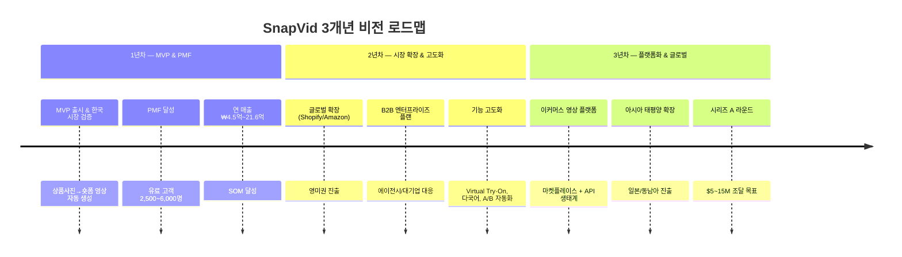
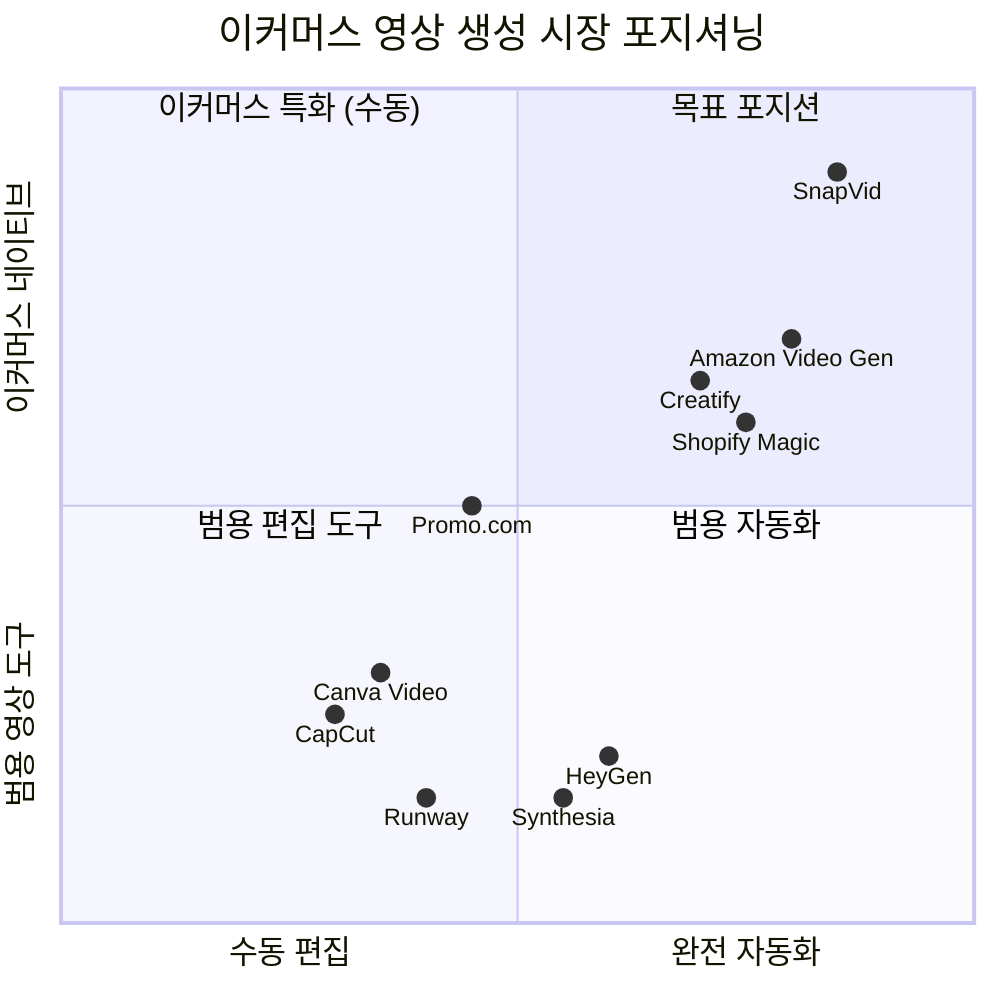
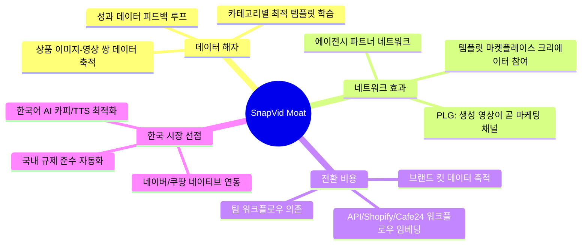
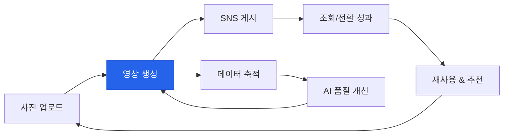
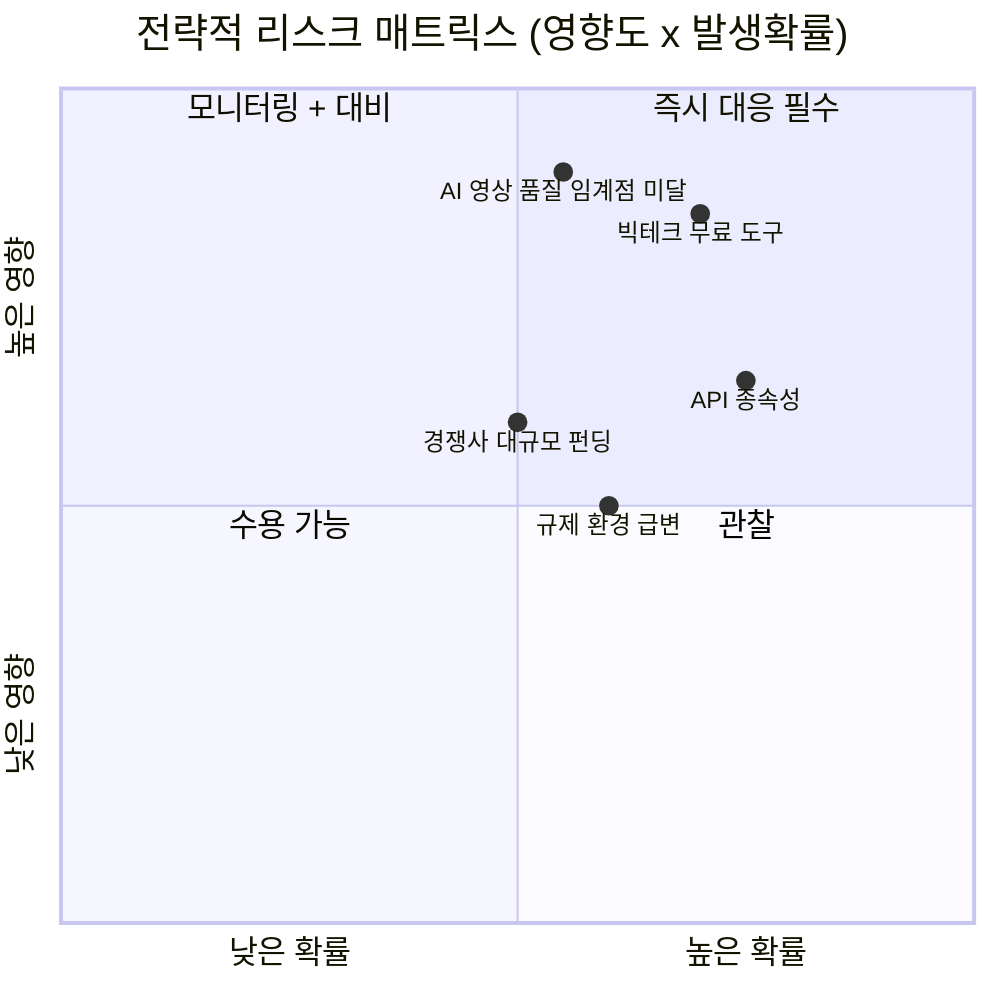

# SnapVid 비전 & 전략 문서

> **작성일:** 2026-02-08
> **버전:** v1.0
> **기반 데이터:** Phase 1 리서치 (시장 조사, 기술 조사, 사용자 조사)
> **문서 상태:** 전략 초안 — 경영진 리뷰 대기

---

## 1. 미션 스테이트먼트

> **"모든 셀러에게 상품 사진 한 장으로 2분 안에 숏폼 마케팅 영상을 만들 수 있는 힘을 준다."**

이커머스 셀러의 68%가 영상 제작 시간을 최대 병목으로 지적하고(HubSpot 2024), 숏폼 영상 수요는 3~5배 폭증했지만 제작 리소스는 그대로인 구조적 모순이 존재한다. SnapVid는 **상품 사진 1장을 완성된 숏폼 마케팅 영상으로 자동 변환하는 엔드투엔드 파이프라인**을 제공하여, 상품당 2.5~7시간이 걸리던 영상 제작을 2분 이내로 단축한다.

---

## 2. 비전 (3년)



### 1년차: MVP & PMF 달성

| 목표 | 상세 | 핵심 지표 |
|------|------|----------|
| **MVP 출시** | 상품 사진 → 15~30초 숏폼 영상 자동 생성 (4~6주 개발) | 영상 1건 원가 ~$0.93 (옵션 C 기준, TECH_RESEARCH) |
| **한국 시장 검증** | 네이버 스마트스토어/쿠팡 셀러 대상 Product-Led Growth | 국내 활성 셀러 40~55만 명 중 얼리어답터 5~10% 타겟 (USER_RESEARCH) |
| **PMF 달성** | "사진 올리면 영상 완성"의 핵심 가치 검증 | 유료 고객 2,500~6,000명, 연 매출 ₩4.5억~21.6억 (USER_RESEARCH SOM) |
| **핵심 플랫폼 지원** | TikTok, YouTube Shorts, Instagram Reels, 네이버 클립, 쿠팡 숏츠 | 5개 플랫폼 영상 규격 자동 대응 |

### 2년차: 시장 확장 & 기능 고도화

| 목표 | 상세 | 핵심 지표 |
|------|------|----------|
| **글로벌 확장** | Shopify/Amazon 연동, 영미권(미국/UK) 진출 | 글로벌 활성 셀러 500~800만 풀 진입 (USER_RESEARCH) |
| **B2B 엔터프라이즈** | 에이전시 멀티 브랜드 워크스페이스, 대기업 SSO/RBAC/승인 워크플로우 | 에이전시 ARPU 월 $200~$800 (USER_RESEARCH) |
| **기능 고도화** | Virtual Try-On (IDM-VTON), 다국어 자동 생성, A/B 테스트 자동화 | 영상 길이 30~60초 확장, 다국어 5개 언어 이상 |
| **자체 호스팅 전환** | 월 5,000건 이상 시 I2V 모델 자체 호스팅으로 원가 절감 | API 대비 70~80% 비용 절감 (TECH_RESEARCH Break-even) |

### 3년차: 플랫폼화 & 글로벌 확장

| 목표 | 상세 | 핵심 지표 |
|------|------|----------|
| **이커머스 영상 플랫폼** | 템플릿 마켓플레이스, 크리에이터 생태계, 오픈 API | 외부 개발자/디자이너 참여 생태계 |
| **아시아 태평양 확장** | 일본, 동남아(TikTok Shop 200만+ 셀러) 시장 진출 | 아태 이커머스 비디오 시장 $5.1B (MARKET_RESEARCH) |
| **시리즈 A** | $5~15M 조달, R&D 확장 및 마케팅 스케일 업 | 경쟁사 참고: Creatify $9M ARR (TECH_RESEARCH) |
| **인텔리전스 레이어** | 영상 성과 기반 자동 최적화, 초개인화 영상 생성 | 전환율 기반 A/B 자동 최적화 |

---

## 3. 핵심 가치 제안 (Value Proposition)

### 3.1 For B2C (1인 셀러 / 크리에이터)

**"사진 1장, 버튼 1번, 영상 1개 — 2분 안에."**

| 기존 고충 | SnapVid 해결 |
|----------|-------------|
| 상품당 영상 제작 2.5~3.5시간 소요 (페르소나: 김민수) | **2분 이내** 자동 생성 |
| 영상 편집 기술 부족, CapCut도 어려움 (페르소나: 최유진) | **편집 지식 제로**에서 사용 가능 (Level 0 완전 자동) |
| 외주 1건 10~30만 원, 납기 3~5일 (MARKET_RESEARCH) | 건당 **2,000~3,000원**, 즉시 생성 |
| 월 영상 제작량 0~3개로 정체 | 주간 **8~10개** 이상 가능 |
| 플랫폼별 (TikTok/Reels/Shorts) 3번 편집 필요 | **원클릭 멀티 플랫폼** 자동 출력 |

### 3.2 For B2B (브랜드 / 에이전시 / 대기업 / 유통)

**"SKU 3,000개를 하루 만에 영상화, 브랜드 가이드라인은 완벽히 유지."**

| 기존 고충 | SnapVid 해결 |
|----------|-------------|
| 에이전시: 클라이언트 1개 추가 = 편집자 0.3명 추가 (페르소나: 이서연) | **인력 추가 없이** 클라이언트 15개→25개 확장 |
| 대기업: SKU 400개 중 영상 커버리지 10% (페르소나: 박준혁) | **SKU 전체 일괄 처리** (Batch + API) |
| 도매업체: 3,000 SKU, 영상 0개 (페르소나: 오성호) | 사진 폴더 업로드 → **전체 자동 영상화** |
| 월 영상 외주비 2,200~7,000만 원 | **80~90% 비용 절감** (ROI 대시보드 제공) |
| 승인 프로세스 7~22영업일 (MARKET_RESEARCH) | 내장 승인 워크플로우로 **당일 처리** |

### 3.3 Value Proposition Canvas

| 구분 | 고객의 일(Jobs) | 고충(Pains) | 이득(Gains) | SnapVid 제공 가치 |
|------|---------------|-------------|-------------|-----------------|
| **B2C 1인 셀러** | 숏폼 영상으로 매출 증대 | 시간 부족, 기술 부족, 비용 부담 | 주간 영상 10개+, 매출 2배 | 사진→영상 자동, 월 ₩9,900 |
| **B2C 크리에이터** | 협찬 영상 제작, 멀티 플랫폼 | 편집 번아웃, 플랫폼별 재편집 | 매일 1개 발행, 조회수 3배 | 스타일 학습, 원클릭 변환 |
| **B2B 중소 브랜드** | 브랜드 일관된 숏폼 콘텐츠 | 퀄리티 불균일, 예산 한계 | 주간 8~10개 고품질 영상 | 브랜드 킷, 라이트 에디터 |
| **B2B 에이전시** | 클라이언트 납품 스케일링 | 인건비 선형 증가, 리비전 병목 | 클라이언트 67% 확장 | 멀티 브랜드, 배치, API |
| **B2B 대기업** | 전 SKU 숏폼 커버리지 | 규모·컴플라이언스·승인 병목 | 커버리지 10%→100% | 엔터프라이즈 보안, 워크플로우 |
| **B2B 도매/유통** | 온라인 채널 매출 확대 | 디지털 역량 부족, SKU 과다 | 0→3,000개 영상 보유 | 극단적 간편 UI, 대량 자동화 |
| **글로벌 셀러** | 다국어 영상 마케팅 | 번역비 $150~300/건, 문화 격차 | 1개 영상→5개 언어 자동 | 다국어 TTS/자막, 문화권 프리셋 |

---

## 4. 포지셔닝

### 4.1 포지셔닝 맵 (경쟁사 대비)



**포지셔닝 해석:**

| 경쟁사 | 위치 | SnapVid 대비 차이점 |
|--------|------|-------------------|
| **Runway, Pika** | 범용 + 반자동 | 최고 품질이나 상품 일관성 유지 실패, 이커머스 워크플로우 미연동 |
| **CapCut, Canva** | 범용 + 수동 편집 | 무료/저가이나 편집 기술 필요, 상품 사진→영상 자동 생성 기능 없음 |
| **HeyGen, Synthesia** | 범용 + 반자동 | AI 아바타 특화, 실제 상품 영상 생성 불가 |
| **Creatify** | 이커머스 중간 + 자동화 | URL→영상 자동화 가능하나 한국 플랫폼 미대응, 아바타 의존 |
| **Amazon Video Gen** | 이커머스 높음 + 자동화 | 무료이나 Amazon 전용, 플랫폼 종속 |
| **Shopify Magic** | 이커머스 높음 + 자동화 | Shopify 전용, 플랫폼 종속 |
| **SnapVid (목표)** | **이커머스 네이티브 + 완전 자동** | 크로스 플랫폼, 한국 특화, 하이브리드 엔진 |

### 4.2 포지셔닝 스테이트먼트

> **이커머스 셀러와 브랜드를 위한** 숏폼 영상 자동 생성 플랫폼으로,
> **상품 사진 1장만 업로드하면** TikTok, 릴스, 쇼츠, 네이버 클립, 쿠팡 숏츠에 최적화된 마케팅 영상을 **2분 안에** 생성합니다.
> **Runway나 CapCut과 달리**, SnapVid는 상품 정체성(로고, 텍스처, 색상)을 완벽히 보존하는 **하이브리드 엔진**(AI 생성 + 원본 합성)과
> **이커머스 네이티브 파이프라인**(카탈로그 연동 → 영상 생성 → 멀티 플랫폼 배포)을 제공합니다.

---

## 5. 핵심 차별화 전략

### 5.1 차별화 포인트 Top 5

| 순위 | 차별화 포인트 | 상세 | 근거 |
|------|-------------|------|------|
| **1** | **하이브리드 엔진 (AI + 원본 합성)** | 배경/효과는 AI 생성, 상품은 원본 레이어 합성. AI 환각(로고 뭉개짐, 색상 변경)을 구조적으로 차단 | 기존 AI 도구의 최대 약점: 상품 디테일 왜곡 확률 0.7~5% (TECH_RESEARCH). 하이브리드로 이를 0%에 수렴시킴 |
| **2** | **한국 이커머스 네이티브** | 네이버 클립, 쿠팡 숏츠, 카카오 등 국내 플랫폼 규격·쇼핑 연동을 기본 지원하는 유일한 솔루션 | 네이버 클립 2,000억 원, 쿠팡 1,500억 원 투자 (MARKET_RESEARCH). 글로벌 도구 미대응 영역 |
| **3** | **엔드투엔드 파이프라인** | 상품 카탈로그에서 이미지 자동 인입 → AI 영상 생성 → 플랫폼별 자동 리사이징 → 멀티 플랫폼 배포 | 기존 AI 도구는 독립형(standalone). 이커머스 워크플로우 통합 도구 시장 공백 (USER_RESEARCH) |
| **4** | **극단적 단순함 (Time-to-Value < 2분)** | 사진 업로드 → 스타일 선택 → 영상 완성. 편집 지식 제로에서 사용 가능 | 첫 영상 품질 실패 시 40~60% 영구 이탈 (USER_RESEARCH). Best-foot-forward 전략으로 Activation 극대화 |
| **5** | **크로스 플랫폼 OSMU** | 1번 생성으로 TikTok, Shorts, Reels, 네이버 클립, 쿠팡 숏츠 5개 플랫폼 규격에 자동 최적화 출력 | 플랫폼별 세이프 존, 최적 길이, 트렌드 반영까지 자동 대응. 3번 편집 → 1번으로 단축 (USER_RESEARCH) |

### 5.2 경쟁 해자 (Moat) 전략



| 해자 유형 | 구축 전략 | 방어 효과 |
|----------|----------|----------|
| **데이터 해자** | 사용자가 생성할수록 "상품 이미지→영상" 쌍 데이터가 축적되어 AI 품질이 지속 개선. 카테고리별(패션, 뷰티, 식품 등) 최적 템플릿을 자동 학습 | 후발 주자가 동일한 데이터를 처음부터 확보하기 어려움. 성과 데이터(CTR, 전환율) 피드백이 추가되면 격차 확대 |
| **네트워크 효과** | PLG 구조: 생성 영상 자체가 SNS에 올라가며 서비스 노출. 템플릿 마켓플레이스에서 크리에이터가 참여할수록 플랫폼 가치 상승 | K-factor > 1 달성 시 유기적 성장. 양면 네트워크(셀러-크리에이터) 형성 |
| **전환 비용 (Switching Cost)** | Shopify/Cafe24/스마트스토어 API 연동으로 기존 워크플로우에 깊이 임베드. 브랜드 킷, 생성 이력, 팀 권한 설정 등이 축적 | B2B 리텐션의 핵심 무기. 연동이 깊어질수록 타 서비스로 전환 비용 증가 |
| **한국 시장 선점** | 네이버 클립·쿠팡 숏츠 규격 네이티브 지원, 한국어 카피라이팅(GPT-4o), TTS(Typecast), 공정위 광고 표시 자동 삽입 | 글로벌 경쟁사(Runway, Creatify 등)가 한국 특수 생태계에 진입하는 데 6~12개월 소요 예상 |

### 5.3 Why Now? (타이밍 근거)

| 근거 | 데이터 | 출처 |
|------|--------|------|
| **I2V AI 프로덕션 도달** | 12개 I2V 모델이 API 공개, 즉시 통합 가능. MVP 영상 1건당 ~$0.93 | TECH_RESEARCH |
| **한국 숏폼 투자 정점** | 네이버 클립 2,000억 원 + 쿠팡 1,500억 원 = 3,500억 원 투자. 셀러의 숏폼 콘텐츠 수요 구조적 폭증 | MARKET_RESEARCH |
| **시장 공백 존재** | "상품 사진 1장 → 완성된 숏폼 영상" 엔드투엔드 솔루션 부재. 기존 도구는 파편화 | MARKET_RESEARCH, USER_RESEARCH |
| **규제 원년 (2026)** | EU AI Act 전면 시행 (2026.08), 한국 AI 기본법 시행 (2026.01). 규제 준수를 선제 도입하면 신뢰도 자산 | MARKET_RESEARCH |
| **오픈소스 격차 해소** | Open-Sora 2.0이 상용 대비 격차 0.69%까지 추격. 2026년 말 기본 품질 거의 해소 → API 비용 급락 예상 | TECH_RESEARCH |
| **빅테크 플랫폼 종속** | Amazon Video Generator(무료, Amazon 전용), TikTok Symphony(TikTok 전용) — 크로스 플랫폼 니즈 충족 불가 | TECH_RESEARCH |
| **AI 콘텐츠 수용도 급증** | 마케터 72%가 AI 생성 콘텐츠 일상 활용 (2024, Capgemini). 소비자 50%+가 AI 광고 인지해도 구매에 영향 없음 | USER_RESEARCH |

---

## 6. 핵심 원칙 (Guiding Principles)

### 제품 설계 원칙 5가지

| 원칙 | 설명 | 적용 사례 |
|------|------|----------|
| **1. 상품이 주인공이다 (Product Fidelity First)** | AI가 만든 영상이 아니라, 상품 사진이 원본 그대로 빛나는 영상을 만든다. 하이브리드 엔진(AI 배경 + 원본 상품 합성)으로 상품 정체성을 절대 훼손하지 않는다 | 배경은 AI가 생성하되, 상품 이미지(로고, 텍스처, 색상)는 원본 레이어로 합성. 환각(Hallucination) 원천 차단 |
| **2. 2분 안에 가치를 보여라 (Time-to-Value < 2 min)** | 사용자가 사진을 올린 순간부터 완성된 영상을 보기까지 2분을 넘기지 않는다. 복잡한 설정, 긴 온보딩, 학습 곡선은 적이다 | 가입: 소셜 로그인 원클릭. 온보딩 = 첫 영상 만들기. 편집 기술 불필요 (Level 0 완전 자동) |
| **3. 한 번 만들고 어디서나 쓴다 (One Source, Multi Use)** | 1번의 생성으로 5개+ 플랫폼에 최적화된 영상을 출력한다. 셀러가 플랫폼별로 반복 작업하는 것은 우리의 실패다 | TikTok, Shorts, Reels, 네이버 클립, 쿠팡 숏츠 각각의 세이프 존, 최적 길이, 비율을 자동 대응 |
| **4. 초보자의 마법, 전문가의 도구 (Progressive Disclosure)** | 1인 셀러는 사진 올리고 끝(Level 0). 에이전시는 씬 에디터와 API(Level 3~5). 하나의 제품이 모든 수준의 사용자를 수용한다 | 기본 화면은 3단계(업로드→선택→완성). "수정하기"로 라이트 에디터 진입. "고급 편집"으로 프로 모드 |
| **5. 데이터가 영상을 진화시킨다 (Data-Driven Creative)** | 사용자의 선택, 성과 데이터(조회수, CTR, 전환율), 트렌드를 학습하여 다음 영상은 더 좋아진다 | 카테고리별 최적 템플릿 자동 추천. A/B 테스트 결과 기반 크리에이티브 자동 최적화. 트렌드 BGM 자동 반영 |

---

## 7. 성공 지표 (North Star & Key Metrics)

### 7.1 North Star Metric

> **주간 활성 영상 생성 수 (Weekly Active Video Generations)**

이 지표가 North Star인 이유:
- 영상 생성은 SnapVid의 핵심 가치 전달 행위
- 생성 수가 늘면 → 데이터 축적 → AI 품질 개선 → 더 많은 생성의 선순환
- 생성된 영상이 SNS에 올라가면 → 바이럴(PLG) → 신규 사용자 유입
- 생성 빈도는 리텐션과 매출(사용량 기반 과금)에 직결



### 7.2 1년차 목표 지표

| 카테고리 | 지표 | 목표 | 근거 |
|---------|------|------|------|
| **성장** | 가입 사용자 수 | 50,000명 | 국내 활성 셀러 40~55만 중 ~10% 인지 |
| **성장** | 월간 활성 사용자 (MAU) | 10,000명 | 가입 대비 MAU 전환율 20% (SaaS 벤치마크) |
| **Activation** | 첫 영상 생성률 (가입→첫 생성) | 60% 이상 | SaaS Activation 벤치마크: B2C 우수 수준 |
| **Activation** | Time-to-Value (가입→영상 확인) | 120초 이내 | B2C 모바일 앱 첫 세션 평균 3~5분 (USER_RESEARCH) |
| **매출** | 유료 전환율 (Freemium→Paid) | 3~5% | SaaS Freemium 벤치마크: B2B 2~5%, B2C 1~2% |
| **매출** | 월간 반복 매출 (MRR) | ₩800만~₩1,800만 | SOM ₩4.5억~21.6억/연 기준 월 환산 |
| **매출** | B2C ARPU | ₩15,000~20,000/월 | 국내 SaaS 가격 민감도 반영 (USER_RESEARCH) |
| **매출** | B2B ARPU | ₩99,000~500,000/월 | 에이전시/브랜드 세그먼트 (USER_RESEARCH) |
| **리텐션** | Week 1 리텐션 | 30% 이상 | SaaS 벤치마크 20~25% 대비 목표 상향 |
| **리텐션** | Month 1 리텐션 | 15% 이상 | 모바일 앱 벤치마크 6~8% 대비 목표 상향 |
| **품질** | 영상 생성 성공률 | 95% 이상 | 첫 시도에 "쓸 만한" 영상 생성 |
| **품질** | 평균 영상 생성 시간 | 90초 이내 | 목표 Time-to-Value 120초 중 생성만 90초 |
| **비용** | 영상 1건 원가 (COGS) | ≤ $1.00 | 옵션 C 기준 $0.93 (TECH_RESEARCH) |
| **바이럴** | K-factor (바이럴 계수) | ≥ 0.5 | PLG 서비스 목표. 1.0 이상 시 자생적 성장 |

---

## 8. 리스크 & 대응

### 8.1 전략적 리스크 Top 5



### 8.2 각 리스크별 대응 계획

#### 리스크 1: 빅테크 무료 도구 진출 [영향: 매우 높음 / 확률: 높음]

| 위협 | 상세 |
|------|------|
| **시나리오** | Amazon Video Generator(무료), TikTok Symphony, 네이버 CLOVA AI, Shopify Magic 등 빅테크가 자체 무료 영상 생성 도구를 출시/강화하여 기본 수요를 흡수 |
| **근거** | Amazon은 이미 무료 AI 영상 생성 제공 중. Shopify Magic은 상품→숏츠 변환 기능 보유 (TECH_RESEARCH) |

| 대응 전략 | 실행 방안 |
|----------|----------|
| **크로스 플랫폼이 핵심 방어선** | 빅테크 도구는 자사 플랫폼 전용 (Amazon→Amazon, TikTok→TikTok). SnapVid는 5개+ 플랫폼 동시 대응. "One Source, Multi Use" 가치는 플랫폼 도구가 대체 불가 |
| **이커머스 워크플로우 통합** | 단순 영상 생성이 아닌, 카탈로그→생성→배포→성과 분석까지의 엔드투엔드 파이프라인으로 차별화. 워크플로우 임베딩이 전환 비용을 높임 |
| **프리미엄 품질 계층** | 빅테크 무료 도구가 "Good Enough" 수준을 제공하면, SnapVid는 "Near-Professional" 품질 + 브랜드 일관성 + 대량 처리로 상위 시장 공략 |
| **빅테크 보완재 포지셔닝** | 각 플랫폼 도구와 경쟁이 아닌 보완. Amazon 셀러가 Amazon 외(TikTok, 네이버)에도 영상이 필요할 때 SnapVid 사용 |

#### 리스크 2: AI 영상 품질 임계점 미달 [영향: 매우 높음 / 확률: 중간]

| 위협 | 상세 |
|------|------|
| **시나리오** | 첫 영상 품질이 사용자 기대에 못 미쳐 Activation 실패. 40~60% 영구 이탈 발생 (USER_RESEARCH) |
| **근거** | AI 환각(상품 디테일 왜곡) 확률 0.7~5%, 프롬프트 동일 재실행 시 품질 편차 20~30% (TECH_RESEARCH) |

| 대응 전략 | 실행 방안 |
|----------|----------|
| **하이브리드 엔진** | 순수 AI 생성의 한계 인정. 상품은 원본 레이어, 배경/효과만 AI 생성하여 상품 정체성 100% 보존 |
| **Best-foot-forward** | 첫 영상은 최고 품질 모델(Runway Gen-4)로 생성. LTV 대비 초기 비용 투자로 Activation 극대화 |
| **멀티 모델 폴백** | Runway + Hailuo + Kling 3중 폴백. 하나가 실패해도 다른 모델로 즉시 재생성. 사용자에게는 "다른 스타일로 다시 만들기" 제공 |
| **Human-in-the-Loop** | 생성 후 자동 QC(상품 유사도 검증). 일정 임계점 미달 시 자동 재생성 또는 사용자 알림 |
| **템플릿 + AI 하이브리드** | 순수 생성이 아닌, 검증된 편집 템플릿에 AI로 생성한 요소를 결합. 품질 하한선 보장 |

#### 리스크 3: API 종속성 및 비용 변동 [영향: 높음 / 확률: 높음]

| 위협 | 상세 |
|------|------|
| **시나리오** | I2V 핵심 API(Runway, Hailuo)의 가격 인상, 서비스 중단, Rate Limit 변경, 정책 변경으로 사업 모델 위협 |
| **근거** | Image-to-Video 모델이 유일한 대체 불가 외부 의존성 (TECH_RESEARCH) |

| 대응 전략 | 실행 방안 |
|----------|----------|
| **멀티 벤더 필수** | Runway + Hailuo + Kling 최소 3개 벤더 동시 운영. 자동 폴백 + 비용 최적 라우팅 |
| **비용 등급화** | 일반 상품은 Hailuo($0.28/건), 프리미엄 상품은 Runway Gen-4 Turbo($0.50/건). 사용자 플랜에 따라 차등 |
| **자체 호스팅 로드맵** | 월 5,000건 이상 시 오픈소스(SVD, Open-Sora) 기반 자체 호스팅 전환. API 대비 70~80% 비용 절감 가능 (TECH_RESEARCH) |
| **큐 시스템** | Rate Limit 대응을 위한 비동기 큐. 사용자에게는 "영상 준비 중" 상태 표시 + 완료 시 알림 |
| **캐싱 전략** | 동일 상품 재생성 방지, 템플릿 기반 변형 생성으로 API 호출 최소화 |

#### 리스크 4: 규제 환경 급변 [영향: 중간 / 확률: 높음]

| 위협 | 상세 |
|------|------|
| **시나리오** | EU AI Act(2026.08), 한국 AI 기본법(2026.01) 전면 시행으로 AI 생성 콘텐츠 라벨링 의무화. AI 라벨 부착 시 광고 CTR 하락 우려 |
| **근거** | 위반 시 EU: 전 세계 매출 최대 1.5~7% 과징금. TikTok/YouTube/Instagram 모두 AI 라벨 의무 정책 시행 중 (MARKET_RESEARCH) |

| 대응 전략 | 실행 방안 |
|----------|----------|
| **규제 준수 = 신뢰 자산** | 규제 대응을 비용이 아닌 차별화로 전환. "SnapVid로 만든 영상은 규제 준수가 보장됩니다" |
| **자동 라벨링** | C2PA Content Credentials 표준 도입. 영상 메타데이터에 AI 생성 정보 자동 기록. 플랫폼 업로드 시 AI 라벨 자동 체크 |
| **공정위 가이드라인 준수** | 한국 "표시/광고의 공정화에 관한 법률" 준수를 위한 "연출된 이미지" 문구 자동 삽입 기능 |
| **투명성 대시보드** | 사용자에게 "이 영상에 사용된 AI 기술" 정보를 제공. 규제 감사 대응용 로그 자동 보관 |

#### 리스크 5: 경쟁사 대규모 펀딩 & 기술 격차 [영향: 높음 / 확률: 중간]

| 위협 | 상세 |
|------|------|
| **시나리오** | Runway($141M), Synthesia($90M), Pika($80M), HeyGen($60M) 등 이미 대규모 자금을 확보한 경쟁사가 이커머스 특화 기능을 추가하거나, Creatify($9M ARR) 같은 직접 경쟁사가 급성장 |
| **근거** | MARKET_RESEARCH 경쟁사 펀딩 현황 |

| 대응 전략 | 실행 방안 |
|----------|----------|
| **한국 시장 선점** | 글로벌 경쟁사가 한국 특수 생태계(네이버, 쿠팡, 카카오)에 진입하는 데 6~12개월 소요. 이 기간에 한국 시장 지배적 위치 확보 |
| **니치→확장 전략** | "이커머스 숏폼 영상"이라는 명확한 니치에서 시작. 범용 AI 영상 도구와 정면 경쟁 회피 |
| **속도가 무기** | 4~6주 MVP 출시 → 빠른 반복. 대형 경쟁사의 의사결정 속도보다 빠르게 시장 피드백 반영 |
| **전환 비용 조기 구축** | API 연동, 브랜드 킷, 팀 워크플로우를 조기에 깊이 구축하여 경쟁사 진입 시 이미 전환 비용이 높은 상태 |
| **파트너십** | 네이버/쿠팡/카페24 등 국내 플랫폼과 공식 파트너십 체결로 진입 장벽 구축 |

---

## 부록: TAM/SAM/SOM 요약

```
┌─────────────────────────────────────────────────────────────┐
│                    시장 규모 요약 (2024)                       │
├─────────────────────────────────────────────────────────────┤
│                                                             │
│  TAM  $5~8B     전세계 숏폼 영상 마케팅 도구 시장              │
│  ━━━━━━━━━━━━━━━━━━━━━━━━━━━━━━━━━━━━━━━━━━━                │
│                                                             │
│  SAM  $500M~1B  이커머스 상품 영상 자동 생성 시장              │
│  ━━━━━━━━━━━━━━━━━━━                                        │
│                                                             │
│  SOM  $330K~1.6M  MVP 1년차 (한국 시장)                      │
│  ━━                                                         │
│                                                             │
├─────────────────────────────────────────────────────────────┤
│  B2B 타겟 합산    약 5~8만 사업체 (국내)                       │
│  B2C 타겟 합산    약 40~55만 셀러 (국내)                      │
│  글로벌 확장 시    약 500~800만 셀러 (전세계)                  │
└─────────────────────────────────────────────────────────────┘
```

> 출처: USER_RESEARCH TAM/SAM/SOM 분석 참조

---

## Sources

본 문서의 모든 데이터와 수치는 Phase 1 리서치 문서에 근거합니다.

| 참조 문서 | 경로 | 주요 인용 섹션 |
|----------|------|--------------|
| 시장 조사 보고서 | `/docs/01-research/MARKET_RESEARCH.md` | 시장 규모, 경쟁 환경, 플랫폼 트렌드, 규제 환경, 기회 영역 |
| 기술 조사 보고서 | `/docs/01-research/TECH_RESEARCH.md` | I2V 모델 비교, MVP 기술 스택, 비용 분석, 기술 리스크 |
| 사용자 조사 보고서 | `/docs/01-research/USER_RESEARCH.md` | TAM/SAM/SOM, 페르소나, 가격 민감도, 사용자 여정, 니즈 우선순위 |

---

**문서 작성일**: 2026-02-08
**다음 업데이트**: 전략 승인 후 Product Requirements Document (PRD) 작성

---

> **역할 정의**
> 본 문서 작성에 다음 역할이 수행되었습니다:
> - **전략 컨설턴트**: 시장 데이터 기반 비전/포지셔닝/차별화 전략 수립
> - **비즈니스 애널리스트**: TAM/SAM/SOM 분석, 경쟁 분석, 리스크 매트릭스 작성
> - **프로덕트 전략가**: 핵심 가치 제안, 설계 원칙, 성공 지표 정의, 로드맵 설계
