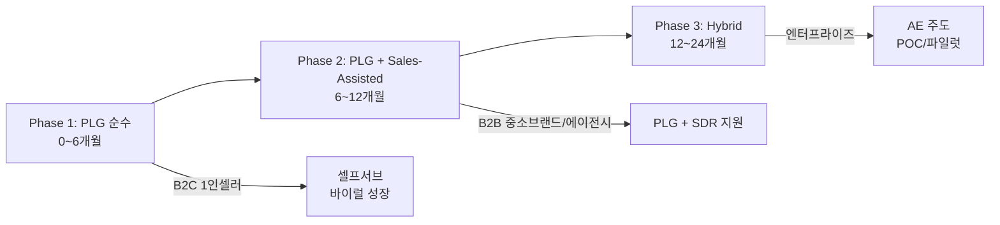
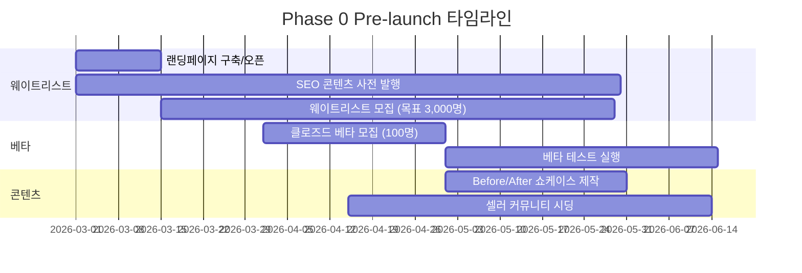
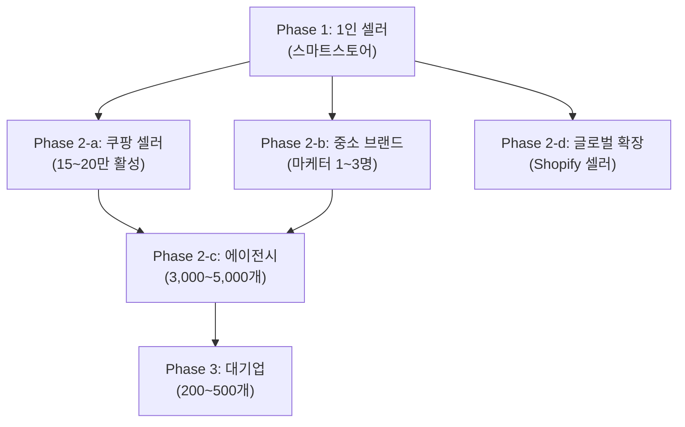
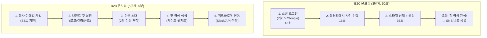
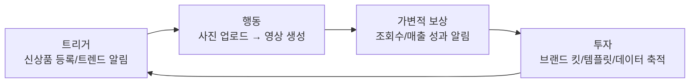

> [<- GTM_STRATEGY 허브로 돌아가기](../GTM_STRATEGY.md)

# 1Dragon Go-to-Market 전략: 런칭 & 성장

> **작성일:** 2026-02-08
> **기반 문서:** MARKET_RESEARCH.md, TECH_RESEARCH.md, USER_RESEARCH.md
> **서비스:** 상품 사진 1장 업로드 -> TikTok/YouTube Shorts/Instagram Reels/네이버 클립/쿠팡 숏폼용 마케팅 영상 AI 자동 생성
> **전략 기간:** Pre-launch ~ 24개월

---

## 1. GTM 전략 개요

### 1.1 GTM 모션 (PLG vs Sales-Led vs Hybrid)

**결론: PLG-First -> Sales-Assisted Hybrid**

| 구분 | 근거 |
|------|------|
| **PLG를 선택하는 이유** | 1) 생성된 영상이 SNS에 업로드되는 순간 서비스가 자연 노출 (Canva/Loom 성장 패턴) 2) B2C 1인셀러 40~55만명이 바이럴 엔진 역할 3) PLG SaaS의 CAC는 전통 SaaS 대비 ~60% 낮음 (OpenView, 2024) |
| **Sales-Assisted를 병행하는 이유** | 1) B2B 에이전시/대기업의 ARPU가 B2C 대비 10~100배 2) 에이전시 3,000~5,000개, 대기업 200~500개는 셀프서브만으로 전환 어려움 3) 엔터프라이즈 의사결정 구조 (담당자->팀장->구매팀) 2~4주 소요 |
| **순수 Sales-Led를 배제하는 이유** | 1) 초기 스타트업에 세일즈팀 구축 비용 과다 2) 시장 교육(Market Education)이 필요한 신규 카테고리에서 PLG가 인지 확산에 유리 |

### 1.2 핵심 가설 & 검증 방법

| # | 가설 | 검증 지표 | 목표값 | 검증 방법 | 판정 시점 |
|---|------|----------|--------|----------|----------|
| H1 | 상품 사진 1장으로 생성한 15초 영상이 수동 제작 영상 대비 70% 이상의 광고 성과(CTR)를 달성한다 | CTR 비교 | AI 영상 CTR >= 수동 영상 CTR x 0.7 | 베타 유저 50명 대상 A/B 테스트 (동일 상품, AI vs 수동 영상을 Meta/TikTok 광고로 집행) | Beta 4주차 |
| H2 | 1인 셀러가 첫 영상을 60초 이내에 생성하면, 주간 영상 제작 빈도가 3배 이상 증가한다 | 주간 영상 생성 수 | Week 1 대비 Week 4에서 3x | 베타 유저 코호트 분석 (주간 활성 사용자 영상 생성 로그) | MVP 4주차 |
| H3 | "Made with 1Dragon" 워터마크 포함 영상의 바이럴 계수(K-factor)가 0.3 이상이다 | K-factor | >= 0.3 | 워터마크 포함 영상 -> 서비스 유입 추적 (UTM + 레퍼럴 코드) | MVP 8주차 |
| H4 | 무료 사용자의 유료 전환율이 2% 이상이다 (B2C 기준) | Free -> Paid CVR | >= 2% | 무료 크레딧 소진 후 72시간 내 전환율 추적 | MVP 12주차 |
| H5 | 네이버 스마트스토어 연동 시 셀러의 리텐션(Day 30)이 미연동 대비 2배 이상이다 | D30 리텐션 | 연동 >= 미연동 x 2 | 스마트스토어 API 연동 셀러 vs 미연동 셀러 코호트 비교 | Phase 2 시작 시 |
| H6 | 에이전시가 1Dragon 도입 시 클라이언트당 영상 제작 원가를 40% 이상 절감한다 | 제작 원가 절감률 | >= 40% | 파일럿 에이전시 5곳의 Before/After 비용 분석 | Phase 2 중반 |

---

## 2. 런칭 전략

### 2.1 Phase 0: Pre-launch (런칭 전 3개월)

#### 웨이트리스트 / 얼리 액세스 전략

**웨이트리스트 설계**

| 요소 | 설계 |
|------|------|
| **랜딩페이지 헤드라인** | "상품 사진 1장, 15초만에 TikTok 영상 완성" |
| **데모 체험** | 가입 없이 사진 1장 업로드 -> 샘플 영상 즉시 생성 (워터마크 포함) |
| **바이럴 루프** | 웨이트리스트 순위제: 친구 1명 초대 시 10순위 상승, 상위 100명에 무료 Pro 3개월 |
| **데이터 수집** | 가입 시 "어떤 플랫폼에서 판매하나요?" 질문으로 세그먼트 사전 분류 |
| **목표** | 3,000명 가입, 이 중 네이버 스마트스토어 셀러 40% 이상 |

#### 베타 테스터 모집 (어떤 세그먼트를 먼저?)

**1순위: 네이버 스마트스토어 1인 셀러 (50명)**

| 선정 이유 | 상세 |
|----------|------|
| 시장 규모 | 활성 1인 셀러 35~40만명, 영상 제작 경험 거의 없음 (월 0~1개) |
| Pain Point 극대화 | 하루 14시간 근무, 영상 편집 기술 없음, 월 예산 5~10만원 |
| 피드백 가치 | "사진만 올리면 끝"이라는 핵심 가치 제안의 최소 기대 수준 검증 |
| PLG 바이럴 잠재력 | 셀러 커뮤니티(네이버 카페, 아이보스)에서 구전 효과 극대화 |

**2순위: 중소 브랜드 마케터 (30명)**

| 선정 이유 | 상세 |
|----------|------|
| 품질 기준 제시 | "광고 소재로 실제 사용 가능한가?" 기준으로 품질 임계점(Good Enough+) 검증 |
| 브랜드 커스터마이징 | 로고/폰트/컬러 적용 기능의 실용성 검증 |
| ARPU 예측 | 월 100~150만원 예산 내에서 수용 가능한 가격대 탐색 |

**3순위: 마케팅 에이전시 (20명)**

| 선정 이유 | 상세 |
|----------|------|
| 대량 처리 검증 | Batch 업로드, 멀티 브랜드 워크스페이스 요구사항 조기 파악 |
| B2B 제품-시장 적합성 | 에이전시 워크플로우에 통합 가능한 수준인지 검증 |

#### 콘텐츠 마케팅 사전 준비

| 콘텐츠 유형 | 수량 | 목적 |
|------------|------|------|
| SEO 블로그 (네이버 블로그 + 자사 블로그) | 20편 | "상품 영상 만들기", "TikTok 마케팅 방법", "스마트스토어 영상 제작" 키워드 선점 |
| Before/After 쇼케이스 영상 | 10편 | 실제 상품 사진 -> 1Dragon 생성 영상 비교. 업종별(패션, 뷰티, 식품, 악세서리, 가전) |
| 셀러 커뮤니티 시딩 | 30건 | 아이보스, 네이버 카페(스마트스토어 관련), 셀러 오픈카톡방에 체험 후기 형태로 노출 |
| 유튜브 튜토리얼 | 5편 | "스마트스토어 셀러를 위한 영상 마케팅 가이드" 시리즈 |

### 2.2 Phase 1: Soft Launch (MVP 런칭)

#### 첫 타겟 세그먼트: 네이버 스마트스토어 1인 셀러

**왜 이 세그먼트인가?**

| 기준 | 평가 | 근거 |
|------|------|------|
| **시장 규모** | 35~40만명 (활성 1인 셀러) | 네이버 공식 추정, 전체 셀러의 60~70% |
| **Pain Point 심각도** | 극심 (월 영상 제작 0~1개) | 시간 부족 + 기술 부재 + 비용 부담 삼중고 |
| **경쟁 공백** | 네이버 클립 특화 영상 생성 도구 부재 | 글로벌 AI 도구는 한국 플랫폼 미대응 |
| **의사결정 속도** | 즉시 (개인 결정) | B2B 대비 5분 이내 결정 |
| **CAC 효율성** | 커뮤니티 바이럴로 저비용 획득 가능 | 셀러 커뮤니티 활발, 구전 효과 높음 |
| **PLG 적합성** | 생성 영상이 네이버 클립/인스타/TikTok에 올라가며 자연 노출 | 제품이 곧 마케팅 채널 |
| **확장 경로** | 1인 셀러 -> 성장 셀러 -> 소규모 브랜드 -> 에이전시 | 자연스러운 업셀 퍼널 |

#### 런칭 채널

| 채널 | 전략 | 예상 효과 |
|------|------|----------|
| **Product Hunt** | 글로벌 론칭 Day. "Photo to Short-form Video in 15 seconds" 포지셔닝 | 글로벌 인지도 확보, 초기 해외 사용자 유입 |
| **네이버 블로그 + 카페** | 셀러 카페 10곳에 체험 후기 + 초대 코드 배포 | 국내 1차 타겟 직접 도달 |
| **TikTok/Instagram** | 1Dragon로 만든 영상을 광고 소재로 활용 (메타 광고) | CPI(Cost Per Install) 기반 효율 측정 |
| **유튜브** | "스마트스토어 셀러 필수 도구" 리뷰어 시딩 (마이크로 인플루언서 5~10명) | 검색 기반 지속적 유입 |
| **아이보스 커뮤니티** | 마케팅 실무자 대상 사례 공유 | B2B 리드 초기 확보 |

#### 초기 성공 지표 (MVP 첫 12주)

| 지표 | 목표 | 측정 방법 |
|------|------|----------|
| **가입자 수** | 5,000명 | 가입 로그 |
| **Activation Rate** (첫 영상 생성 완료) | 40% (2,000명) | 영상 생성 이벤트 트래킹 |
| **TTV (Time-to-Value)** | 60초 이내 | 가입 -> 첫 영상 생성 완료까지 중위값 |
| **Week 1 리텐션** | 25% | 가입 1주 후 재방문율 |
| **Day 30 리텐션** | 10% | 가입 30일 후 재방문율 |
| **유료 전환율** | 2% (100명) | Free -> Paid 전환 |
| **NPS** | 40+ | 베타 유저 설문 |
| **K-factor** | 0.3+ | 추천 기반 유입 추적 |

### 2.3 Phase 2: Growth (6~12개월)

#### 세그먼트 확장 순서

| 순서 | 세그먼트 | 시기 | 확장 근거 | 핵심 기능 추가 |
|------|---------|------|----------|--------------|
| 2-a | 쿠팡 마켓플레이스 셀러 | M7~M9 | 15~20만 활성 셀러, 숏폼 영향 구매 전환율 12.3% | 쿠팡 상품 이미지 연동, 쿠팡 숏폼 규격 자동 대응 |
| 2-b | 중소 브랜드 마케터 | M7~M10 | 월 예산 100~150만원, 주간 8~10개 영상 필요 | 브랜드 킷, A/B 버전 생성, 라이트 에디터 |
| 2-c | 마케팅 에이전시 | M9~M12 | 스케일링 병목 해결 니즈, 높은 ARPU ($200~800/월) | Batch 처리, 멀티 브랜드 워크스페이스, API, 화이트라벨 |
| 2-d | 글로벌 Shopify 셀러 (영어) | M10~M12 | Shopify 활성 200~250만 스토어, 영어권 시장 테스트 | 영어 카피 생성, Shopify 앱 스토어 출시, 다국어 TTS |

#### 성장 레버

| 레버 | 구체적 실행 | 기대 효과 |
|------|-----------|----------|
| **플랫폼 네이티브 연동** | 네이버 스마트스토어 API -> 상품 등록 시 자동 영상 생성 | 워크플로우 임베딩으로 D30 리텐션 2x, 전환 비용(switching cost) 극대화 |
| **바이럴 워터마크** | "Made with 1Dragon" 포함 시 월 5개 추가 무료 영상 | K-factor 0.3 -> 0.5+ 목표. PLG 유기적 성장 엔진 |
| **커뮤니티 앰배서더** | 파워 셀러 20명 앰배서더 프로그램. 월 Pro 무료 + 추천 수수료 10% | 셀러 커뮤니티 내 신뢰도 높은 구전 |
| **콘텐츠 마케팅 스케일** | 업종별 성공 사례 50건 발행, YouTube 채널 운영 | SEO 유입 월 5,000 -> 20,000 |
| **에이전시 파트너 프로그램** | 10개 에이전시 파트너십. 볼륨 디스카운트 + 공동 마케팅 | 에이전시 1곳 = 클라이언트 10~15개 간접 획득 |

### 2.4 Phase 3: Scale (12~24개월)

#### 글로벌 확장

| 시장 | 시기 | 전략 |
|------|------|------|
| **일본** | M13~M18 | K-뷰티 크로스보더 셀러부터 시작. Rakuten/Amazon JP 연동. 일본어 TTS/카피 |
| **동남아 (인도네시아, 태국, 베트남)** | M15~M20 | TikTok Shop 동남아 GMV 급성장 활용. Shopee/Lazada 연동 |
| **미국/유럽** | M18~M24 | Shopify 앱 스토어 글로벌 론칭. Amazon Seller Central 연동. 다국어 6개국 지원 |

#### 엔터프라이즈 진출

| 요소 | 전략 |
|------|------|
| **타겟** | 국내 매출 상위 500대 중 D2C/리테일 80~120개 기업 |
| **진입 전략** | 기존 에이전시 파트너를 통한 소개 (Bottom-up) + CMO 직접 아웃바운드 (Top-down) |
| **필수 기능** | SSO, RBAC, 데이터 처리 계약(DPA), SOC2 인증, PIM/DAM 연동, 승인 워크플로우 |
| **영업 사이클** | 3~6개월 (POC 1개월 -> 파일럿 2개월 -> 계약) |
| **가격** | 커스텀 협상. 연간 계약 3,600만~7,200만 (월 300~600만) |
| **성공 기준** | SKU 커버리지 30% -> 80% 달성, 영상 제작 비용 전년 대비 25% 절감 증빙 |

---

## 3. 채널 전략

### 3.1 획득 (Acquisition) 채널

| 채널 | 타겟 세그먼트 | 예상 CAC | 우선순위 | 전략 |
|------|-------------|---------|---------|------|
| **PLG 바이럴 (워터마크)** | 1인 셀러, 인플루언서 | 0 (오가닉) | P0 | 영상 내 "Made with 1Dragon" -> 시청자 유입. 워터마크 포함 시 월 5개 추가 무료 |
| **셀러 커뮤니티** | 1인 셀러, 중소 브랜드 | 2,000~5,000 | P0 | 아이보스, 네이버 카페(스마트스토어, 쿠팡 셀러), 오픈카톡방. 실사용 후기 중심 |
| **SEO / 콘텐츠 마케팅** | 전 세그먼트 | 3,000~8,000 | P0 | "상품 영상 만들기", "TikTok 마케팅", "네이버 클립 영상 제작" 키워드 |
| **메타 광고 (인스타/FB)** | 1인 셀러, 중소 브랜드 | 5,000~15,000 | P1 | 타겟: 스마트스토어 셀러, 쇼핑몰 운영자. Before/After 소재 활용 |
| **TikTok 광고** | 1인 셀러, 인플루언서 | 3,000~10,000 | P1 | 1Dragon로 만든 영상 자체가 광고 소재. "이 영상, 사진 1장으로 만들었습니다" |
| **YouTube (튜토리얼/리뷰)** | 전 세그먼트 | 5,000~12,000 | P1 | 마이크로 인플루언서 시딩 + 자체 채널 운영. 검색 기반 장기 유입 |
| **네이버 검색광고** | 1인 셀러, 중소 브랜드 | 8,000~20,000 | P1 | 검색 의도 기반 전환. "영상 제작 도구", "상품 영상 AI" |
| **LinkedIn 아웃바운드** | 에이전시, 대기업 | 50,000~200,000 | P2 | 마케팅 팀장/CMO 타겟. 케이스 스터디 + ROI 계산기 공유 |
| **파트너 채널 (에이전시)** | 중소 브랜드, 대기업 | 30,000~100,000 | P2 | 파트너 에이전시를 통한 간접 세일즈. 에이전시당 클라이언트 10~15개 |
| **Shopify 앱 스토어** | 글로벌 셀러 | 10,000~30,000 | P2 | 앱 스토어 SEO + 리뷰 확보. 글로벌 확장의 핵심 채널 |
| **Product Hunt / 테크 미디어** | 얼리어답터, 글로벌 | 0 (PR) | P1 (런칭 시) | 런칭 데이 홍보. 글로벌 인지도 초기 확보 |

### 3.2 활성화 (Activation) 전략

#### 온보딩 플로우 설계 원칙

**핵심 원칙: "첫 영상까지의 장벽을 제로에 가깝게"**

#### TTV (Time-to-Value) 목표

| 세그먼트 | TTV 목표 | 현재 Pain Point 대비 |
|---------|---------|-------------------|
| 1인 셀러 | **60초 이내** | 상품당 2.5~3.5시간 -> 1분 (99.5% 단축) |
| 중소 브랜드 | **5분 이내** (브랜드 킷 설정 포함) | 상품당 3시간 -> 5분 (97% 단축) |
| 에이전시 | **30분 이내** (첫 배치 10개 완료) | 클라이언트당 4~7시간/건 -> 3분/건 |
| 대기업 | **1시간 이내** (POC 첫 결과물 확인) | 영상 1건 리드타임 15~22영업일 -> 1시간 |

#### Activation 지표 정의

| 세그먼트 | Activation Event | 목표 달성률 | Aha Moment |
|---------|-----------------|-----------|-----------:|
| B2C (1인 셀러) | 첫 영상 생성 완료 + SNS 공유 | 30% (가입자 대비) | "사진 올렸더니 진짜 영상이 나왔다!" |
| B2B (중소 브랜드) | 브랜드 킷 설정 + 영상 3개 생성 | 40% (가입자 대비) | "우리 브랜드 톤에 맞는 영상이 자동으로!" |
| B2B (에이전시) | 팀원 2명+ 가입 + 클라이언트 1개 워크스페이스 생성 | 50% (가입자 대비) | "이 속도면 클라이언트 2배는 더 받을 수 있겠다" |

**Best-foot-forward 전략:**
- 첫 영상은 최고 품질 모델(Runway Gen-4)로 생성하여 Aha Moment 극대화
- 비용: 첫 영상 $0.50 vs 일반 영상 $0.28 (Hailuo) -> LTV 대비 투자 정당화
- 첫 결과물 불만족 시 즉시 "다른 스타일로 다시 만들기" 무료 재시도 제공

### 3.3 유지 (Retention) 전략

#### 리텐션 루프

| 리텐션 전략 | 상세 | 타겟 |
|-----------|------|------|
| **외부 트리거 - 트렌드 알림** | "이번 주 TikTok 인기 스타일: OOO (+340%)" 푸시 알림. 해당 스타일 원클릭 적용 | B2C |
| **외부 트리거 - 성과 알림** | "지난 영상 조회수 1,200회 돌파!" / "이번 달 외주 대비 240만 절감" | B2C / B2B |
| **워크플로우 임베딩** | 스마트스토어 상품 등록 시 자동 영상 생성 (API 연동) | B2C / B2B |
| **습관 루프 - 주간 리포트** | 매주 월요일 "이번 주 추천 트렌드 + 지난주 성과 요약" 이메일 | 전체 |
| **데이터 축적 (투자)** | 브랜드 킷, 생성 히스토리, 성과 데이터가 쌓일수록 이탈 비용 증가 | B2B |
| **게이미피케이션** | 주간 영상 생성 스트릭, 월간 성과 배지, 레벨 시스템 | B2C |
| **시즌 캠페인** | 설날/추석/블프/11.11 등 시즌별 템플릿 자동 추천 | 전체 |

#### 이탈 방지 전략 (첫 영상 품질 관리)

**Activation 실패 시 40~60% 영구 이탈**이므로, 첫 영상 품질 관리가 최우선 과제.

| 상황 | 대응 |
|------|------|
| 첫 영상 품질 불만족 | 즉시 "다른 스타일 3개" 재생성 무료 제공. 최대 5회 재시도 |
| 업로드 이미지 품질 저하 | Real-ESRGAN 자동 업스케일링 + "더 좋은 사진으로 더 좋은 영상" 가이드 팝업 |
| 상품 카테고리별 최적화 | 패션/뷰티/식품/가전/악세서리 카테고리 자동 감지 -> 최적 템플릿 자동 매칭 |
| AI 아티팩트 발생 | 하이브리드 엔진(배경: AI 생성 / 상품: 원본 레이어 합성)으로 상품 왜곡 방지 |
| 생성 시간 초과 (> 60초) | 프로그레스 바 + "잠깐! 생성 중에 다른 상품도 올려보세요" 인게이지먼트 |

### 3.4 수익화 (Revenue) 전략

#### 가격 체계

| 플랜 | 월 가격 | 영상 수 | 핵심 기능 | 타겟 |
|------|--------|--------|----------|------|
| **Free** | 0 | 3개/월 | 720p, 워터마크, 기본 템플릿, 1개 플랫폼 | 체험/바이럴 |
| **Starter** | 9,900/월 | 30개/월 | 1080p, 워터마크 제거, 전체 템플릿, 3개 플랫폼 | 1인 셀러 |
| **Pro** | 29,900/월 | 100개/월 | 브랜드 킷, A/B 버전, 라이트 에디터, 스마트스토어 연동 | 중소 브랜드 |
| **Business** | 99,000/월 | 500개/월 | Batch 처리, 멀티 워크스페이스, API, 팀 협업 (5석) | 에이전시 |
| **Enterprise** | 커스텀 | 무제한 | SSO, RBAC, 승인 워크플로우, PIM/DAM 연동, 전담 매니저 | 대기업 |

> **가격 설계 근거:**
> - Starter 9,900: 심리적 만원 이하, 1인 셀러 월 예산 5~10만원의 10~20%
> - Pro 29,900: 영상당 299. 외주 10~50만원/건 대비 99% 절감
> - Business 99,000: 영상당 198. 에이전시 인건비 월 2,200만원 대비 ROI 명확
> - 연간 결제 시 20% 할인 (Starter 7,900/월, Pro 23,900/월, Business 79,000/월)

#### Free -> Paid 전환 전략

| 전환 포인트 | 전략 |
|-----------|------|
| **무료 크레딧 소진 시** | "이번 달 무료 3개를 모두 사용했습니다. 지금 구독하면 첫 달 50% 할인" (72시간 리밋 오퍼) |
| **품질 업셀** | Free는 720p -> "4K 고화질로 업그레이드하면 조회수 2배" 프리미엄 품질 비교 노출 |
| **기능 게이트** | 워터마크 제거, 브랜드 킷, 배치 처리는 유료 플랜에서만 |
| **ROI 시각화** | "이번 달 1Dragon로 절약한 시간: 12시간, 금액: 360,000" 대시보드 |

#### 업셀/크로스셀 전략

| 전환 경로 | 트리거 | 오퍼 |
|----------|--------|------|
| Free -> Starter | 무료 3개 소진 + 재방문 | 첫 달 50% (4,950) |
| Starter -> Pro | 월 30개 상한 도달 / 브랜드 킷 니즈 발생 | "Pro 업그레이드 시 이번 달 잔여 크레딧 이월" |
| Pro -> Business | 팀원 초대 시도 / 배치 업로드 시도 | "팀 5명까지 포함, 7일 무료 체험" |
| Business -> Enterprise | 500개 상한 도달 / SSO 요청 | 전담 AE 배정, POC 1개월 무료 |
| 단건 -> 연간 | 3개월 연속 결제 시 | "연간 전환 시 2개월 무료 (20% 절감)" |

### 3.5 추천 (Referral) 전략

#### 바이럴 메커니즘

| 메커니즘 | 설계 | K-factor 기여 |
|---------|------|-------------|
| **제품 내재 바이럴** | 생성 영상이 SNS에 올라가는 순간 "Made with 1Dragon" 노출 | 수동적, 지속적 |
| **워터마크 인센티브** | 워터마크 유지 시 월 5개 추가 무료 영상 | 능동적 선택 |
| **"이 영상 뭐로 만들었어?" 모멘트** | 댓글/DM으로 질문 -> 자동 응답 템플릿 제공 | 구전 가속 |
| **결과물 공유 CTA** | 영상 생성 완료 시 "SNS에 공유하기" 원클릭 버튼 우선 배치 | 공유 전환율 극대화 |

#### 레퍼럴 프로그램 설계

| 요소 | B2C | B2B |
|------|-----|-----|
| **인센티브** | 양면: 추천인 + 피추천인 각각 5개 무료 영상 | 양면: 추천인 + 피추천인 각각 1개월 무료 |
| **메커니즘** | 고유 초대 코드 + 원클릭 카카오톡 공유 | 고유 초대 링크 + 이메일 초대 |
| **추적** | UTM + 레퍼럴 코드 | UTM + CRM 연동 |
| **상한** | 월 최대 20개 보너스 영상 | 최대 3개월 무료 |
| **리더보드** | 월간 추천왕 Top 10에 Pro 1개월 무료 | 분기별 최다 추천 에이전시 표창 |
