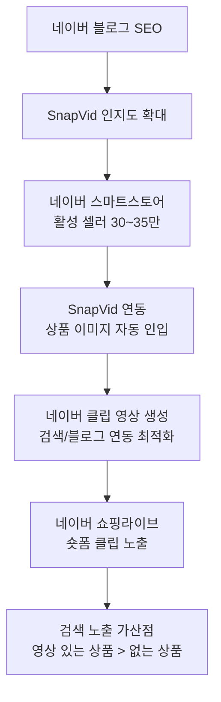

> [<- GTM_STRATEGY 허브로 돌아가기](../GTM_STRATEGY.md)

# SnapVid Go-to-Market 전략: 파트너십 & 콘텐츠 & 한국 특화

> **작성일:** 2026-02-08
> **기반 문서:** MARKET_RESEARCH.md, TECH_RESEARCH.md, USER_RESEARCH.md

---

## 4. 파트너십 전략

### 4.1 플랫폼 파트너십

#### 네이버 스마트스토어 연동

| 항목 | 전략 |
|------|------|
| **연동 범위** | 상품 이미지 자동 인입 -> 영상 생성 -> 네이버 클립 자동 업로드 |
| **기술** | 네이버 커머스 API (상품 정보, 이미지 조회) + 네이버 클립 업로드 API |
| **비즈니스 가치** | 셀러의 워크플로우 임베딩 -> 리텐션 극대화, 전환 비용 상승 |
| **접근 방법** | 네이버 디벨로퍼 프로그램 등록 -> API 파트너 신청 -> 네이버 클립팀 협업 제안 |
| **타임라인** | Phase 1 후반 (M4~M6) |
| **KPI** | 연동 셀러 D30 리텐션 >= 미연동 대비 2배 |

#### 카페24/Shopify 앱 스토어

| 항목 | 카페24 | Shopify |
|------|--------|---------|
| **앱 유형** | 카페24 앱 스토어 등록 | Shopify App Store 등록 |
| **연동 범위** | 상품 이미지 -> 영상 생성 -> 상세페이지 임베드 | 상품 이미지 -> 영상 생성 -> PDP 임베드 |
| **수수료** | 매출의 20% (카페24 표준) | 매출의 0% (Shopify 2024년 정책) |
| **타임라인** | Phase 2 (M7~M9) | Phase 2 (M10~M12) |
| **KPI** | 카페24 앱스토어 상위 50위 진입 | Shopify 앱스토어 "Marketing" 카테고리 Top 30 |

#### TikTok for Business

| 항목 | 전략 |
|------|------|
| **연동** | TikTok for Business API -> 영상 생성 후 TikTok 직접 업로드 + TikTok Shop 상품 태그 자동 연결 |
| **파트너 프로그램** | TikTok Marketing Partner 프로그램 지원 (Creative Solutions 카테고리) |
| **공동 마케팅** | TikTok x SnapVid 공동 웨비나 "셀러를 위한 숏폼 마케팅 마스터클래스" |
| **타임라인** | Phase 2 (M8~M10) |

### 4.2 기술 파트너십

| 파트너 | 역할 | 파트너십 형태 | 우선순위 |
|--------|------|-------------|---------|
| **Runway** | 핵심 Image-to-Video 모델 (Gen-4 Turbo) | API 볼륨 디스카운트 계약 (월 10,000+ 건 시 20% 할인) | P0 |
| **Hailuo (MiniMax)** | 저비용 Image-to-Video 폴백 | API 사용 계약 | P0 |
| **Typecast** | 한국어 TTS | API 파트너 + 공동 마케팅 | P1 |
| **Deepgram** | 자막 생성 (한국어 WER 2~4%) | 무료 티어 활용 -> 볼륨 시 엔터프라이즈 계약 | P1 |
| **Remove.bg** | 배경 제거 | API 볼륨 디스카운트 | P1 |
| **OpenAI (GPT-4o)** | 마케팅 카피 생성 | API 사용 | P1 |

### 4.3 비즈니스 파트너십

#### 마케팅 에이전시 파트너 프로그램

| 티어 | 조건 | 혜택 |
|------|------|------|
| **Silver** | 월 500건 이상 | 10% 볼륨 디스카운트, 파트너 배지 |
| **Gold** | 월 2,000건 이상 OR 클라이언트 5개+ | 20% 할인, 화이트라벨 옵션, 공동 케이스 스터디 |
| **Platinum** | 월 5,000건 이상 OR 클라이언트 15개+ | 30% 할인, 전담 파트너 매니저, 신기능 우선 액세스, 공동 마케팅 |

#### 이커머스 솔루션 연동

| 솔루션 | 연동 내용 | 타임라인 |
|--------|----------|---------|
| **카페24** | 앱 스토어 출시, 상품 데이터 연동 | M7~M9 |
| **고도몰/메이크샵** | API 연동 (활성 5~10만 쇼핑몰) | M10~M12 |
| **이카운트 ERP** | 상품 정보 연동 (도매업체 세그먼트) | M12~M15 |
| **Shopify** | App Store 출시, Liquid 임베드 | M10~M12 |
| **Amazon Seller Central** | 상품 이미지 연동, A+ Content 영상 생성 | M15~M18 |

---

## 5. 콘텐츠 마케팅 전략

### 5.1 콘텐츠 필러 (핵심 주제)

| 필러 | 목적 | 비중 | 핵심 키워드 |
|------|------|------|-----------|
| **1. 숏폼 마케팅 가이드** | SEO 유입 + 시장 교육 | 35% | "상품 영상 만들기", "TikTok 마케팅", "릴스 제작", "네이버 클립" |
| **2. 성공 사례 / Before-After** | 신뢰 구축 + 전환 | 30% | "매출 2배", "영상 제작 시간 99% 단축", "OOO 셀러 성공기" |
| **3. 튜토리얼 / 팁** | 활성화 + 리텐션 | 20% | "SnapVid 사용법", "상품 사진 잘 찍는 법", "숏폼 트렌드" |
| **4. 업계 인사이트** | 사고 리더십 + B2B 리드 | 15% | "AI 영상 마케팅 트렌드", "이커머스 영상 ROI", "규제 동향" |

### 5.2 채널별 콘텐츠 전략

#### 블로그/SEO

| 항목 | 전략 |
|------|------|
| **플랫폼** | 네이버 블로그 (국내 SEO) + 자사 블로그 (글로벌 SEO) |
| **발행 빈도** | 주 3회 (네이버 2회, 자사 1회) |
| **핵심 키워드** | "상품 영상 자동 생성", "TikTok 마케팅 도구", "스마트스토어 영상 제작", "AI 영상 만들기" |
| **콘텐츠 유형** | 가이드 (40%), 사례 (30%), 비교 (20%), 뉴스 (10%) |
| **KPI** | 월 오가닉 유입 M3: 2,000 -> M6: 10,000 -> M12: 30,000 |

#### 소셜 미디어 (SnapVid 쇼케이스)

| 항목 | 전략 |
|------|------|
| **핵심 전략** | SnapVid로 만든 영상을 직접 게시 -> "이 영상은 사진 1장으로 만들었습니다" |
| **Instagram** | 릴스 주 5회. Before(사진) -> After(영상) 포맷. 업종별 쇼케이스 |
| **TikTok** | 매일 1회. "사진 -> 영상 변환 과정" ASMR 스타일. 트렌딩 사운드 활용 |
| **KPI** | Instagram 팔로워 M6: 5,000 / TikTok 팔로워 M6: 10,000 |

#### YouTube (튜토리얼/케이스 스터디)

| 항목 | 전략 |
|------|------|
| **채널 콘셉트** | "이커머스 셀러를 위한 영상 마케팅 채널" |
| **발행 빈도** | 주 1회 (롱폼 1개 + 쇼츠 2~3개) |
| **시리즈** | (1) 업종별 성공 사례 (2) SnapVid 기능 튜토리얼 (3) 숏폼 마케팅 마스터클래스 |
| **KPI** | 구독자 M6: 1,000 / M12: 5,000 |

#### 커뮤니티 (셀러 커뮤니티)

| 커뮤니티 | 전략 | 빈도 |
|---------|------|------|
| **아이보스** | 마케팅 실무 사례 공유, Q&A 참여 | 주 2회 |
| **네이버 카페 (스마트스토어 관련)** | 체험 후기, 비교 리뷰 형태 | 주 2~3회 |
| **셀러 오픈카톡방** | 자연스러운 추천, 사용 팁 공유 | 수시 |
| **SnapVid 공식 커뮤니티** | 사용자 간 영상 공유, 피드백, 기능 요청 | 상시 (Phase 2~) |

### 5.3 콘텐츠 캘린더 (첫 3개월)

| 주차 | 블로그 (네이버) | 블로그 (자사) | 인스타/TikTok | YouTube | 커뮤니티 |
|------|---------------|-------------|-------------|---------|---------|
| **M1-W1** | "2026 숏폼 마케팅 트렌드 TOP 5" | "Product Photo to Video: The Future of E-commerce" | 론칭 티저 영상 (Before/After) | 론칭 소개 영상 | Product Hunt 론칭 |
| **M1-W2** | "스마트스토어 셀러, 영상 마케팅 시작하는 법" | "How SnapVid Works: Technical Deep Dive" | 패션 상품 쇼케이스 3개 | 튜토리얼 #1: 첫 영상 만들기 | 아이보스 사례 공유 |
| **M1-W3** | "상품 사진으로 TikTok 영상 만들기 (실전 가이드)" | - | 뷰티 상품 쇼케이스 3개 | - | 스마트스토어 카페 체험기 |
| **M1-W4** | "AI 영상 vs 수동 제작, 광고 성과 비교" | "SnapVid vs Manual: A/B Test Results" | 식품 상품 쇼케이스 3개 | 케이스 스터디 #1: OO 셀러 | - |
| **M2-W1** | "네이버 클립 영상 제작, 이렇게 하면 됩니다" | - | 주간 트렌드 스타일 소개 | 튜토리얼 #2: 브랜드 킷 설정 | 오픈카톡 시딩 |
| **M2-W2** | "쿠팡 셀러도 숏폼 시대, 준비하세요" | "5 Tips for Better Product Photos" | 악세서리 쇼케이스 3개 | - | 아이보스 Q&A |
| **M2-W3** | "상품 영상으로 매출 2배 올린 셀러 인터뷰" | - | 가전/생활 쇼케이스 3개 | 케이스 스터디 #2: OO 브랜드 | 카페 체험기 2차 |
| **M2-W4** | "AI 영상 저작권, 알아야 할 것들" | "AI Content Labeling: What You Need to Know" | 월간 베스트 영상 TOP 5 | 마스터클래스 #1: 숏폼 마케팅 기초 | - |
| **M3-W1~4** | 업종별 심화 가이드 (패션/뷰티/식품/가전) 4편 | ROI Calculator 공개 + 활용 가이드 | 사용자 UGC 리포스팅 시작 | 튜토리얼 + 케이스 각 1편 | 커뮤니티 이벤트 (영상 콘테스트) |

---

## 6. 한국 시장 특화 전략

### 6.1 네이버 생태계 진입 전략

| 전략 | 구체적 실행 | 기대 효과 |
|------|-----------|----------|
| **스마트스토어 API 연동** | 판매자센터에서 "SnapVid로 영상 만들기" 버튼. 상품 이미지/설명/가격 자동 인입 | 셀러의 TTV를 30초로 단축. 워크플로우 임베딩 |
| **네이버 클립 최적화** | 클립 규격(9:16, 3분 이내, 900x1600+) 자동 대응. 검색 키워드 기반 해시태그 자동 생성 | 클립 영상의 검색 노출 가산점 활용 |
| **네이버 블로그 SEO** | "스마트스토어 영상 만들기", "네이버 클립 제작" 키워드 선점 (주 2회 발행) | 셀러 유입의 핵심 채널. 네이버 검색 점유율 활용 |
| **스마트스토어 셀러 대상 웨비나** | "매출 2배 올리는 숏폼 영상 마케팅" 월 1회 무료 웨비나 | 리드 수집 + 교육 + 신뢰 구축 |
| **클립 크리에이터 프로그램 연계** | 네이버 클립 크리에이터 47만명 중 셀링형 크리에이터 타겟 | 콘텐츠 크리에이터 세그먼트 확보 |

### 6.2 쿠팡 생태계 전략

| 전략 | 구체적 실행 | 기대 효과 |
|------|-----------|----------|
| **쿠팡 상품 이미지 연동** | 쿠팡 판매자센터 연동. 상품 이미지 -> 숏폼 영상 자동 생성 | 쿠팡 활성 셀러 15~20만 대상 |
| **쿠팡 숏폼 최적화** | 15~60초 권장 길이, 1080x1920, 원클릭 구매 연동 고려한 CTA 배치 | 숏폼 영향 구매 전환율 12.3% 활용 |
| **쿠팡 파트너스 연계** | 쿠팡 파트너스 컨퍼런스 발표/부스 참가 | B2B 네트워크 확장 |
| **로켓그로스 셀러 타겟** | 로켓그로스 셀러 대상 특화 캠페인. 물류는 쿠팡, 마케팅은 SnapVid | 번들 가치 제안 |

### 6.3 국내 셀러 커뮤니티 공략

| 커뮤니티 | 규모 (추정) | 공략 전략 |
|---------|-----------|----------|
| **아이보스** | 마케터 20만+ | 마케팅 도구 리뷰 섹션에 상세 비교 글. Q&A 적극 참여. 월 1회 칼럼 기고 |
| **네이버 카페 "스마트스토어 성공전략"** | 10만+ | 실사용 후기 형태의 네이티브 콘텐츠. 초대 코드 배포 |
| **셀러 오픈카톡방** | 5,000+ (복수) | 앰배서더 5~10명 배치. 자연스러운 추천 + 사용 팁 공유 |
| **당근마켓 비즈프로필 커뮤니티** | 10만+ | 로컬 소상공인 대상 "무료 영상 제작" 이벤트 |
| **카페24 파트너 포럼** | 2만+ | 카페24 앱 출시 후 포럼 내 사례 공유 |
