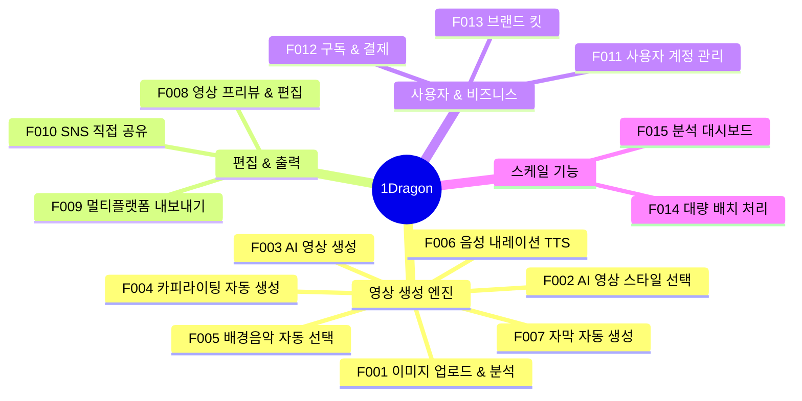
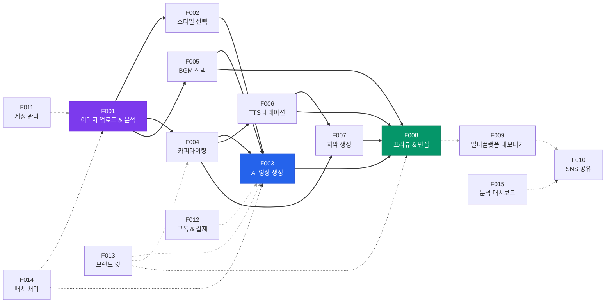

# 1Dragon 기능 명세서

> **작성일:** 2026-02-09
> **기반 문서:** TECH_RESEARCH.md, USER_RESEARCH.md, VISION.md, BUSINESS_MODEL.md, GTM_STRATEGY.md, MVP_SCOPE.md
> **문서 상태:** 프로덕트 기능 명세 초안

---

## 1. 기능 개요 맵 (전체 기능 트리)

**기능-Phase 매핑:**

| Phase | 기능 ID | 기능명 | 타겟 세그먼트 |
|:-----:|---------|--------|-------------|
| **MVP** | F001~F012 | 핵심 생성 파이프라인 + 계정/결제 | 1인 셀러, 중소 브랜드 마케터 |
| **Phase 2** | F008(에디터 확장), F013 | 라이트 에디터, 브랜드 킷 | 중소 브랜드, 에이전시 |
| **Phase 3** | F014 | 배치 처리 + API | 에이전시, 대기업 |
| **Phase 3~4** | F015 | 분석 대시보드 | 전체 (데이터 축적 후) |

---

## 2. 핵심 기능별 상세 명세

---

### F001: 이미지 업로드 & 분석

| 항목 | 내용 |
|------|------|
| **설명** | 사용자가 상품 사진을 업로드하면 AI가 자동으로 상품 카테고리, 색상, 키워드, 분위기를 분석하여 최적 영상 생성 파라미터를 결정한다 |
| **우선순위** | P0 |
| **Phase** | MVP |
| **관련 페르소나** | 전체 (최유진, 김민수, 이서연, 박준혁, Sarah Chen, 장하늘, 오성호) |

**입력:**

| 파라미터 | 필수 | 타입 | 제약 조건 |
|---------|:----:|------|----------|
| 상품 이미지 | O | JPEG, PNG, WebP | 최소 720x720px, 최대 20MB, sRGB |
| 상품명 | O | 텍스트 | 최대 100자 |
| 카테고리 (선택) | X | Enum | 패션/뷰티/식품/가전/악세서리/기타 |

**출력:**

| 필드 | 타입 | 설명 |
|------|------|------|
| product_category | Enum | 자동 감지된 상품 카테고리 |
| color_palette | Array[HexColor] | 상품 주요 색상 상위 5개 |
| keywords | Array[String] | 상품 설명 키워드 5개 (한국어) |
| mood | Enum | 모던/따뜻한/활기찬/고급스러운/캐주얼 |
| recommended_styles | Array[StyleID] | 추천 영상 스타일 3개 (랭킹순) |
| background_removed_image | URL | 배경 제거된 상품 이미지 |
| enhanced_image | URL | 업스케일된 이미지 (필요 시) |

**비즈니스 규칙:**

1. 이미지 해상도가 720px 미만이면 Real-ESRGAN으로 자동 업스케일링 후 진행
2. 비상품 이미지(풍경, 사람만, 텍스트만) 감지 시 "상품 사진을 올려주세요" 경고 + 재업로드 유도
3. 사용자가 카테고리를 직접 지정하면 AI 자동 감지보다 우선 적용
4. 배경 제거 실패 시(투명/복잡한 배경) 원본 이미지로 폴백하여 진행

**에지케이스:**

| 케이스 | 처리 |
|--------|------|
| 해상도 720px 미만 | Real-ESRGAN 자동 업스케일 -> 안내 메시지 "더 좋은 사진으로 더 좋은 영상" |
| 지원하지 않는 포맷 (GIF, BMP 등) | "JPEG 또는 PNG 형식으로 변환해주세요" 에러 |
| 20MB 초과 | 자동 압축 제안 + 클라이언트 사이드 리사이징 |
| EXIF 회전 정보 있는 이미지 | EXIF 기반 자동 회전 보정 |
| 여러 상품이 한 이미지에 포함 | 주요 상품 1개 자동 감지 + "하나의 상품만 포함된 사진을 추천합니다" 안내 |
| 배경이 이미 투명한 이미지 | 배경 제거 단계 스킵 |
| Claude Vision API 장애 | GPT-4o Vision으로 폴백 |

**에러 처리:**

| 에러 | HTTP | 메시지 | 사용자 액션 |
|------|------|--------|-----------|
| 파일 형식 미지원 | 400 | "지원하지 않는 이미지 형식입니다" | 다른 이미지 업로드 유도 |
| 파일 크기 초과 | 413 | "이미지가 너무 큽니다 (최대 20MB)" | 자동 압축 or 다른 이미지 |
| 분석 실패 | 500 | "이미지 분석 중 오류가 발생했습니다" | 재시도 버튼 + 다른 이미지 제안 |
| API 타임아웃 | 504 | "잠시 후 다시 시도해주세요" | 자동 재시도 (최대 3회) |

---

### F002: AI 영상 스타일 선택

| 항목 | 내용 |
|------|------|
| **설명** | 상품 분석 결과를 기반으로 최적 영상 스타일을 자동 추천하고, 사용자가 원하면 다른 스타일을 선택할 수 있다 |
| **우선순위** | P0 |
| **Phase** | MVP |
| **관련 페르소나** | 전체 |

**입력:**

| 파라미터 | 필수 | 타입 | 설명 |
|---------|:----:|------|------|
| image_analysis | O | F001 출력 | 이미지 분석 결과 |
| target_platform | X | Enum | TikTok/Shorts/Reels (기본: 전체) |
| user_preference | X | StyleID | 사용자 선호 스타일 (Level 1) |

**출력:**

| 필드 | 타입 | 설명 |
|------|------|------|
| selected_style | StyleID | 선택된/추천된 스타일 |
| style_preview | URL | 3초 미리보기 애니메이션 |
| motion_params | Object | 카메라 움직임, 전환 효과, 속도 파라미터 |

**비즈니스 규칙:**

1. Level 0 (완전 자동): AI가 추천한 최상위 스타일을 즉시 적용, 사용자 선택 UI 미노출
2. Level 1 (선택형): 5개 스타일 카드 노출, 각각 3초 미리보기 제공
3. 스타일 목록 (MVP 5개):
   - **심플**: 깔끔한 화이트 배경, 미니멀 전환, 정보 중심
   - **다이내믹**: 빠른 줌/패닝, 강렬한 전환, 에너지 넘치는 BGM
   - **감성**: 따뜻한 톤, 부드러운 전환, 감성적 BGM
   - **트렌디**: TikTok 트렌드 반영, 빠른 컷, 밈 요소
   - **프리미엄**: 고급스러운 색감, 느린 카메라 무브먼트, 럭셔리 BGM

**에지케이스:**

| 케이스 | 처리 |
|--------|------|
| 분석 결과와 사용자 선택이 상충 (예: 저가 생활용품 + 프리미엄 스타일) | 사용자 선택 우선. 경고 없음 |
| 카테고리별 스타일 적합도가 모두 낮은 경우 | "심플" 스타일을 기본값으로 |

**에러 처리:**

| 에러 | 메시지 | 사용자 액션 |
|------|--------|-----------|
| 스타일 프리뷰 로드 실패 | 정적 썸네일 폴백 표시 | - |
| 스타일 메타데이터 로드 실패 | "심플" 기본 적용 + 재시도 | 재시도 or 진행 |

---

### F003: AI 영상 생성 (핵심)

| 항목 | 내용 |
|------|------|
| **설명** | 하이브리드 엔진(AI 배경 생성 + 원본 상품 합성)으로 상품 정체성을 보존한 숏폼 마케팅 영상을 생성한다. 1Dragon의 핵심 차별화 기능 |
| **우선순위** | P0 |
| **Phase** | MVP |
| **관련 페르소나** | 전체 |

**입력:**

| 파라미터 | 필수 | 타입 | 설명 |
|---------|:----:|------|------|
| background_removed_image | O | URL | 배경 제거된 상품 이미지 |
| selected_style | O | StyleID | 선택된 영상 스타일 |
| copy_set | O | F004 출력 | 카피라이팅 결과 |
| bgm_track | O | F005 출력 | BGM 트랙 |
| narration | X | F006 출력 | TTS 음성 (옵션) |
| subtitles | O | F007 출력 | 자막 데이터 |
| video_length | X | Integer | 15초(Free) / 30초(Starter) |

**출력:**

| 필드 | 타입 | 설명 |
|------|------|------|
| video_url | URL | 생성된 영상 파일 (MP4) |
| video_metadata | Object | 해상도, 길이, fps, 파일 크기 |
| generation_time | Integer | 생성 소요 시간 (초) |
| quality_score | Float | 내부 품질 점수 (0~1) |
| platform_variants | Array[URL] | 플랫폼별 최적화 영상 3개 |

**비즈니스 규칙:**

1. **하이브리드 엔진 프로세스**:
   - Step 1: Remove.bg로 상품 배경 제거 -> 상품 전경 레이어 분리
   - Step 2: Runway Gen-4 Turbo로 배경/효과 영상 3클립 생성 (인트로/상품/CTA)
   - Step 3: 원본 상품 이미지를 레이어로 합성 (AI 환각 차단)
   - Step 4: FFmpeg로 카피+자막+BGM+내레이션+워터마크 합성
2. **품질 등급별 I2V 엔진**:
   - 유료 사용자: Runway Gen-4 Turbo ($0.50/건)
   - 무료 사용자: Hailuo 02 ($0.28/건)
   - 첫 영상 (전체): Runway Gen-4 (Best-foot-forward)
3. **생성 시간 SLA**: 60초 이내 (p95). 초과 시 프로그레스 바 + 인게이지먼트 UI
4. **자동 QC**: 생성 후 상품 유사도 검증. 유사도 70% 미만 시 자동 재생성 (최대 2회)
5. **영상 구성**: 3개 10초 클립 연결 (30초 기준)
   - 클립 1: 인트로 - 훅 카피 + 상품 등장 애니메이션
   - 클립 2: 클로즈업 - 상품 디테일 + 설명 카피
   - 클립 3: CTA - 행동 유도 + 브랜드/가격 정보

**에지케이스:**

| 케이스 | 처리 |
|--------|------|
| Runway API 장애 | Hailuo 02 -> Kling 2.6 순서 자동 폴백 |
| Rate Limit 초과 | 큐 대기 + "영상 준비 중" 상태 + 완료 알림 (푸시/이메일) |
| 상품 유사도 검증 실패 | 자동 재생성 2회 -> 실패 시 "다른 스타일로 다시 만들기" 유도 |
| 생성 시간 120초 초과 | 타임아웃 에러 + 자동 재시도 1회 + 폴백 모델 전환 |
| 투명 배경 이미지 입력 | 배경 제거 단계 스킵, 직접 I2V로 진행 |

**에러 처리:**

| 에러 | 메시지 | 사용자 액션 |
|------|--------|-----------|
| I2V 생성 실패 | "영상 생성 중 문제가 발생했습니다" | "다시 만들기" 버튼 (무료 재시도) |
| 모든 폴백 모델 실패 | "현재 서버가 바쁩니다. 잠시 후 다시 시도해주세요" | 이메일 알림 등록 옵션 |
| 크레딧 부족 | "이번 달 영상 생성 한도를 모두 사용했습니다" | 플랜 업그레이드 또는 크레딧 구매 |

---

### F004: 카피라이팅 자동 생성

| 항목 | 내용 |
|------|------|
| **설명** | 상품 분석 결과와 영상 스타일을 기반으로 한국어 마케팅 카피(훅, 설명, CTA)를 자동 생성한다 |
| **우선순위** | P0 |
| **Phase** | MVP |
| **관련 페르소나** | 전체 (특히 최유진 - 카피 작성 어려움) |

**입력:**

| 파라미터 | 필수 | 설명 |
|---------|:----:|------|
| product_name | O | 상품명 |
| image_analysis | O | 카테고리, 키워드, 분위기 |
| selected_style | O | 영상 스타일 |
| target_platform | X | 플랫폼별 카피 톤 조정 |

**출력:**

| 필드 | 설명 | 예시 |
|------|------|------|
| hook_copy | 첫 1~3초 훅 카피 | "이 악세서리, 진짜 2만 원?" |
| body_copy | 상품 설명 카피 (2~3문장) | "핸드메이드 실버 링. 하나뿐인 디자인." |
| cta_copy | 행동 유도 문구 | "지금 바로 스마트스토어에서 만나보세요" |
| hashtags | 추천 해시태그 5개 | #핸드메이드 #실버링 #악세서리 #유니크 #스마트스토어 |

**비즈니스 규칙:**

1. 3개 변형 카피 세트 동시 생성 (사용자 선택 가능)
2. 과대광고 표현 자동 필터링: "최고", "100%", "완벽한", "기적의" 등 주의 표현 경고
3. 플랫폼별 카피 톤 자동 조정: TikTok(캐주얼), Reels(감성적), Shorts(정보형)
4. 한국어 마춤법 검사 자동 적용

**에지케이스:**

| 케이스 | 처리 |
|--------|------|
| 상품명만 있고 이미지 분석 실패 | 상품명 기반 일반적 카피 생성 |
| 성인/의약품 관련 상품 감지 | 광고 규제 경고 + 보수적 카피 생성 |
| GPT-4o API 장애 | Claude Haiku 폴백 |

---

### F005: 배경음악 자동 선택

| 항목 | 내용 |
|------|------|
| **설명** | 상품 카테고리와 영상 스타일에 맞는 로열티 프리 BGM을 자동 매칭한다 |
| **우선순위** | P0 |
| **Phase** | MVP |
| **관련 페르소나** | 전체 (특히 최유진 - BGM 선정 어려움) |

**입력:** 영상 스타일, 상품 분위기, 영상 길이

**출력:** BGM 트랙 (MP3/WAV), BPM, 장르, 라이선스 정보

**비즈니스 규칙:**

1. Free 플랜: 기본 라이브러리 20곡
2. Starter 플랜: 전체 라이브러리 200+곡 + Udio AI 생성
3. 자동 덕킹: 내레이션 구간에서 BGM 볼륨 자동 -12dB
4. 모든 BGM은 상업적 사용 가능, YouTube/TikTok/Instagram 저작권 클리어 보장
5. 영상 길이에 맞춰 자동 페이드인/페이드아웃

**에지케이스:**

| 케이스 | 처리 |
|--------|------|
| 적합한 BGM 없음 | 분위기 유사도 기준 최근접 매칭 |
| Udio API 장애 | Stable Audio 폴백 / 로열티 프리 라이브러리 폴백 |
| 사용자가 BGM 없이 원함 | BGM 없음 옵션 제공 |

---

### F006: 음성 내레이션 (TTS)

| 항목 | 내용 |
|------|------|
| **설명** | 카피라이팅 결과를 한국어 자연어 음성으로 변환한다 |
| **우선순위** | P1 |
| **Phase** | MVP |
| **관련 페르소나** | 전체 |

**입력:** 카피 텍스트, 음성 선택 (3종), 속도 (0.8x~1.5x)

**출력:** 음성 파일 (WAV), 타임코드

**비즈니스 규칙:**

1. 한국어 기본 음성 3종: 여성 밝은 / 남성 차분 / 여성 전문
2. 내레이션은 옵션 (포함/미포함 토글)
3. 속도 조절: 0.8x (느림) ~ 1.5x (빠름), 기본 1.0x
4. Typecast API 사용, 감정 표현 지원

**에지케이스:**

| 케이스 | 처리 |
|--------|------|
| 카피 텍스트가 영상 길이 초과 | 자동 텍스트 축약 제안 또는 속도 1.2x 자동 적용 |
| 영어/숫자 혼합 텍스트 | 한국어 발음 규칙 적용 (예: "15,000원" -> "만 오천 원") |
| Typecast API 장애 | ElevenLabs -> Google Cloud TTS 폴백 |

---

### F007: 자막 자동 생성

| 항목 | 내용 |
|------|------|
| **설명** | 내레이션/카피를 기반으로 타임코드 동기화된 자막을 자동 생성한다 |
| **우선순위** | P0 |
| **Phase** | MVP |
| **관련 페르소나** | 전체 (무음 시청 대응 필수) |

**입력:** 내레이션 음성 파일 또는 카피 텍스트, 영상 타임라인

**출력:** SRT/VTT 자막 파일, 스타일 적용된 자막 레이어

**비즈니스 규칙:**

1. 무음 시청 사용자 비율 85% 이상 -> 자막은 기본 포함
2. 자막 스타일 3종: 심플 흰색 / 강조 노란 / 모션(단어별 등장)
3. 세이프 존 내 배치 (플랫폼별 하단 여백 자동 계산)
4. 한국어 WER 2~4% (Deepgram)

**에지케이스:**

| 케이스 | 처리 |
|--------|------|
| 내레이션 없는 영상 | 카피 텍스트를 타이밍 분배하여 자막 생성 |
| 자막이 세이프 존과 겹침 | 자동 위치 조정 (상단 또는 중앙) |
| Deepgram API 장애 | 카피 텍스트 기반 자막 직접 생성 (타임코드 추정) |

---

### F008: 영상 프리뷰 & 편집

| 항목 | 내용 |
|------|------|
| **설명** | 생성된 영상을 즉시 프리뷰하고, Phase에 따라 단계적 편집 기능을 제공한다 |
| **우선순위** | P0 (프리뷰) / P1 (라이트 에디터) / P2 (씬 에디터) |
| **Phase** | MVP (프리뷰) -> Phase 2 (라이트 에디터) -> Phase 3 (씬 에디터) |
| **관련 페르소나** | 전체 |

**MVP 범위 (Level 0~1):**

| 기능 | 설명 |
|------|------|
| 인앱 프리뷰 | 생성 즉시 영상 재생, 전체화면 지원 |
| 플랫폼 미리보기 | TikTok/Reels/Shorts 각각의 세이프 존 오버레이 표시 |
| 재생성 | "다른 스타일로 다시 만들기" 버튼 (최대 5회 무료) |
| 다운로드 | MP4 직접 다운로드 |

**Phase 2 확장 (Level 2 - 라이트 에디터):**

| 기능 | 설명 |
|------|------|
| 카피 수정 | 텍스트 직접 수정 |
| 폰트/색상 변경 | 브랜드 킷 연동 |
| 로고 위치 조정 | 드래그 앤 드롭 |
| 영상 길이 조절 | 트림 바 |
| BGM 변경 | 라이브러리에서 교체 |

**Phase 3 확장 (Level 3 - 씬 에디터):**

| 기능 | 설명 |
|------|------|
| 씬 순서 변경 | 드래그 앤 드롭으로 클립 순서 변경 |
| 개별 씬 효과 | 전환 효과, 속도, 필터 조정 |
| 타이밍 세밀 조정 | 씬별 시작/종료 시간 |
| 사운드 믹싱 | BGM/내레이션/효과음 볼륨 개별 조정 |

**에지케이스:**

| 케이스 | 처리 |
|--------|------|
| 5회 재생성 모두 불만족 | "더 좋은 사진으로 다시 시도해보세요" 가이드 + 고객지원 연결 |
| 프리뷰 로딩 실패 | 썸네일 + "다시 로드" 버튼 |
| 모바일에서 편집 시도 | MVP: "편집 기능은 PC에서 이용 가능합니다" / Phase 2: 모바일 편집 지원 |

---

### F009: 멀티플랫폼 내보내기

| 항목 | 내용 |
|------|------|
| **설명** | 1번 생성으로 TikTok, YouTube Shorts, Instagram Reels 3개 플랫폼에 최적화된 영상을 동시 출력한다 |
| **우선순위** | P0 |
| **Phase** | MVP (3개 플랫폼) -> Phase 2 (네이버 클립, 쿠팡 숏폼 추가) |
| **관련 페르소나** | 전체 |

**출력 규격:**

| 플랫폼 | 비율 | 해상도 | 최적 길이 | fps | 세이프 존 상단/하단 | 코덱 |
|--------|:----:|:------:|:--------:|:---:|:------------------:|:----:|
| TikTok | 9:16 | 1080x1920 | 15~30초 | 30 | 150px / 270px | H.264+AAC |
| YouTube Shorts | 9:16 | 1080x1920 | 30~60초 | 30 | 100px / 200px | H.264+AAC |
| Instagram Reels | 9:16 | 1080x1920 | 15~30초 | 30 | 120px / 250px | H.264+AAC |

**비즈니스 규칙:**

1. Free: 1개 플랫폼만 선택 출력 (워터마크 포함)
2. Starter: 3개 플랫폼 동시 출력
3. 각 플랫폼별 세이프 존, 텍스트 위치, CTA 배치 자동 최적화
4. 파일명 자동 지정: `[상품명]_[플랫폼]_[날짜].mp4`
5. 비트레이트: 8~12 Mbps (고화질 + 파일 크기 효율 균형)

**에지케이스:**

| 케이스 | 처리 |
|--------|------|
| 특정 플랫폼 규격 변경 | 서버 사이드 규격 설정 업데이트 (클라이언트 업데이트 불필요) |
| 파일 크기가 플랫폼 제한 초과 | 비트레이트 자동 하향 조정 |

---

### F010: SNS 직접 공유

| 항목 | 내용 |
|------|------|
| **설명** | 생성된 영상을 TikTok, Instagram에 원클릭으로 직접 업로드한다 |
| **우선순위** | P1 |
| **Phase** | MVP |
| **관련 페르소나** | 최유진, 장하늘 (개인 SNS 운영자) |

**비즈니스 규칙:**

1. TikTok: TikTok for Business API 연동, 계정 연결 필요
2. Instagram: Meta Graph API 연동, 비즈니스 계정 필요
3. YouTube: YouTube Data API 연동 (Phase 2)
4. 공유 시 캡션(카피)+해시태그 자동 채움
5. "Made with 1Dragon" 워터마크 포함 시 월 5건 추가 보너스

**에지케이스:**

| 케이스 | 처리 |
|--------|------|
| SNS 계정 미연결 | "계정 연결" 안내 -> 다운로드 후 직접 업로드 대안 |
| 업로드 실패 (네트워크) | 재시도 + 다운로드 대안 |
| 플랫폼 정책 변경 | API 호환성 모니터링 + 다운로드 폴백 항상 유지 |

---

### F011: 사용자 계정 관리

| 항목 | 내용 |
|------|------|
| **설명** | 소셜 로그인 기반 회원 가입, 프로필 관리, 생성 히스토리 조회 기능을 제공한다 |
| **우선순위** | P0 |
| **Phase** | MVP |
| **관련 페르소나** | 전체 |

**비즈니스 규칙:**

1. 소셜 로그인: 카카오(국내 1순위), Google, Apple
2. 가입 필수 정보: 이메일만 (소셜 로그인에서 자동 수집)
3. 선택 정보: 상호명, 판매 플랫폼, 상품 카테고리 (온보딩 시 수집)
4. 생성 히스토리: 최근 30일간 생성한 영상 목록, 다운로드/재다운로드
5. 잔여 크레딧 표시: "이번 달 N/30건 사용"

**에지케이스:**

| 케이스 | 처리 |
|--------|------|
| 동일 이메일로 다른 소셜 로그인 시도 | 기존 계정 연결 안내 |
| 계정 삭제 요청 | 30일 유예 후 영구 삭제, GDPR/개인정보보호법 준수 |
| 세션 만료 | 자동 재인증 (Refresh Token) |

---

### F012: 구독 & 결제

| 항목 | 내용 |
|------|------|
| **설명** | Freemium + 크레딧 기반 구독 결제 시스템 |
| **우선순위** | P0 |
| **Phase** | MVP (Free + Starter) -> Phase 2 (Pro) -> Phase 3 (Business/Enterprise) |
| **관련 페르소나** | 전체 |

**플랜 체계 (MVP):**

| 항목 | Free | Starter |
|------|:----:|:-------:|
| **가격** | ₩0 | ₩9,900/월 (연간 ₩7,900/월) |
| **영상 생성** | 월 3건 | 월 30건 |
| **해상도** | 1080x1920 | 1080x1920 |
| **영상 길이** | 최대 15초 | 최대 30초 |
| **워터마크** | 포함 (제거 불가) | 선택 (포함 시 +5건/월) |
| **스타일/템플릿** | 기본 5개 | 전체 50+개 |
| **출력 포맷** | 1개 플랫폼 | 3개 플랫폼 동시 |
| **BGM** | 기본 20곡 | 전체 200+곡 + AI 생성 |
| **TTS** | 1종 | 3종 |
| **결제 수단** | - | 카카오페이, 토스페이, 신용카드 |

**비즈니스 규칙:**

1. 무료 크레딧 소진 후 72시간 리밋 오퍼: "지금 구독하면 첫 달 50% 할인"
2. 연간 결제 시 20% 할인 (Starter ₩7,900/월)
3. 워터마크 포함 인센티브: 포함 시 월 5건 추가 무료 (바이럴 촉진)
4. 결제 실패 시 3일간 3회 자동 재시도 -> 실패 시 Free 플랜 다운그레이드
5. 환불 정책: 구독 시작 7일 이내 전액 환불

**에지케이스:**

| 케이스 | 처리 |
|--------|------|
| 결제 중 세션 종료 | 결제 상태 확인 + 미완료 시 복구 안내 |
| 이중 결제 | 자동 감지 + 즉시 환불 |
| 연간 -> 월간 전환 | 잔여 기간 만료 후 월간 전환 |
| 크레딧 이월 | 미사용 크레딧 이월 불가 (월 단위 리셋) |

---

### F013: 브랜드 킷 (Brand Kit)

| 항목 | 내용 |
|------|------|
| **설명** | 브랜드 로고, 폰트, 컬러 팔레트, 톤앤매너를 1회 등록하면 이후 모든 영상에 자동 적용한다 |
| **우선순위** | P1 |
| **Phase** | Phase 2 |
| **관련 페르소나** | 김민수(중소 브랜드), 이서연(에이전시), 박준혁(대기업) |

**입력:**

| 항목 | 설명 | 포맷 |
|------|------|------|
| 로고 | 브랜드 로고 이미지 | PNG (투명 배경 권장) |
| 프라이머리 컬러 | 브랜드 메인 색상 | HEX 코드 |
| 세컨더리 컬러 | 보조 색상 (최대 3개) | HEX 코드 |
| 폰트 | 브랜드 폰트 | 웹폰트 이름 또는 업로드 |
| 톤앤매너 | 브랜드 톤 설명 | 텍스트 (선택) |

**비즈니스 규칙:**

1. Pro 플랜: 3개 브랜드 킷 / Enterprise: 무제한
2. 브랜드 킷 등록 후 모든 영상에 자동 적용 (로고 위치, 자막 폰트/색상, 엔딩 화면)
3. 에이전시: 클라이언트별 독립 브랜드 킷 (데이터 격리)
4. 1회 설정 후 변경 없이 반복 사용 -> 리텐션 핵심 기능

---

### F014: 대량 배치 처리

| 항목 | 내용 |
|------|------|
| **설명** | 수십~수백 장의 상품 사진을 일괄 업로드하여 대량 영상을 자동 생성한다 |
| **우선순위** | P2 |
| **Phase** | Phase 3 |
| **관련 페르소나** | 이서연(에이전시), 박준혁(대기업), 오성호(도매) |

**입력:**

| 파라미터 | 설명 |
|---------|------|
| 이미지 폴더/ZIP | 최대 500장 일괄 업로드 |
| CSV/Excel | 상품명, 카테고리, 가격 등 메타데이터 |
| 공통 스타일 | 전체 적용할 기본 스타일 |
| 브랜드 킷 | 적용할 브랜드 킷 |

**비즈니스 규칙:**

1. Pro: 최대 50장 / Business: 최대 200장 / Enterprise: 무제한
2. 배치 진행률 실시간 표시 (N/총 M건 완료)
3. 개별 영상 품질 QC 후 "승인 대기" 상태 -> 일괄 승인 또는 개별 재생성
4. 배치 우선순위: Enterprise > Business > Pro (대기열 관리)
5. 야간 배치 할인: 새벽 2~6시 생성 시 크레딧 20% 할인

---

### F015: 분석 대시보드

| 항목 | 내용 |
|------|------|
| **설명** | 생성된 영상의 SNS 성과 데이터를 수집하여 인사이트를 제공한다 |
| **우선순위** | P2 |
| **Phase** | Phase 2~3 (데이터 축적 후) |
| **관련 페르소나** | 김민수(중소 브랜드), 이서연(에이전시), 박준혁(대기업) |

**데이터 포인트:**

| 지표 | 설명 | 소스 |
|------|------|------|
| 조회수 | 플랫폼별 영상 조회수 | TikTok/Instagram/YouTube API |
| 참여율 | 좋아요, 댓글, 공유 비율 | 플랫폼 API |
| 생성 통계 | 월별 생성 건수, 스타일별 분포 | 내부 데이터 |
| ROI 계산 | "이번 달 외주 대비 ₩N 절감" | 내부 계산 |
| 트렌드 추천 | 이번 주 인기 스타일, 성과 좋은 카테고리 | 내부 분석 |

**비즈니스 규칙:**

1. 기본 통계: 전체 플랜 제공 (생성 건수, 잔여 크레딧)
2. 성과 분석: Pro 이상 (SNS 연동 시)
3. ROI 대시보드: "이번 달 1Dragon로 절약한 시간: N시간, 금액: ₩N"
4. 주간 성과 리포트 이메일 자동 발송

---

## 3. 기능 의존성 맵

> 실선: MVP 필수 의존성 / 점선: Phase 2+ 확장 의존성

---

## 4. 기능-페르소나 매핑 매트릭스

| 기능 | 최유진 (1인 셀러) | 김민수 (중소 브랜드) | 이서연 (에이전시) | 박준혁 (대기업) | Sarah Chen (글로벌) | 장하늘 (인플루언서) | 오성호 (도매) |
|------|:---:|:---:|:---:|:---:|:---:|:---:|:---:|
| **F001 이미지 업로드** | ★★★★★ | ★★★★★ | ★★★★★ | ★★★★☆ | ★★★★★ | ★★★★☆ | ★★★★★ |
| **F002 스타일 선택** | ★★★★★ | ★★★★☆ | ★★★☆☆ | ★★☆☆☆ | ★★★★☆ | ★★★★★ | ★★★★★ |
| **F003 AI 영상 생성** | ★★★★★ | ★★★★★ | ★★★★★ | ★★★★★ | ★★★★★ | ★★★★★ | ★★★★★ |
| **F004 카피라이팅** | ★★★★★ | ★★★★☆ | ★★★☆☆ | ★★☆☆☆ | ★★★★☆ | ★★★★☆ | ★★★★★ |
| **F005 BGM** | ★★★★★ | ★★★★☆ | ★★★☆☆ | ★★☆☆☆ | ★★★★☆ | ★★★★★ | ★★★★☆ |
| **F006 TTS** | ★★★★☆ | ★★★☆☆ | ★★☆☆☆ | ★★☆☆☆ | ★★★★★ | ★★☆☆☆ | ★★★★☆ |
| **F007 자막** | ★★★★★ | ★★★★★ | ★★★★☆ | ★★★★☆ | ★★★★★ | ★★★★★ | ★★★★★ |
| **F008 프리뷰/편집** | ★★★☆☆ | ★★★★☆ | ★★★★★ | ★★★★★ | ★★★★☆ | ★★★★★ | ★★☆☆☆ |
| **F009 멀티플랫폼** | ★★★★☆ | ★★★★★ | ★★★★★ | ★★★★★ | ★★★★★ | ★★★★★ | ★★★☆☆ |
| **F010 SNS 공유** | ★★★★★ | ★★★★☆ | ★★★☆☆ | ★★☆☆☆ | ★★★★★ | ★★★★★ | ★★★☆☆ |
| **F011 계정 관리** | ★★★★☆ | ★★★★☆ | ★★★★☆ | ★★★★★ | ★★★★☆ | ★★★★☆ | ★★★★☆ |
| **F012 구독/결제** | ★★★★☆ | ★★★★☆ | ★★★★☆ | ★★★★★ | ★★★★☆ | ★★★★☆ | ★★★☆☆ |
| **F013 브랜드 킷** | ★☆☆☆☆ | ★★★★★ | ★★★★★ | ★★★★★ | ★★★☆☆ | ★★☆☆☆ | ★☆☆☆☆ |
| **F014 배치 처리** | ★★☆☆☆ | ★★★☆☆ | ★★★★★ | ★★★★★ | ★★★☆☆ | ★☆☆☆☆ | ★★★★★ |
| **F015 분석 대시보드** | ★★★☆☆ | ★★★★★ | ★★★★★ | ★★★★★ | ★★★★☆ | ★★★★☆ | ★★★☆☆ |

> ★★★★★ = 핵심 니즈, ★★★☆☆ = 보통, ★☆☆☆☆ = 거의 불필요

---

## Sources

| 참조 문서 | 경로 | 주요 인용 |
|----------|------|----------|
| 기술 조사 보고서 | `/docs/01-research/TECH_RESEARCH.md` | API 스펙, 비용, 폴백 전략 |
| 사용자 조사 보고서 | `/docs/01-research/USER_RESEARCH.md` | 페르소나, 니즈 우선순위, 커스터마이징 레벨, 플랫폼 스펙 |
| 비전 & 전략 | `/docs/02-strategy/VISION.md` | 설계 원칙 (Progressive Disclosure, Product Fidelity First) |
| 비즈니스 모델 | `/docs/02-strategy/BUSINESS_MODEL.md` | 가격 티어, 기능별 플랜 매핑 |
| MVP 범위 정의 | `/docs/03-product/MVP_SCOPE.md` | MVP 포함/제외 기능, 기술 아키텍처 |

---

**문서 작성일**: 2026-02-09
**다음 업데이트**: 각 기능별 와이어프레임 연동 후 상세 UI 스펙 추가

---

> **역할 정의**
> 본 문서 작성에 다음 역할이 수행되었습니다:
> - **프로덕트 매니저**: 기능 범위 정의, 우선순위 결정, 페르소나 매핑
> - **시스템 분석가**: 입출력 정의, 비즈니스 규칙 명세, 에지케이스/에러 처리 설계
> - **테크니컬 라이터**: 기능 의존성 분석, 다이어그램 작성, 구조화된 명세 문서화
