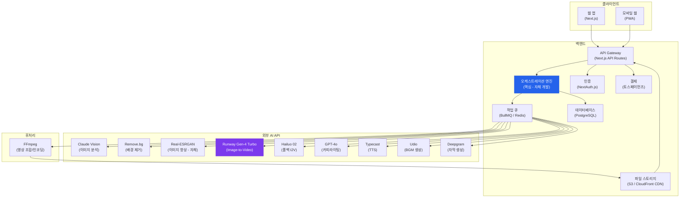
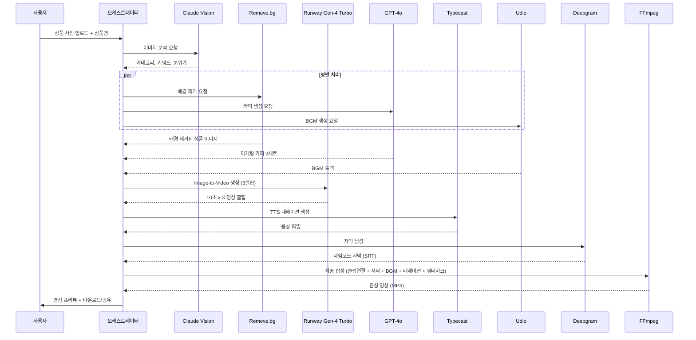
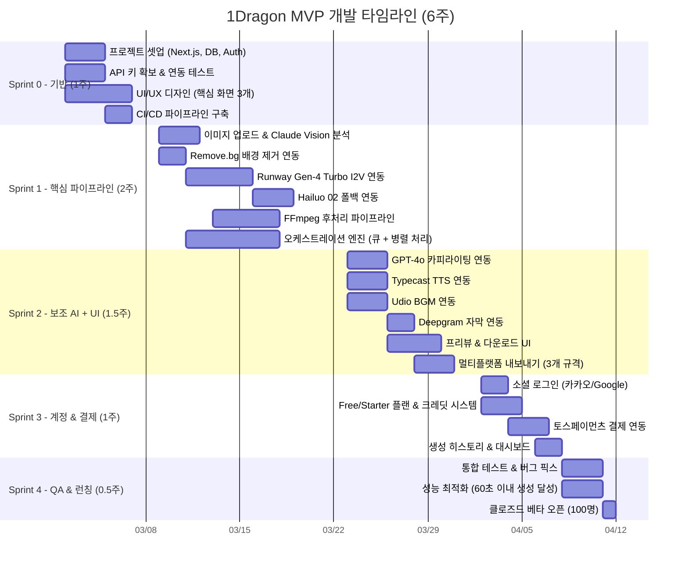

# 1Dragon MVP 범위 정의

> **작성일:** 2026-02-09
> **기반 문서:** TECH_RESEARCH.md, USER_RESEARCH.md, VISION.md, BUSINESS_MODEL.md, GTM_STRATEGY.md
> **문서 상태:** 프로덕트 정의 초안

---

## 1. MVP 목표

### 1.1 핵심 가설

> **"상품 사진 1장 + 상품명만으로 15초 숏폼 영상을 60초 이내에 생성하면, 1인 셀러의 영상 콘텐츠 제작 빈도가 3배 이상 증가한다."**

이 가설은 다음 3가지 하위 가설로 분해된다.

| # | 하위 가설 | 검증 지표 | 목표값 | 검증 방법 | 판정 시점 |
|---|----------|----------|--------|----------|----------|
| H1 | 상품 사진 1장으로 생성한 15초 영상이 수동 제작 영상 대비 70% 이상의 광고 성과(CTR)를 달성한다 | CTR 비교 | AI 영상 CTR >= 수동 영상 CTR x 0.7 | 베타 유저 50명 A/B 테스트 (Meta/TikTok 광고) | Beta 4주차 |
| H2 | 1인 셀러가 첫 영상을 60초 이내에 생성하면, 주간 영상 제작 빈도가 3배 이상 증가한다 | 주간 영상 생성 수 | Week 1 대비 Week 4에서 3x | 코호트 분석 (주간 활성 사용자 생성 로그) | MVP 4주차 |
| H3 | "Made with 1Dragon" 워터마크 포함 영상의 바이럴 계수(K-factor)가 0.3 이상이다 | K-factor | >= 0.3 | 워터마크 영상 -> 서비스 유입 추적 (UTM) | MVP 8주차 |
| H4 | 무료 사용자의 유료 전환율이 2% 이상이다 (B2C 기준) | Free -> Paid CVR | >= 2% | 무료 크레딧 소진 후 72시간 내 전환율 추적 | MVP 12주차 |

### 1.2 성공 기준 (3개월)

| 카테고리 | 지표 | 목표 | 근거 |
|---------|------|------|------|
| **성장** | 가입 사용자 수 | 10,000명 | GTM_STRATEGY M3 목표 |
| **Activation** | 첫 영상 생성률 (가입 -> 첫 생성) | 40% 이상 | GTM_STRATEGY Activation Rate 목표 |
| **Activation** | Time-to-Value (가입 -> 영상 확인) | 60초 이내 | VISION 원칙 "2분 안에 가치를 보여라" |
| **품질** | 영상 생성 성공률 | 95% 이상 | 첫 시도에 "쓸 만한" 영상 생성 |
| **품질** | 평균 영상 생성 시간 | 60초 이내 | 핵심 가설 직결 |
| **리텐션** | Week 1 리텐션 | 25% 이상 | GTM_STRATEGY 초기 성공 지표 |
| **매출** | 유료 전환율 | 2% 이상 | SaaS Freemium B2C 벤치마크 |
| **매출** | 유료 고객 수 | 250명 | 10,000명 x 2.5% 전환 기준 |
| **바이럴** | K-factor | >= 0.3 | PLG 초기 목표 |
| **비용** | 영상 1건 원가 (COGS) | <= $1.00 | TECH_RESEARCH 옵션 C 기준 $0.93 |

### 1.3 타겟 사용자 (MVP)

**1순위: 네이버 스마트스토어 1인 셀러**

| 속성 | 상세 |
|------|------|
| **규모** | 활성 1인 셀러 35~40만 명 (전체 셀러의 60~70%) |
| **대표 페르소나** | 최유진 (29세) - 스마트스토어 "유니크마인드" 대표 |
| **핵심 고충** | 하루 14시간+ 근무, 영상 편집 기술 전무, 월 영상 제작 0~1개, 예산 월 5~10만 원 |
| **기대** | 사진 올리고 버튼 한 번이면 영상 완성, 편집 지식 제로에서 사용 가능 |
| **선정 이유** | Pain Point 극대화, PLG 바이럴 잠재력(셀러 커뮤니티 구전 효과), 즉시 의사결정(개인) |

**2순위: 중소 패션/뷰티 브랜드 마케팅 담당자**

| 속성 | 상세 |
|------|------|
| **규모** | 국내 활성 중소 브랜드 마케터 약 5~10만 명 추정 |
| **대표 페르소나** | 김민수 (32세) - (주)어반핏 마케팅 담당자 |
| **핵심 고충** | 상품당 영상 제작 2.5~3.5시간, 주간 2~3개 한계, 외주 건당 15~30만 원 |
| **기대** | 상품 사진 3~5장 업로드 -> 플랫폼별 영상 즉시 생성, 브랜드 톤앤매너 유지 |

---

## 2. MVP 포함 기능

### 2.1 핵심 기능 (Must Have)

| ID | 기능명 | 설명 | 우선순위 | Phase | 관련 페르소나 |
|----|--------|------|---------|-------|-------------|
| F001 | 이미지 업로드 & 분석 | 상품 사진 1장 업로드, Claude Vision으로 카테고리/속성/키워드 자동 추출 | P0 | MVP | 전체 |
| F002 | AI 영상 스타일 선택 | 상품 카테고리 기반 최적 스타일 자동 추천 + 3~5개 중 선택 | P0 | MVP | 전체 |
| F003 | AI 영상 생성 | Runway Gen-4 Turbo 기반 Image-to-Video, 하이브리드 엔진(AI 배경 + 원본 상품 합성) | P0 | MVP | 전체 |
| F004 | 카피라이팅 자동 생성 | GPT-4o 기반 한국어 마케팅 카피(훅, CTA, 설명) 자동 생성 | P0 | MVP | 전체 |
| F005 | 배경음악 자동 선택 | 상품 카테고리/분위기 기반 로열티 프리 BGM 자동 매칭 | P0 | MVP | 전체 |
| F006 | 음성 내레이션 (TTS) | Typecast 기반 한국어 TTS, 기본 3종 음성 | P1 | MVP | 전체 |
| F007 | 자막 자동 생성 | Deepgram 기반 자동 자막 + 타임코드 동기화 | P0 | MVP | 전체 |
| F008 | 영상 프리뷰 | 생성된 영상 즉시 프리뷰, "다른 스타일로 다시 만들기" 기능 | P0 | MVP | 전체 |
| F009 | 멀티플랫폼 내보내기 | TikTok/YouTube Shorts/Instagram Reels 3개 플랫폼 규격 자동 출력 | P0 | MVP | 전체 |
| F010 | SNS 직접 공유 | TikTok/Instagram에 원클릭 직접 업로드 | P1 | MVP | 최유진, 장하늘 |
| F011 | 사용자 계정 관리 | 소셜 로그인 (카카오/Google), 기본 프로필, 생성 히스토리 | P0 | MVP | 전체 |
| F012 | 구독 & 결제 | Free/Starter 2개 플랜, 인앱 결제 (카카오페이/신용카드) | P0 | MVP | 전체 |

### 2.2 각 기능별 상세 스펙

#### F001: 이미지 업로드 & 분석

| 항목 | 스펙 |
|------|------|
| **입력** | JPEG/PNG, 최대 20MB, 최소 720x720px |
| **분석 엔진** | Claude Vision API |
| **출력 데이터** | 상품 카테고리, 색상 팔레트, 주요 키워드 5개, 분위기(모던/따뜻한/활기찬 등), 추천 스타일 3개 |
| **처리 시간** | 3초 이내 |
| **에지케이스** | 저해상도 이미지 -> Real-ESRGAN 자동 업스케일링, 비상품 이미지 -> 경고 메시지 + 재업로드 유도 |
| **에러 처리** | 지원하지 않는 포맷 -> 변환 안내, 파일 크기 초과 -> 자동 압축 제안 |

#### F002: AI 영상 스타일 선택

| 항목 | 스펙 |
|------|------|
| **스타일 수** | MVP 기본 5개 (심플/다이내믹/감성/트렌디/프리미엄) |
| **추천 로직** | 상품 카테고리 x 플랫폼(TikTok/Reels/Shorts) 조합 기반 자동 추천 |
| **미리보기** | 각 스타일별 3초 샘플 애니메이션 |
| **커스터마이징** | Level 0 (완전 자동): 추천 스타일 즉시 적용 / Level 1 (선택형): 5개 중 택 1 |

#### F003: AI 영상 생성 (핵심)

| 항목 | 스펙 |
|------|------|
| **생성 엔진** | Runway Gen-4 Turbo (메인) + Hailuo 02 (무료 티어/폴백) |
| **하이브리드 엔진** | Remove.bg로 배경 제거 -> AI가 배경/효과 생성 -> 원본 상품 이미지 레이어 합성 -> FFmpeg 후처리 |
| **출력 사양** | 9:16, 1080x1920, 15초(Free)/30초(Starter), 30fps, H.264+AAC |
| **클립 구성** | 3개 10초 클립 연결 (30초 기준): 인트로(훅) + 상품 클로즈업 + CTA |
| **생성 시간** | 60초 이내 (목표 45초) |
| **품질 보장** | 첫 영상은 Runway Gen-4(최고 품질)로 생성 (Best-foot-forward 전략) |
| **재생성** | "다른 스타일로 다시 만들기" 최대 5회 무료 재시도 |
| **폴백** | Runway 실패 시 -> Hailuo 02 -> Kling 2.6 순서 자동 폴백 |

#### F004: 카피라이팅 자동 생성

| 항목 | 스펙 |
|------|------|
| **엔진** | GPT-4o API |
| **생성 요소** | 훅 카피 (1~3초), 상품 설명 카피, CTA 문구 |
| **입력** | 상품명 + 이미지 분석 결과 (카테고리, 키워드, 분위기) |
| **출력** | 3개 변형 카피 세트 (사용자 선택 가능) |
| **언어** | 한국어 (MVP) |
| **규제 준수** | 과대광고 표현 자동 필터링 ("최고", "100%", "완벽" 등 주의 표현 경고) |

#### F005: 배경음악 자동 선택

| 항목 | 스펙 |
|------|------|
| **음원 소스** | Udio API 기반 AI 생성 + 로열티 프리 라이브러리 20곡(Free) / 200+곡(Starter) |
| **매칭 로직** | 상품 카테고리 x 스타일 x 영상 길이 기반 자동 매칭 |
| **볼륨** | 자동 덕킹 (내레이션 시 BGM 볼륨 자동 감소) |
| **라이선스** | 전체 상업적 사용 가능, TikTok/YouTube/Instagram 저작권 클리어 보장 |

#### F006: 음성 내레이션 (TTS)

| 항목 | 스펙 |
|------|------|
| **엔진** | Typecast API |
| **음성** | 한국어 기본 3종 (여성 밝은/남성 차분/여성 전문) |
| **입력** | 카피라이팅 자동 생성 결과물 또는 사용자 직접 입력 |
| **옵션** | 내레이션 포함/미포함 토글 |
| **품질** | 감정 표현 지원, 자연스러운 한국어 발화 |

#### F007: 자막 자동 생성

| 항목 | 스펙 |
|------|------|
| **엔진** | Deepgram API |
| **타임코드** | 단어 단위 +-50ms 정밀도 |
| **한국어 WER** | 2~4% (Deepgram 한국어 성능) |
| **스타일** | 기본 자막 스타일 3종 (심플 흰색/강조 노란/모션) |
| **위치** | 세이프 존 자동 계산, 하단 중앙 기본 배치 |

#### F008: 영상 프리뷰

| 항목 | 스펙 |
|------|------|
| **프리뷰** | 생성 즉시 인앱 재생, 플랫폼별 세이프 존 오버레이 표시 |
| **재생성** | "다른 스타일로 다시 만들기" 버튼, 최대 5회 무료 |
| **다운로드** | MP4 직접 다운로드 |
| **편집** | MVP에서는 편집 없음 (Level 0~1만 지원) |

#### F009: 멀티플랫폼 내보내기

| 항목 | 스펙 |
|------|------|
| **플랫폼** | TikTok, YouTube Shorts, Instagram Reels |
| **자동 최적화** | 세이프 존, 최적 길이, 비트레이트 각 플랫폼별 자동 조정 |
| **출력 포맷** | 9:16, 1080x1920, 30fps, H.264+AAC, 8~12Mbps |
| **워터마크** | Free: "Made with 1Dragon" 포함(제거 불가) / Starter: 선택(포함 시 +5건/월 보너스) |

---

## 3. MVP 제외 기능 (이유 포함)

| 기능 | 제외 이유 | 예정 Phase |
|------|----------|-----------|
| 브랜드 킷 (Brand Kit) | 1인 셀러 MVP에서는 브랜드 가이드라인 불필요. 중소 브랜드/에이전시 확장 시 필수 | Phase 2 |
| A/B 테스트 복수 버전 | 퍼포먼스 마케팅 고도화 기능. MVP 핵심 가치 검증 후 추가 | Phase 2 |
| 대량 배치 처리 | 에이전시/대기업 대상 기능. MVP는 1건씩 개별 생성에 집중 | Phase 3 |
| 라이트 에디터 | Level 2 커스터마이징. MVP는 Level 0~1만 지원하여 극단적 단순함 유지 | Phase 2 |
| 씬 에디터 / 프로 에디터 | Level 3~4 커스터마이징. 에이전시/프로 세그먼트 대상 | Phase 3 |
| API 연동 | 에이전시/개발자 대상. MVP는 웹 UI 전용 | Phase 3 |
| 스마트스토어 연동 | 네이버 커머스 API 파트너 신청 + 개발 필요. MVP 직후 최우선 추가 | Phase 1.5 (M4~M6) |
| 쿠팡/카페24 연동 | 플랫폼별 별도 개발 필요 | Phase 2 |
| 다국어 자막/TTS | 글로벌 셀러 대상. MVP는 한국어 전용 | Phase 2~3 |
| Virtual Try-On | 기술 성숙도 베타 수준, 프로덕션 도입에 3~6개월 검증 필요 (TECH_RESEARCH) | Phase 3+ |
| 4K 출력 | 추가 비용 발생 + 대부분 플랫폼에서 1080p로 충분 | Phase 2 (Pro) |
| 팀 협업 기능 | B2B 전용 기능. MVP는 개인 사용자 대상 | Phase 2~3 |
| 승인 워크플로우 | 대기업 전용 기능 | Phase 4 |
| SSO/RBAC | 엔터프라이즈 보안 요구사항 | Phase 4 |
| PIM/DAM 연동 | 엔터프라이즈 시스템 통합 | Phase 4 |
| 분석 대시보드 | 영상 성과 분석. MVP 이후 리텐션 강화 시 추가 | Phase 2 |
| 트렌드 자동 추천 | 데이터 축적 후 가능. Nice-to-have 기능 | Phase 2~3 |

---

## 4. MVP 기술 스택

### 4.1 아키텍처 개요

**오케스트레이션 파이프라인 (핵심 자체 개발):**

### 4.2 API 의존성 & 비용

| 서비스 | 역할 | 비용/건 (USD) | 비용/건 (KRW) | 무료 티어 | 대체 불가도 | 폴백 |
|--------|------|:------------:|:------------:|----------|:----------:|------|
| **Claude Vision** | 이미지 분석 | $0.005 | ~₩7 | 웹 무료 | 낮음 | Gemini Vision, GPT-4o Vision |
| **Remove.bg** | 배경 제거 | $0.200 | ~₩260 | 월 1장 | 낮음 | SAM 2 (자체 호스팅) |
| **Real-ESRGAN** | 이미지 향상 | $0.000 | ₩0 | 자체 호스팅 | - | Magnific AI |
| **Runway Gen-4 Turbo** | Image-to-Video | $0.500 | ~₩650 | 없음 | **높음** | Hailuo 02, Kling 2.6 |
| **Hailuo 02** | I2V 폴백/무료 티어 | $0.280 | ~₩364 | 없음 | 중간 | Kling 2.6 |
| **GPT-4o** | 카피라이팅 | $0.010 | ~₩13 | $5 크레딧 | 낮음 | Claude Haiku |
| **Typecast** | 한국어 TTS | $0.100 | ~₩130 | 월 5분 | 중간 | ElevenLabs, Google TTS |
| **Udio** | BGM 생성 | $0.100 | ~₩130 | $10/월 구독 | 낮음 | Stable Audio |
| **Deepgram** | 자막 생성 | $0.010 | ~₩13 | $200/월 무료 | 낮음 | Whisper (자체) |
| **FFmpeg** | 영상 후처리 | $0.000 | ₩0 | 오픈소스 | - | - |
| **합계** | | **$0.93** | **₩1,210** | | | |

> **핵심 의존**: Image-to-Video 모델(Runway Gen-4 Turbo)이 유일한 대체 불가 외부 의존성. Runway + Hailuo + Kling 3중 폴백 필수.

**무료 티어 비용 최적화:**

| 구분 | 유료 사용자 | 무료 사용자 |
|------|-----------|-----------|
| I2V 엔진 | Runway Gen-4 Turbo ($0.50) | Hailuo 02 ($0.28) |
| 영상 1건 원가 | $0.93 (₩1,210) | $0.56 (₩728) |
| 월간 쿼터 | 30건 (Starter) | 3건 |
| 목적 | 프리미엄 품질 -> 리텐션 | 체험 -> 바이럴 |

---

## 5. MVP 타임라인

### 5.1 4~6주 개발 스프린트 계획

### 5.2 마일스톤

| 마일스톤 | 시점 | 완료 기준 | 의사결정 포인트 |
|---------|------|----------|---------------|
| **M0: 프로젝트 킥오프** | Week 0 | 팀 구성, 기술 스택 확정, API 키 확보 | - |
| **M1: 핵심 파이프라인 동작** | Week 3 | 사진 1장 -> 15초 영상 생성 성공 (E2E) | 영상 품질 1차 검증. "Good Enough" 임계선(55%) 도달 여부 |
| **M2: 보조 AI 통합** | Week 4.5 | 카피+BGM+TTS+자막이 포함된 완성 영상 생성 | 60초 이내 생성 시간 달성 여부 |
| **M3: 계정 & 결제** | Week 5.5 | 가입 -> 생성 -> 결제 전체 플로우 동작 | Free/Starter 플랜 체계 검증 |
| **M4: 클로즈드 베타** | Week 6 | 100명 베타 테스터 대상 서비스 오픈 | NPS 40+ 달성 여부 -> MVP 런칭 Go/No-Go |
| **M5: MVP 퍼블릭 런칭** | Week 8~10 | 베타 피드백 반영, Product Hunt 런칭 | Activation Rate 35% 이상 -> PMF 1차 신호 |
| **M6: PMF 검증** | Week 12 | 유료 전환율 2%+, Week 1 리텐션 25%+ | Seed 라운드 준비 또는 피벗 결정 |

---

## 6. MVP 리스크 & 완화

| # | 리스크 | 영향도 | 발생 확률 | 완화 전략 |
|---|--------|:------:|:--------:|----------|
| 1 | **AI 영상 품질 임계점 미달**: 생성 영상이 "Good Enough" 수준에 미달하여 Activation 실패 (40~60% 영구 이탈) | 매우 높음 | 중간 | 하이브리드 엔진(배경 AI + 상품 원본 합성)으로 상품 정체성 100% 보존. 첫 영상 Best-foot-forward 전략(Runway Gen-4). 멀티 모델 폴백(Runway+Hailuo+Kling) |
| 2 | **Runway API 장애/Rate Limit**: 핵심 I2V API 서비스 중단 또는 Rate Limit 초과 | 높음 | 중간 | 3중 폴백(Runway -> Hailuo -> Kling). 비동기 큐 시스템으로 Rate Limit 대응. "영상 준비 중" 상태 + 완료 알림 UX |
| 3 | **60초 이내 생성 시간 미달성**: API 응답 지연으로 생성 시간 초과 | 중간 | 높음 | 병렬 처리(배경 제거+카피+BGM 동시 호출). 프로그레스 바 + 인게이지먼트 UI("생성 중에 다른 상품도 올려보세요") |
| 4 | **영상 저작권 이슈**: AI 생성 BGM의 YouTube/TikTok 저작권 주장 | 중간 | 중간 | 로열티 프리 라이브러리 우선 사용. Udio API 상업 라이선스 확인. 저작권 클레임 발생 시 자동 대체 BGM 제공 |
| 5 | **비용 초과**: 무료 사용자 영상 생성 비용이 예산 초과 | 높음 | 중간 | 무료 티어는 Hailuo(건당 ₩728)로 비용 억제. 월 3건 제한. 무료 크레딧 소진 후 72시간 리밋 오퍼로 전환 유도 |
| 6 | **규제 리스크**: 한국 AI 기본법(2026.01 시행) AI 생성 표시 의무 | 낮음 | 확실 | 영상 메타데이터에 AI 생성 정보 자동 삽입. "Made with 1Dragon (AI-generated)" 표기. C2PA Content Credentials 표준 도입 준비 |
| 7 | **경쟁사 선점**: Creatify, Amazon Video Generator 등이 한국 시장 진입 | 중간 | 중간 | 네이버/쿠팡 생태계 네이티브 연동으로 선점. 한국어 특화(Typecast TTS + Claude Vision). 4~6주 빠른 MVP 출시 |
| 8 | **베타 사용자 모집 실패**: 클로즈드 베타 100명 미달 | 낮음 | 낮음 | Pre-launch 웨이트리스트 3,000명 목표. 셀러 커뮤니티 시딩(아이보스, 네이버 카페). 웨이트리스트 순위제 바이럴 루프 |

---

## Sources

본 문서의 모든 데이터와 수치는 Phase 1~2 문서에 근거합니다.

| 참조 문서 | 경로 | 주요 인용 |
|----------|------|----------|
| 기술 조사 보고서 | `/docs/01-research/TECH_RESEARCH.md` | 옵션 C 기술 스택, API 비용, 영상 원가, 기술 리스크 |
| 사용자 조사 보고서 | `/docs/01-research/USER_RESEARCH.md` | 페르소나, 커스터마이징 레벨, 플랫폼 스펙, 니즈 우선순위, 가설 |
| 비전 & 전략 | `/docs/02-strategy/VISION.md` | 미션, 설계 원칙, 성공 지표, 차별화 전략 |
| 비즈니스 모델 | `/docs/02-strategy/BUSINESS_MODEL.md` | 가격 정책, 단위 경제학, 수익 모델 |
| GTM 전략 | `/docs/02-strategy/GTM_STRATEGY.md` | 런칭 전략, 타겟 세그먼트, 초기 성공 지표, 팀 구성 |

---

**문서 작성일**: 2026-02-09
**다음 단계**: FEATURE_SPEC.md 기능 명세서, USER_FLOWS.md 사용자 플로우 작성

---

> **역할 정의**
> 본 문서 작성에 다음 역할이 수행되었습니다:
> - **프로덕트 매니저**: MVP 범위 정의, 핵심 가설 설정, 성공 기준 수립, 기능 우선순위 결정
> - **테크니컬 아키텍트**: 기술 스택 설계, 아키텍처 다이어그램, API 의존성 분석, 파이프라인 설계
> - **프로젝트 매니저**: 스프린트 계획, 마일스톤 정의, 리스크 매트릭스 작성
