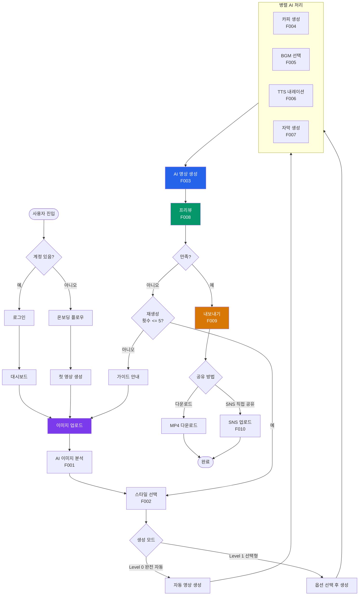
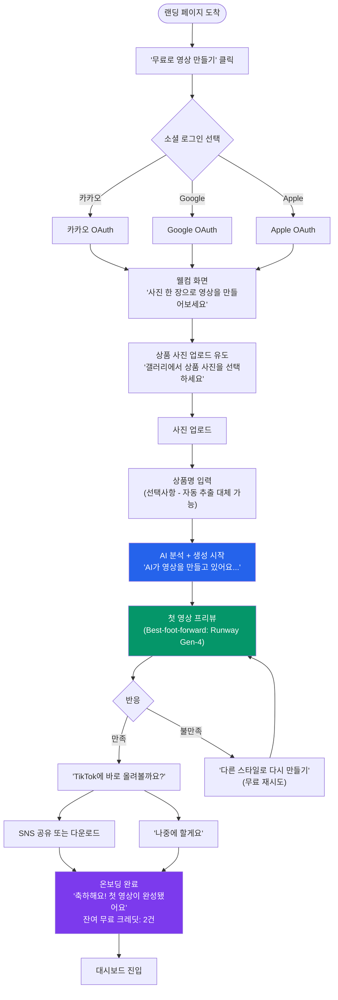
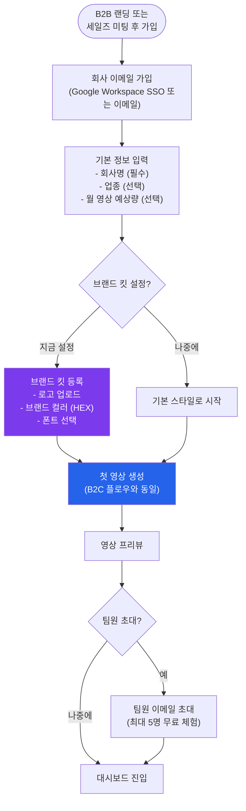
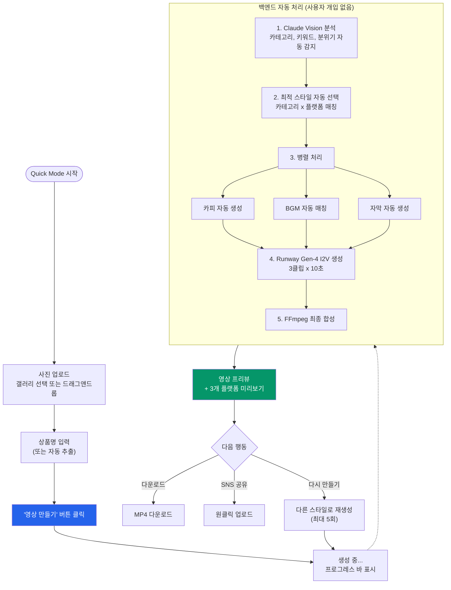
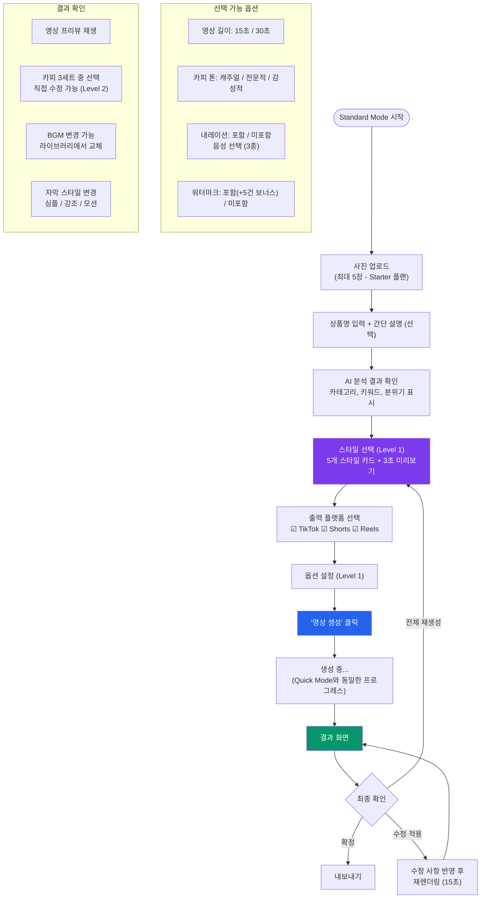
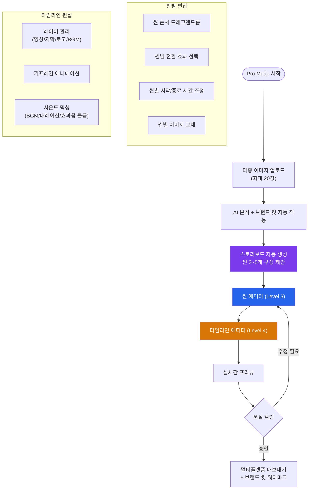

> [<- 허브로 돌아가기](../USER_FLOWS.md)

# 1Dragon 사용자 플로우 -- 온보딩 + 영상 생성

> **원본 문서:** USER_FLOWS.md (2026-02-09)
> **범위:** 섹션 1 (핵심 플로우 다이어그램) + 섹션 2 (온보딩 플로우) + 섹션 3 (영상 생성 플로우)

---

## 1. 핵심 플로우 다이어그램

### 1.1 전체 서비스 플로우 개요

사용자가 1Dragon에 진입하여 영상을 생성하고 활용하기까지의 전체 플로우를 다음과 같이 정의한다.

### 1.2 사용자 여정 단계별 매핑

| 여정 단계 | 플로우 | 관련 기능 | 핵심 지표 |
|----------|--------|----------|----------|
| **Acquisition** | 랜딩 -> 가입 | F011 | 가입 전환율 |
| **Activation** | 온보딩 -> 첫 영상 생성 | F001~F008 | Time-to-Value (60초 이내) |
| **Retention** | 반복 영상 생성 -> 대시보드 | F001~F010 | Week 1 리텐션 25%+ |
| **Revenue** | 무료 크레딧 소진 -> 구독 | F012 | Free->Paid CVR 2%+ |
| **Referral** | 워터마크 영상 공유 -> 바이럴 | F009, F010 | K-factor 0.3+ |

---

## 2. 온보딩 플로우

### 2.1 B2C 온보딩 (1인 셀러 - 최유진 페르소나)

**설계 원칙**: Time-to-Value < 60초. 가입과 동시에 첫 영상 생성을 시작한다. 별도의 튜토리얼은 제공하지 않으며, "첫 영상 만들기" 자체가 온보딩이다.

**단계별 화면 상태:**

| 단계 | 화면 | 소요 시간 | 에러 상태 |
|------|------|----------|----------|
| 1. 랜딩 | CTA 버튼 중심, 샘플 영상 자동 재생 | - | - |
| 2. 로그인 | 소셜 로그인 3종 버튼 | 3초 | OAuth 실패 -> 재시도 안내 |
| 3. 웰컴 | 단순 안내 텍스트 + 업로드 버튼 | 2초 | - |
| 4. 사진 업로드 | 갤러리 접근 또는 드래그앤드롭 | 5초 | 미지원 포맷 -> 안내 메시지 |
| 5. 상품명 입력 | 텍스트 필드 (선택) | 5초 | - |
| 6. AI 생성 중 | 프로그레스 바 + 단계별 안내 애니메이션 | 30~60초 | 생성 실패 -> 자동 재시도 |
| 7. 첫 결과 | 영상 프리뷰 + 재생성/공유 버튼 | - | - |

**에지케이스:**

| 케이스 | 처리 |
|--------|------|
| 갤러리 권한 거부 (모바일) | "사진 접근 권한이 필요합니다" + 설정 이동 링크 |
| 상품명 미입력 | Claude Vision 분석 결과에서 상품명 자동 추출 시도 -> 실패 시 "상품명" 기본값 |
| 첫 영상 생성 실패 | "잠시 후 다시 시도해주세요" + 자동 재시도 1회 + 폴백 모델 |
| 네트워크 불안정 | 오프라인 상태 감지 -> "인터넷 연결을 확인해주세요" |
| 소셜 로그인 동일 이메일 충돌 | "이미 가입된 이메일입니다. [카카오/Google]로 로그인해주세요" |

---

### 2.2 B2B 온보딩 (중소 브랜드/에이전시 - 김민수, 이서연 페르소나)

**설계 원칙**: 팀 설정과 브랜드 킷 등록을 온보딩에 포함하되, 첫 영상 생성은 3분 이내에 가능해야 한다. 복잡한 설정은 온보딩 이후로 미룬다.

**B2B 온보딩 차별점:**

| 항목 | B2C | B2B |
|------|-----|-----|
| 가입 방식 | 소셜 로그인 원클릭 | 회사 이메일 + 기본 정보 |
| 브랜드 설정 | 없음 (MVP) | 선택적 브랜드 킷 (Phase 2) |
| 첫 영상 생성 | 즉시 (30초) | 기본 정보 입력 후 (2~3분) |
| 팀 기능 | 없음 | 팀원 초대 (Phase 2) |
| 온보딩 완료 기준 | 첫 영상 생성 | 첫 영상 생성 + 팀원 1명 초대 |

---

## 3. 영상 생성 플로우

### 3.1 Quick Mode (Level 0 - 완전 자동)

**대상 사용자**: 최유진(1인 셀러), 오성호(도매). 편집 기술이 없거나 극도의 시간 효율을 원하는 사용자.

**핵심 경험**: 사진 업로드 -> 버튼 1번 -> 영상 완성. 중간 선택 과정 없음.

**프로그레스 바 단계 표시:**

| 진행률 | 표시 메시지 | 실제 처리 단계 | 예상 시간 |
|:------:|-----------|-------------|:--------:|
| 0~10% | "상품을 분석하고 있어요..." | Claude Vision 이미지 분석 | ~3초 |
| 10~25% | "배경을 정리하고 있어요..." | Remove.bg 배경 제거 | ~3초 |
| 25~40% | "마케팅 카피를 쓰고 있어요..." | GPT-4o 카피 생성 (병렬) | ~5초 |
| 40~75% | "영상을 만들고 있어요..." | Runway Gen-4 I2V 생성 | ~30초 |
| 75~90% | "음악과 자막을 넣고 있어요..." | BGM + TTS + 자막 합성 | ~10초 |
| 90~100% | "거의 다 됐어요!" | FFmpeg 최종 인코딩 | ~5초 |

**인게이지먼트 UI (생성 대기 중):**
- "생성 중에 다른 상품 사진도 올려보세요" (다음 영상 큐잉)
- 카테고리별 성공 사례 슬라이드 ("패션 셀러 A님은 이 스타일로 조회수 1.2만 달성")
- 현재 생성 중인 영상의 스타일 미리보기 썸네일

---

### 3.2 Standard Mode (Level 1~2 - 선택형/라이트 에딧)

**대상 사용자**: 김민수(중소 브랜드), 장하늘(인플루언서). 자동 생성 기반이지만 스타일/카피/BGM을 직접 선택하고 싶은 사용자.

**Level 1 vs Level 2 기능 분리:**

| 항목 | Level 1 (선택형) | Level 2 (라이트 에딧, Phase 2) |
|------|-----------------|-------------------------------|
| 스타일 | 5개 중 택 1 | 5개 중 택 1 + 커스텀 파라미터 |
| 카피 | 3세트 중 택 1 | 직접 수정 가능 |
| BGM | 분위기 기반 자동 매칭 | 라이브러리에서 직접 교체 |
| 자막 | 스타일 3종 택 1 | 폰트/색상/크기 변경 |
| 영상 길이 | 15초 / 30초 택 1 | 트림 바로 정밀 조정 |
| 브랜드 킷 | N/A | 로고/컬러 자동 적용 |

**에지케이스:**

| 케이스 | 처리 |
|--------|------|
| 5장 업로드 시 1장이 미지원 포맷 | 해당 이미지만 건너뛰기 + 안내 메시지 |
| 스타일 미리보기 로딩 실패 | 정적 썸네일 폴백 + "미리보기를 불러올 수 없습니다" |
| 카피 수정 후 영상 길이 초과 | "카피가 영상 길이를 초과합니다. 줄이거나 속도를 높일까요?" |
| 내레이션 포함 선택 시 TTS 실패 | 내레이션 없이 생성 + "내레이션 생성에 실패했습니다. 자막만 포함됩니다" 안내 |

---

### 3.3 Pro Mode (Level 3~4 - 씬 에디터/프로 에디터, Phase 2~3)

**대상 사용자**: 이서연(에이전시), 박준혁(대기업). 세밀한 편집 제어가 필요한 전문가.

> **Note**: MVP에는 포함되지 않으며, Phase 2~3에서 단계적으로 구현된다.

