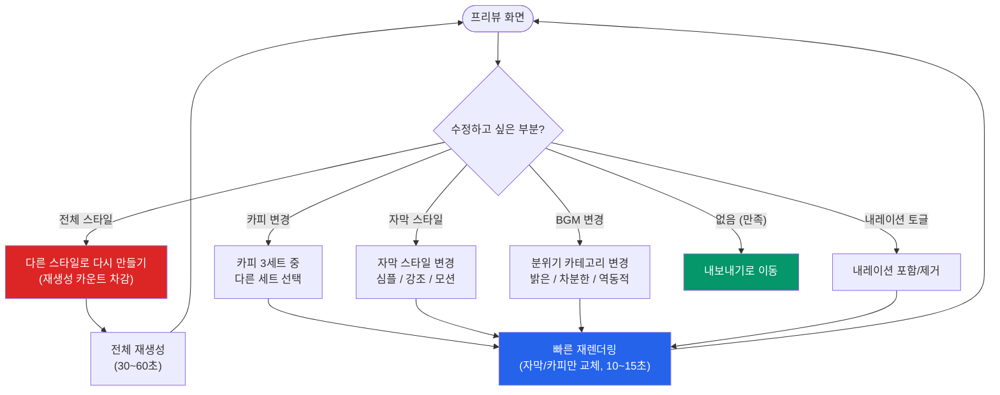
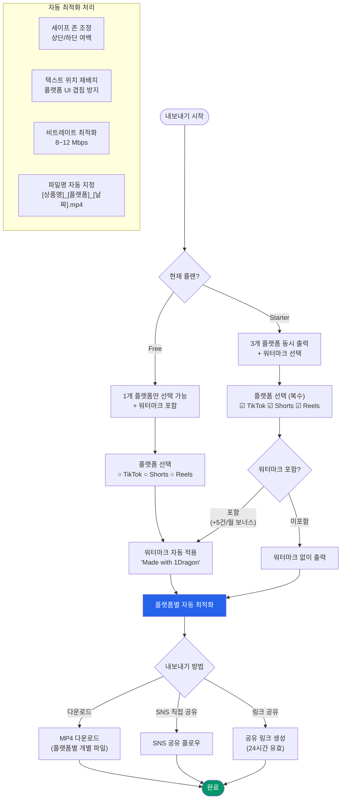
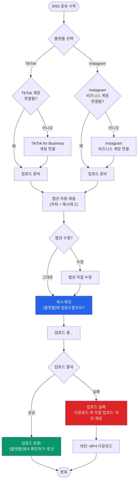
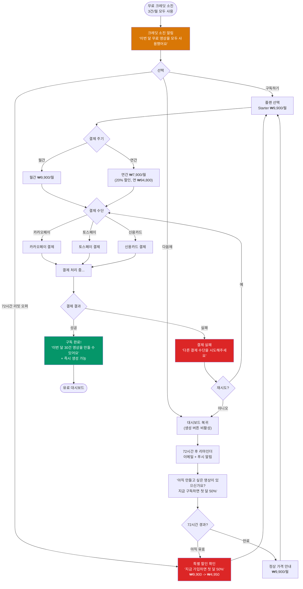
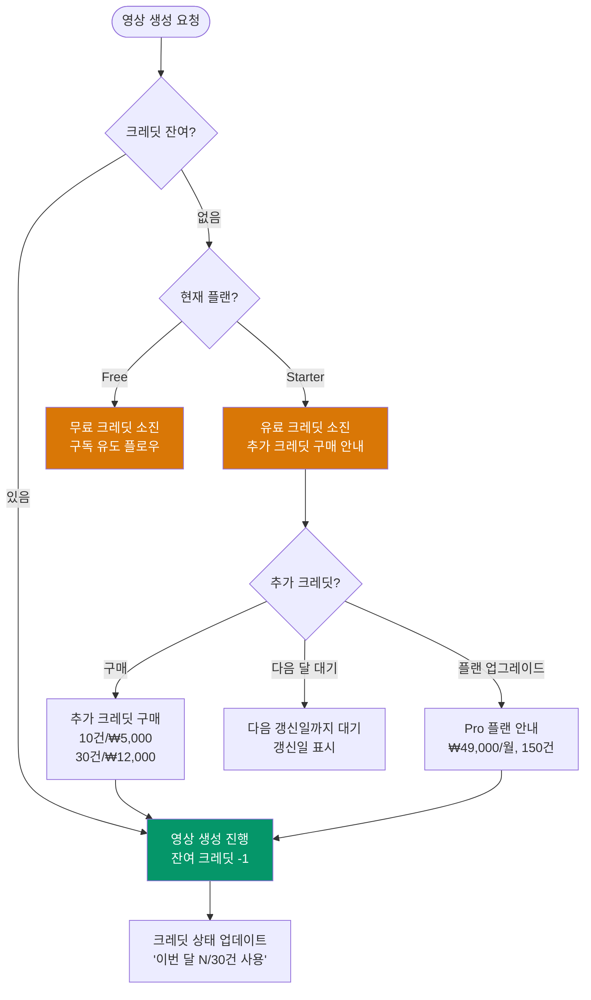
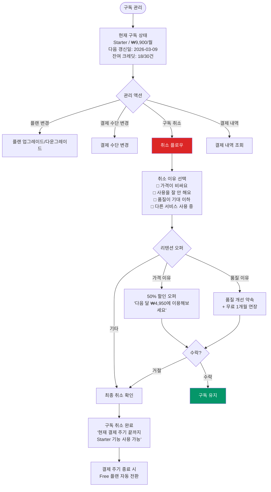

> [<- 허브로 돌아가기](../USER_FLOWS.md)

# 1Dragon 사용자 플로우 -- 편집 + 내보내기 + 결제

> **원본 문서:** USER_FLOWS.md (2026-02-09)
> **범위:** 섹션 4 (편집 플로우) + 섹션 5 (내보내기 & 공유 플로우) + 섹션 6 (결제 & 구독 플로우)

---

## 4. 편집 플로우

### 4.1 MVP 편집 플로우 (Level 0~1)

MVP에서 편집 기능은 최소화하여, 사용자가 생성된 결과를 확인하고 재생성하는 것에 집중한다. "편집"이 아닌 "선택"의 개념으로 접근한다.

**전체 재생성 vs 빠른 재렌더링:**

| 구분 | 전체 재생성 | 빠른 재렌더링 |
|------|-----------|-------------|
| **소요 시간** | 30~60초 | 10~15초 |
| **크레딧 소모** | 1건 차감 (재생성 5회 무료) | 차감 없음 |
| **변경 범위** | 스타일, 영상 클립, 전환 효과 전체 | 카피 텍스트, 자막 스타일, BGM, 내레이션만 |
| **API 호출** | Runway Gen-4 재호출 | FFmpeg만 재합성 |
| **비용** | ~$0.50 (I2V 비용 포함) | ~$0.01 (FFmpeg만) |

**에지케이스:**

| 케이스 | 처리 |
|--------|------|
| 재생성 5회 모두 불만족 | "더 좋은 사진으로 시도해보세요" 가이드 + 고객지원 연결 |
| 빠른 재렌더링 중 서버 오류 | 이전 버전 유지 + 재시도 안내 |
| 카피 수정 시 금칙어(과대광고) 포함 | 경고 메시지 "과장된 표현이 포함되어 있습니다" + 수정 제안 |

---

## 5. 내보내기 & 공유 플로우

### 5.1 멀티플랫폼 내보내기

### 5.2 SNS 직접 공유 플로우

**플랫폼별 세이프 존 스펙:**

| 플랫폼 | 상단 여백 | 하단 여백 | 좌우 여백 | 자막 위치 기본값 |
|--------|:--------:|:--------:|:--------:|:------------:|
| TikTok | 150px | 270px | 40px | 하단 중앙 (270px 위) |
| YouTube Shorts | 100px | 200px | 30px | 하단 중앙 (200px 위) |
| Instagram Reels | 120px | 250px | 40px | 하단 중앙 (250px 위) |

**에지케이스:**

| 케이스 | 처리 |
|--------|------|
| SNS 계정 연결 해제 상태 | 재연결 안내 + 다운로드 대안 |
| 업로드 중 네트워크 끊김 | 로컬에 영상 캐시 + 재시도 안내 |
| 플랫폼 API 변경/장애 | 다운로드 폴백 항상 유지 + 인앱 알림 |
| 캡션 글자 수 초과 (TikTok 4000자/Instagram 2200자) | 자동 축약 + "캡션이 길어서 일부 생략됩니다" 안내 |

---

## 6. 결제 & 구독 플로우

### 6.1 Free -> Paid 전환 (크레딧 소진 시)

**전환 유도 타이밍:**

| 시점 | 트리거 | 메시지 | 채널 |
|------|--------|--------|------|
| 크레딧 잔여 1건 | 영상 생성 완료 시 | "무료 영상이 1건 남았어요" | 인앱 배너 |
| 크레딧 소진 | 생성 시도 시 | "이번 달 무료 영상을 모두 사용했어요" | 인앱 모달 |
| 소진 후 24시간 | 타이머 트리거 | "아까 만들던 영상, 계속 만들어볼까요?" | 푸시 + 이메일 |
| 소진 후 48시간 | 타이머 트리거 | "지금 구독하면 첫 달 50% 할인" | 이메일 |
| 소진 후 72시간 | 리밋 오퍼 만료 | "할인이 곧 종료됩니다" | 푸시 + 이메일 |
| 다음 월 초 | 크레딧 리셋 | "새 무료 영상 3건이 충전됐어요!" | 푸시 |

### 6.2 크레딧 소진 & 갱신 플로우

### 6.3 구독 관리 플로우

**결제 실패 자동 처리:**

| 시점 | 액션 | 사용자 알림 |
|------|------|-----------|
| 갱신일 결제 실패 | 자동 재시도 1회 | "결제에 실패했습니다. 결제 수단을 확인해주세요" (이메일) |
| +1일 | 자동 재시도 2회 | "결제가 처리되지 않았습니다" (푸시 + 이메일) |
| +3일 | 자동 재시도 3회 (최종) | "결제 수단을 업데이트해주세요. 미처리 시 Free 플랜으로 전환됩니다" (이메일) |
| +7일 | Free 플랜 다운그레이드 | "구독이 만료되었습니다. 재구독하면 이전 영상 기록이 복원됩니다" (이메일) |

**환불 정책 플로우:**

| 조건 | 환불 | 처리 |
|------|------|------|
| 구독 시작 7일 이내 | 전액 환불 | 즉시 Free 플랜 전환, 생성 영상은 유지 |
| 7일 초과 | 환불 불가 | 현재 주기 끝까지 이용 후 취소 |
| 이중 결제 | 중복분 즉시 환불 | 자동 감지 + 24시간 내 처리 |
