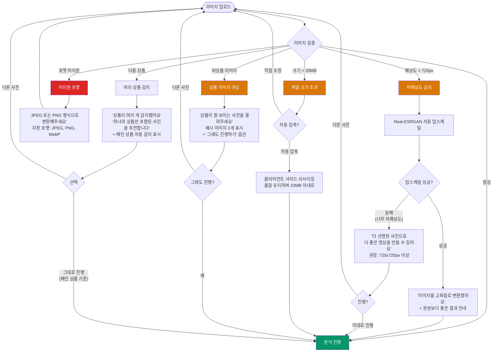
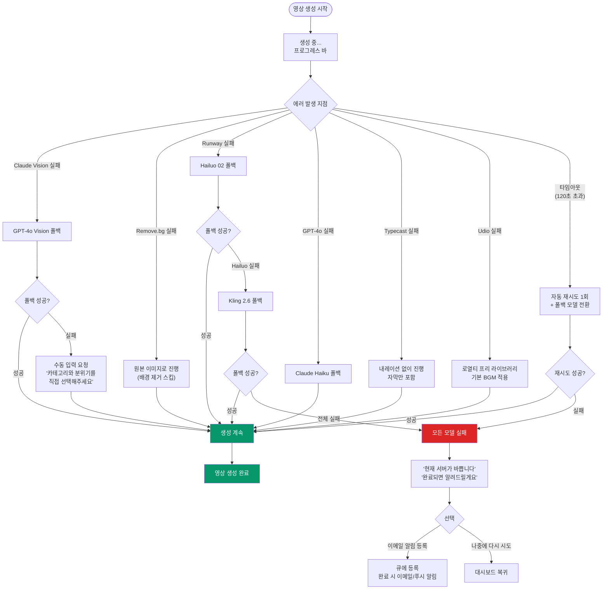
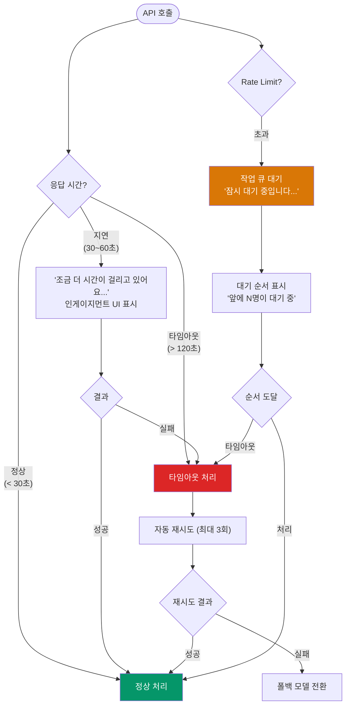
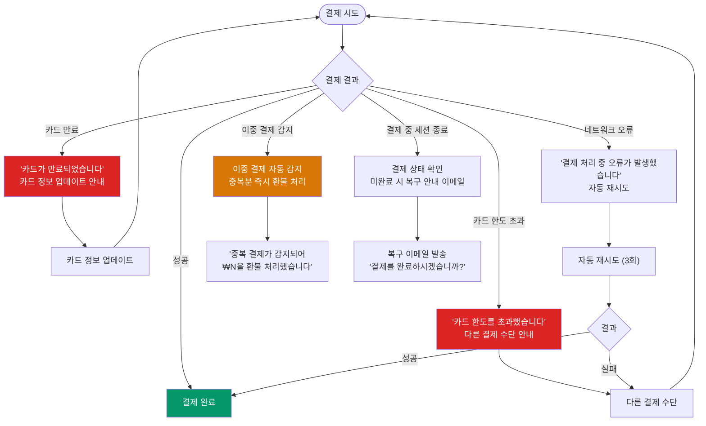
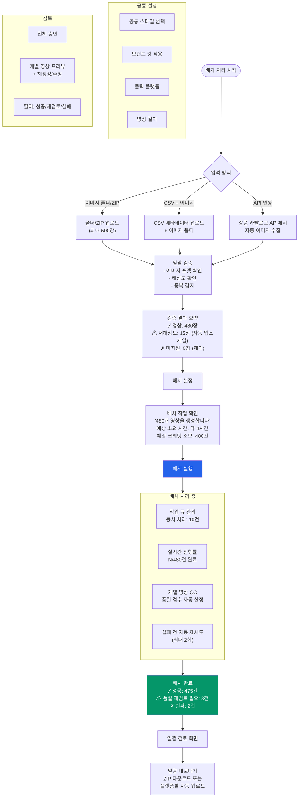

> [<- 허브로 돌아가기](../USER_FLOWS.md)

# 1Dragon 사용자 플로우 -- 에러/예외 + 배치 처리

> **원본 문서:** USER_FLOWS.md (2026-02-09)
> **범위:** 섹션 7 (에러 & 예외 플로우) + 섹션 8 (배치 처리 플로우) + 부록 (화면 상태 매트릭스)

---

## 7. 에러 & 예외 플로우

### 7.1 이미지 품질 문제

### 7.2 영상 생성 실패

**폴백 체인 요약:**

| 서비스 | 메인 | 폴백 1 | 폴백 2 | 최종 처리 |
|--------|------|--------|--------|----------|
| 이미지 분석 | Claude Vision | GPT-4o Vision | Gemini Vision | 수동 카테고리 입력 |
| 배경 제거 | Remove.bg | SAM 2 (자체) | - | 원본 이미지로 진행 |
| Image-to-Video | Runway Gen-4 Turbo | Hailuo 02 | Kling 2.6 | 대기열 + 알림 |
| 카피라이팅 | GPT-4o | Claude Haiku | - | 기본 템플릿 카피 |
| TTS | Typecast | ElevenLabs | Google Cloud TTS | 내레이션 없이 진행 |
| BGM | Udio | Stable Audio | - | 로열티 프리 라이브러리 |
| 자막 | Deepgram | Whisper (자체) | - | 카피 텍스트 기반 자막 |

### 7.3 API 타임아웃 & Rate Limit

### 7.4 결제 실패

---

## 8. 배치 처리 플로우 (Phase 3)

> **Note**: 배치 처리는 MVP에 포함되지 않으며, Phase 3에서 에이전시/대기업 대상으로 구현된다. 아래는 미래 구현 참조용 플로우이다.

### 8.1 대량 영상 일괄 생성

**배치 우선순위 & 제한:**

| 플랜 | 최대 배치 수 | 동시 처리 | 우선순위 | 야간 할인 (02~06시) |
|------|:-----------:|:--------:|:--------:|:-----------------:|
| Pro | 50장 | 5건 | 보통 | 20% 크레딧 할인 |
| Business | 200장 | 10건 | 높음 | 20% 크레딧 할인 |
| Enterprise | 무제한 | 20건 | 최우선 | 커스텀 |

**배치 에러 처리:**

| 에러 유형 | 처리 | 사용자 알림 |
|----------|------|-----------|
| 개별 이미지 분석 실패 | 건너뛰기 + 실패 목록에 추가 | 배치 완료 리포트에 표시 |
| I2V 생성 실패 (개별) | 자동 재시도 2회 -> 폴백 모델 -> 실패 처리 | 재시도 후에도 실패한 건만 알림 |
| Rate Limit 초과 | 큐 대기 + 처리 속도 자동 조절 | "예상 시간이 늘어났습니다" |
| 전체 API 장애 | 배치 일시 정지 + 복구 후 자동 재개 | "일시적으로 중단됩니다. 복구 시 자동 재개됩니다" |
| 크레딧 부족 (도중) | 현재까지 완료분 저장 + 잔여 건 대기 | "크레딧이 부족합니다. 추가 구매 후 나머지를 처리합니다" |

---

## 부록: 플로우별 화면 상태 매트릭스

### 전체 화면 상태 정의

| 상태 | 설명 | UI 표현 |
|------|------|--------|
| **로딩 (Loading)** | 데이터 또는 리소스를 불러오는 중 | 스켈레톤 UI + 스피너 |
| **빈 상태 (Empty)** | 표시할 데이터가 없음 | 일러스트 + 행동 유도 CTA |
| **에러 (Error)** | 처리 실패 | 에러 메시지 + 원인 설명 + 해결 액션 |
| **권한 없음 (Forbidden)** | 접근 권한이 없는 기능 | 플랜 업그레이드 유도 |
| **성공 (Success)** | 처리 완료 | 성공 메시지 + 다음 행동 유도 |
| **생성 중 (Generating)** | AI 영상 생성 진행 중 | 프로그레스 바 + 단계 표시 + 인게이지먼트 |
| **크레딧 소진 (Exhausted)** | 월간 크레딧 사용 완료 | 구독/크레딧 구매 유도 |

### 주요 화면별 상태 조합

| 화면 | 로딩 | 빈 상태 | 에러 | 권한 없음 | 성공 |
|------|:----:|:------:|:----:|:--------:|:----:|
| 대시보드 | 스켈레톤 | "첫 영상을 만들어보세요!" | 데이터 로드 실패 + 재시도 | - | - |
| 이미지 업로드 | 업로드 프로그레스 | 드래그앤드롭 영역 | 파일 검증 실패 메시지 | - | 분석 완료 |
| 스타일 선택 | 미리보기 로딩 | - | 스타일 로드 실패 | - | 스타일 선택됨 |
| 영상 생성 | 프로그레스 바 + 단계별 | - | 생성 실패 + 재시도/폴백 | 크레딧 소진 | 프리뷰 준비됨 |
| 프리뷰 | 영상 버퍼링 | - | 영상 로드 실패 | - | 재생 가능 |
| 내보내기 | 인코딩 프로그레스 | - | 인코딩 실패 | Free 제한 (1개 플랫폼) | 다운로드 준비 |
| 생성 히스토리 | 스켈레톤 | "아직 만든 영상이 없어요" | 목록 로드 실패 | - | 영상 목록 표시 |
| 결제 | 결제 처리 중 | - | 결제 실패 + 대안 | - | 결제 완료 |
| 구독 관리 | - | Free 플랜 상태 | 구독 정보 로드 실패 | - | 현재 구독 표시 |

---

## Sources

| 참조 문서 | 경로 | 주요 인용 |
|----------|------|----------|
| 기술 조사 보고서 | `/docs/01-research/TECH_RESEARCH.md` | 폴백 체인, API 비용, 생성 시간 SLA |
| 사용자 조사 보고서 | `/docs/01-research/USER_RESEARCH.md` | 페르소나 여정 맵, 커스터마이징 레벨, 플랫폼 세이프 존, 이탈 위험 지점 |
| 비전 & 전략 | `/docs/02-strategy/VISION.md` | Time-to-Value 원칙, Progressive Disclosure, Product Fidelity First |
| 비즈니스 모델 | `/docs/02-strategy/BUSINESS_MODEL.md` | 가격 티어, 크레딧 시스템, 워터마크 인센티브, 환불 정책 |
| GTM 전략 | `/docs/02-strategy/GTM_STRATEGY.md` | 바이럴 루프, PLG 전략, 전환 유도 타이밍, AARRR KPI |
| MVP 범위 정의 | `/docs/03-product/MVP_SCOPE.md` | MVP 포함/제외 기능, 기술 아키텍처, 오케스트레이션 파이프라인 |
| 기능 명세서 | `/docs/03-product/FEATURE_SPEC.md` | F001~F015 기능 스펙, 비즈니스 규칙, 에지케이스, 의존성 맵 |

---

**문서 작성일**: 2026-02-09
**다음 업데이트**: UI 와이어프레임 연동 후 화면별 상세 인터랙션 추가, Playwright E2E 시나리오 작성

---

> **역할 정의**
> 본 문서 작성에 다음 역할이 수행되었습니다:
> - **UX 디자이너**: 사용자 플로우 설계, 온보딩 트랙 분리, 화면 상태 정의, Progressive Disclosure 적용
> - **프로덕트 매니저**: 전환 유도 전략, 크레딧 소진 시나리오, 리텐션 오퍼 설계
> - **시스템 분석가**: 에러/예외 플로우, 폴백 체인 설계, API 타임아웃 처리, 배치 에러 핸들링
> - **테크니컬 라이터**: Mermaid 다이어그램 작성, 구조화된 문서화, 에지케이스 체계화
