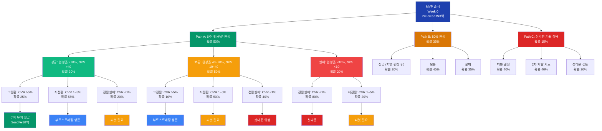

# 의사결정 경로 분석 (Decision Paths)

## 1. 전체 의사결정 트리 (Mermaid)

## 2. 분기점별 상세 분석

### 2.1 분기점 1: 개발 완료도 (Week 6)

| 경로 | 확률 | 조건 | 핵심 KPI | 의사결정 |
|------|------|------|----------|----------|
| **Path A: 6주 완성** | **50%** | 모든 기능 구현, 60초 생성, 베타 오픈 가능 | 하이브리드 엔진 동작, 3중 폴백 완비 | 예정대로 런칭 |
| **Path B: 80% 완성** | **35%** | 핵심 기능 OK, 보조 기능(TTS/결제) 미완 | 영상 생성 가능, 일부 기능 제약 | **축소 런칭** (영상 생성만 먼저) |
| **Path C: 기술 장애** | **15%** | 하이브리드 엔진 실패, 품질 미달 | 품질 < 55%, 생성 시간 > 180초 | **기술 피봇** (템플릿 기반으로 전환) |

### 2.2 분기점 2: 초기 사용자 반응 (Week 8~14)

| 경로 | 확률 (Path A) | KPI 조건 | 사용자 반응 | 대응 전략 |
|------|--------------|----------|-------------|----------|
| **성공** | **30%** | 가입 5K+, Act 40%+, NPS 40+ | 자발적 공유, "진짜 되네" | Seed 준비, B2B 기능 개발 |
| **보통** | **50%** | 가입 2~5K, Act 20~40%, NPS 10~40 | "신기하지만...", 1~2회 사용 | 품질/UX 집중 개선, Best-foot-forward |
| **실패** | **20%** | 가입 <2K, Act <20%, NPS <10 | "이게 뭐야", 즉시 이탈 | 긴급 피봇 (품질/타겟/제품) |

### 2.3 분기점 3: 유료 전환 (Month 2~3)

| 경로 | 확률 (성공시) | KPI 조건 | 재무 상태 | 대응 전략 |
|------|--------------|----------|-----------|----------|
| **고전환** | **25%** | CVR > 5%, MRR ₩2.5M+ | 부분 상쇄 | 가격 최적화, Seed 본격화 |
| **저전환** | **55%** | CVR 1~5%, MRR ₩0.5~2.5M | 적자 지속 | 가격 실험, 건당 과금 테스트 |
| **전환실패** | **20%** | CVR < 1%, MRR < ₩0.5M | 런웨이 급감 | B2B 피봇, 기능 변경 |

### 2.4 분기점 4: 자원 & 런웨이 (Month 4~6)

| 경로 | 진입 조건 | 확률 | 목표/상태 | 행동 |
|------|----------|------|-----------|------|
| **투자 유치** | 성공+고전환 | **50%** | Seed ₩10억 | 팀 확장, 글로벌 진출 준비 |
| **부트스트래핑** | 보통+저전환 | **35%** | MRR ₩100만+ | 팀 축소(2~3명), 비용 최적화 |
| **피봇** | 전환실패 | **25%** | 런웨이 2~3개월 | P-A/B/C/D 중 선택 실행 |
| **셧다운** | 기술실패/피봇실패 | **10%** | 런웨이 < 1개월 | 서비스 종료, 잔여 자금 정산 |

[← Back to Hub](hub.md)
