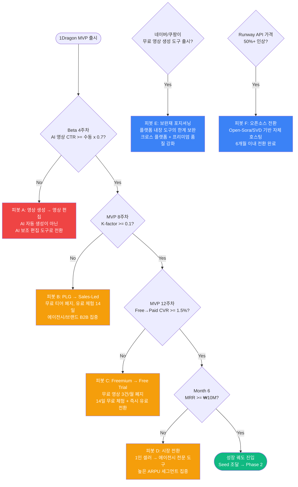

# 통합 합의 (Stage 3: Synthesis)

## 1. 확인된 강점

Red Team도 인정한 1Dragon의 진정한 강점:

| # | 강점 | 합의 근거 |
|---|------|----------|
| **S1** | **이커머스 네이티브 엔드투엔드 파이프라인** | 기존 AI 영상 도구가 독립형인 반면, 상품 카탈로그 → 영상 생성 → 플랫폼 배포까지의 통합 파이프라인은 실질적 차별화. Red Team도 빅테크 도구가 "자사 플랫폼 전용"이라는 한계를 인정 |
| **S2** | **크로스 플랫폼(OSMU) 가치** | Amazon Video Generator, TikTok Symphony 등 빅테크 도구가 자사 플랫폼에 종속되어 있어, 5개+ 플랫폼 동시 대응은 대체 불가능한 가치. Red Team도 이 니즈의 존재를 인정 |
| **S3** | **한국 이커머스 생태계(네이버/쿠팡)의 특수성** | 글로벌 경쟁사가 네이버 클립, 쿠팡 숏츠 규격에 대응하지 않는 것은 사실. 이 특수 시장에서 선점 기회는 실존함 |
| **S4** | **기술 발전이 아군** | I2V AI 품질 향상, API 가격 하락, 오픈소스 모델 성숙이 모두 1Dragon에 유리한 방향으로 작용. 시간이 갈수록 원가는 하락하고 품질은 개선됨 |
| **S5** | **명확한 Pain Point** | 마케터 68%가 영상 제작 시간을 최대 병목으로 지적(HubSpot 2024). 상품당 2.5~7시간 → 2분 이내라는 가치 제안은 매력적 |

## 2. 확인된 약점

Blue Team도 인정한 1Dragon의 구조적 약점:

| # | 약점 | 합의 근거 | 심각도 |
|---|------|----------|--------|
| **W1** | **무료 티어의 구조적 비용 문제** | 건당 실비가 있는 서비스에서 Freemium은 "무료 사용자 = 비용"이라는 구조. Canva/Slack과 근본적으로 다름. Blue Team도 인정 | Critical |
| **W2** | **핵심 API 종속성** | 원가의 75%가 Runway + Remove.bg에 집중. 대체 불가능한 외부 의존성. Blue Team도 멀티 벤더 + 자체 호스팅 로드맵으로 완화만 가능하다고 인정 | Critical |
| **W3** | **MVP 범위 과다** | 6주에 9개 API + 하이브리드 엔진 + 폴백 + 결제까지 구축하는 것은 비현실적. Blue Team도 8주로 조정 + 범위 축소를 수용 | High |
| **W4** | **하이브리드 엔진의 한정적 해자** | 기술적 복제가 가능한 API 조합이므로, 단독으로는 방어 가능한 해자가 되기 어려움. Blue Team도 데이터+워크플로우 해자로 보완 필요 인정 | High |
| **W5** | **Starter 플랜의 역마진** | ₩9,900/월 × 30건 구조에서 사용량이 높을수록 적자. Blue Team도 가격 인상 또는 쿼터 축소 검토 수용 | High |
| **W6** | **GTM 콘텐츠 볼륨 vs 팀 규모 불일치** | 마케팅 담당 1~2명으로 계획된 콘텐츠 볼륨 달성 불가. Blue Team도 채널 집중 전략으로 수용 | Medium |

## 3. 미해결 논쟁

Red Team과 Blue Team이 합의에 도달하지 못한 쟁점:

| # | 논쟁 | Red Team 주장 | Blue Team 주장 | 추가 검증 필요 |
|---|------|-------------|--------------|--------------|
| **D1** | **PLG가 이 시장에서 작동하는가?** | 건당 실비 구조에서 PLG는 구조적으로 불리. CAC 절감 효과가 무료 티어 비용을 상쇄하지 못할 것 | 무료 티어를 극한 설계(2건, 10초, Hailuo)로 비용 억제 가능. 워터마크 바이럴의 CAC 절감 효과가 핵심 | **MVP 12주차에 PLG 단위 경제학(무료 사용자 1명의 비용 vs 바이럴 유입 1명의 가치) 측정 필요** |
| **D2** | **네이버/쿠팡의 자체 도구 출시 가능성** | 네이버(AI 450억 투자), 쿠팡(350억 투자)이 자체 영상 생성을 내장할 가능성 높음 | 플랫폼사의 자체 도구는 기본 기능에 그치며, 크로스 플랫폼은 제공하지 않을 것 | **네이버/쿠팡의 AI 로드맵을 파트너십 논의를 통해 사전 파악 필요** |
| **D3** | **Year 3 ARR ₩79.8억의 달성 가능성** | 한국 시장만으로는 달성 어렵고, 글로벌 확장이 필수인데 글로벌에서는 Creatify 등과 정면 경쟁 | 글로벌 확장은 Year 2 말부터 시작하며, K-뷰티 크로스보더 셀러→일본/동남아 순차 확장 가능 | **Year 1 한국 시장 실적 기반으로 Year 2~3 계획 재수립 필요** |
| **D4** | **Activation Rate 30~40%의 현실성** | SaaS 평균 20~25%. 사진 미보유, 생성 대기 이탈 등 고려하면 25% 이하 | 샘플 이미지 제공, 인게이지먼트 UI, Best-foot-forward 전략으로 30% 달성 가능 | **Beta 4주차 Activation Rate 실측 후 판단** |
| **D5** | **Seed ₩10억 조달 가능성** | 한국 시장만 타겟, AI 영상 분야 해외 대규모 펀딩 존재 상황에서 VC 투자 매력 부족 | PMF 시그널(전환율 5%+, NPS 40+)과 한국 시장 선점이 차별화. K-뷰티 글로벌 스토리도 가능 | **Pre-Seed 단계에서 Seed VC 사전 관계 구축 병행 필요** |

## 4. 전략 수정 권고 (Action Items)

변증법 분석 결과, 다음 **13개 Action Item**을 권고한다.

### Critical Priority (즉시 실행)

| # | Action Item | 근거 | 담당 | 기한 |
|---|------------|------|------|------|
| **A1** | **무료 티어 재설계**: 월 2건, 10초, 720p, Hailuo 전용으로 변경. 건당 원가를 ₩364 이하로 억제 | W1(무료 티어 구조적 비용) + 공격 5-1(PLG 역마진) | PM | MVP 출시 전 |
| **A2** | **MVP 범위 축소 & 일정 조정**: 멀티 모델 폴백 제거(Runway 단일 + Hailuo 1차 폴백), 에지 케이스 최소화, 개발 기간 8주로 조정 | W3(MVP 범위 과다) + 공격 4-1(6주 비현실적) | CTO | 즉시 |
| **A3** | **Starter 가격/쿼터 조정**: ₩14,900/월 + 20건 또는 ₩9,900/월 + 15건으로 변경하여 단위 경제학 개선 | W5(Starter 역마진) + 공격 6-2 | PM/CEO | MVP 출시 전 |
| **A4** | **API 벤더 다중화 계약**: Runway + Hailuo 동시 계약, 볼륨 디스카운트 사전 협상 | W2(API 종속) + 공격 3-1 | CTO | Month 1~2 |

### High Priority (Month 1~3)

| # | Action Item | 근거 | 담당 | 기한 |
|---|------------|------|------|------|
| **A5** | **PLG 단위 경제학 측정 프레임워크 구축**: 무료 사용자 1명의 총 비용 vs 바이럴 유입 1명의 LTV를 추적하는 대시보드 | D1(PLG 작동 여부 논쟁) | PM/Data | MVP 8주차 |
| **A6** | **GTM 채널 집중**: 블로그(네이버), TikTok 쇼케이스, 셀러 커뮤니티 3개로 압축. YouTube/Instagram은 Phase 2로 이동 | W6(콘텐츠 볼륨 vs 팀 불일치) | 마케팅 | 즉시 |
| **A7** | **네이버/쿠팡 파트너십 선제 접촉**: 자체 도구 개발 계획 유무 파악 + API 파트너 지원 | D2(플랫폼 자체 도구 가능성) | CEO | Month 1~2 |
| **A8** | **SOM 보수적 기준 채택**: 기본 계획을 "유료 고객 2,500명, 연 매출 ₩4.5억"으로 하향. 낙관적 시나리오는 참고용으로만 사용 | 공격 1-2(SOM 비현실성) | CEO/CFO | 즉시 |
| **A9** | **Activation 목표 하향**: 40% → 30%로 조정. 샘플 이미지 제공으로 "사진 없는 사용자" 문제 해결 | D4(Activation 현실성) | PM | MVP 출시 전 |

### Medium Priority (Month 3~6)

| # | Action Item | 근거 | 담당 | 기한 |
|---|------------|------|------|------|
| **A10** | **자체 호스팅 기술 검증(POC)**: Open-Sora 2.0 또는 SVD를 GPU 1대에서 테스트, 품질/속도/비용 비교 | 공격 3-5(자체 호스팅 부담) + W2(API 종속) | CTO | Month 4~6 |
| **A11** | **하이브리드 엔진 특허 출원**: 방법 발명(배경 AI 생성 + 원본 합성 + QC 파이프라인) | W4(하이브리드 엔진 한정적 해자) | CEO/법무 | Month 3 |
| **A12** | **SAM 재검증**: 실제 사용자 데이터 기반으로 "이커머스 영상 도구 도입 의향율"을 재산정 | 공격 1-1(TAM/SAM 근거 허약) | PM/Data | Month 3(Beta 종료 후) |
| **A13** | **Seed 투자자 사전 관계 구축**: Pre-Seed 단계부터 Seed 후보 VC 5곳과 분기별 업데이트 공유 | D5(Seed 조달 난이도) | CEO | Month 1~ |

## 5. 피봇 시나리오 맵

**피봇 시나리오 상세:**

| 피봇 | 트리거 | 방향 | 영향도 |
|------|--------|------|--------|
| **A: 편집 도구 전환** | AI 영상 CTR이 수동의 50% 미만 | AI "자동 생성"이 아닌 AI "보조 편집"으로 재포지셔닝. CapCut 대안으로 | 전면 피봇 |
| **B: Sales-Led 전환** | K-factor < 0.1 (PLG 실패) | 무료 티어 폐지, B2B 세일즈 조직 구축. 에이전시 5곳 파일럿부터 시작 | 비즈니스 모델 피봇 |
| **C: Free Trial 전환** | 유료 전환율 < 1.5% | Freemium → 14일 무료 체험 모델. 무료 비용 제거로 단위 경제학 개선 | 가격 모델 피봇 |
| **D: 시장 전환** | MRR ₩10M 미달 (Month 6) | 1인 셀러 대중 시장 → 에이전시/브랜드 프리미엄 시장. ARPU 10x 전략 | 타겟 시장 피봇 |
| **E: 보완재 전환** | 네이버/쿠팡 무료 도구 출시 | 플랫폼 도구와 경쟁이 아닌 보완. 크로스 플랫폼 + 프리미엄 품질로 상위 시장 | 포지셔닝 조정 |
| **F: 오픈소스 전환** | Runway API 50%+ 인상 | Open-Sora/SVD 자체 호스팅. GPU 클러스터 구축 (6개월 프로젝트) | 기술 스택 피봇 |

[← Back to Hub](hub.md)
