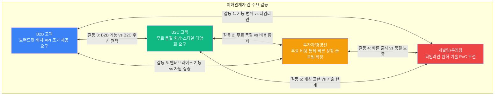

# 그룹 간 갈등 매트릭스 (Conflict Matrix)

## 갈등 구조 개요

## 갈등 상세 매트릭스

| # | 갈등 | 그룹 A | 그룹 B | 핵심 이슈 | 심각도 |
|:-:|------|--------|--------|----------|:------:|
| 1 | **기능 범위 vs 타임라인** | B2B (브랜드킷/배치/API 조기 제공) | 개발팀 (6주 MVP에 추가 불가) | B2B가 원하는 기능을 MVP에 넣으면 6주 -> 12주+로 지연. 넣지 않으면 B2B 세그먼트 사실상 포기 | 높음 |
| 2 | **무료 품질 vs 비용 통제** | B2C (무료도 30초/멀티플랫폼) | 투자자 (무료 비용 최소화) | 무료 영상 품질을 높이면 바이럴 효과 증가하지만 건당 비용 ₩728~₩1,210 부담. 낮추면 Activation 실패 리스크 | 매우 높음 |
| 3 | **B2B 기능 vs B2C 우선** | B2B (브랜드/배치/팀 기능 우선) | B2C (극단적 단순함 유지) | B2B 기능을 추가하면 UI 복잡도 증가 -> B2C의 "사진 1장, 버튼 1번" 단순함 훼손 위험 | 중간 |
| 4 | **빠른 출시 vs 품질 보증** | 투자자 (4~6주 빠른 출시) | 개발팀 (8주 + 품질 보증) | 투자자는 빠른 시장 검증, 개발팀은 하이브리드 엔진 PoC + 충분한 QA 필요. 2주 차이가 PMF 증명 시기에 영향 | 높음 |
| 5 | **엔터프라이즈 vs 자원 집중** | B2B (SSO/RBAC/승인 워크플로우 빨리) | 투자자 (Year 1은 B2C PLG 집중) | 엔터프라이즈 기능 개발에 자원 투입하면 PLG 성장 속도가 느려짐. 하지만 B2B ARPU가 10~100배 높아 매출 기여 큼 | 중간 |
| 6 | **개성 표현 vs 기술 한계** | B2C (스타일 다양성, 커스터마이징) | 개발팀 (MVP 5개 스타일이 현실적 한계) | 인플루언서/크리에이터의 "개성 유지" 니즈를 충족하려면 스타일 수 확대 + 커스터마이징 옵션이 필요하나, 각 스타일마다 프롬프트 엔지니어링 + QA 필요 | 중간 |

[← Back to Hub](hub.md)
