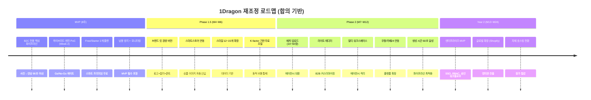

# 갈등 해소 및 최종 합의안 (Resolutions & Consensus)

## 1. 갈등 해소 협상안

### 갈등 1 해소: 기능 범위 vs 타임라인
**협상안: "Phase 1.5" 도입으로 B2B 최소 기능 조기 전달**
- **MVP (6~8주)**: B2C 전용, 브랜드킷/배치/API 미포함
- **Phase 1.5 (M4~M6)**: B2B 최소 기능 (브랜드 킷 경량, 스마트스토어 연동, 배치 경량)
- **개발팀 대응**: MVP 타임라인 8주로 완화, Phase 1.5 별도 스프린트 구성

### 갈등 2 해소: 무료 품질 vs 비용 통제
**협상안: "스마트 프리미엄" - 무료 1건은 최고 품질, 나머지 2건은 경량**
- **무료 3건**: 1건 Runway(30초, 멀티플랫폼) + 2건 Hailuo(15초, 단일)
- **비용 통제**: K-factor 기반 동적 쿼터 조절 (K<0.2 시 2건으로 축소)
- **남용 방지**: 이메일 인증, IP Rate Limit 필수 적용

### 갈등 3 해소: B2B 기능 vs B2C 우선
**협상안: Progressive Disclosure 철저 적용**
- **기본 UI**: B2C 전용 단순 화면 유지
- **Pro 이상**: 설정 메뉴 내 B2B 기능 점진적 노출
- **기술**: Feature Flag 기반 UI 복잡도 제어

### 갈등 4 해소: 빠른 출시 vs 품질 보증
**협상안: "6주 출시 + 2주 품질 게이트" = 8주 총 기간**
- **Week 2 게이트**: 하이브리드 엔진 PoC 품질 판정
- **Week 8 게이트**: NPS 40+, Activation Rate 35%+ 달성 여부

### 갈등 5 해소: 엔터프라이즈 vs 자원 집중
**협상안: "Bottom-Up Enterprise"**
- **Year 1**: B2C/중소 브랜드 집중, 엔터프라이즈 기능 개발 보류
- **접근법**: 담당자 개인 사용 유도 -> 팀 단위 도입 (Bottom-Up)
- **Year 2**: 엔터프라이즈 MVP 개발 시작

### 갈등 6 해소: 개성 표현 vs 기술 한계
**협상안: "커뮤니티 스타일 확장" + AI 프롬프트 커스터마이징**
- **MVP**: 5개 기본 스타일 제공
- **Phase 1.5**: 데이터 기반 인기 스타일 12~15개로 확장
- **Phase 2**: "내 스타일 저장" 기능 제공

## 2. 최종 합의안 (Consensus Points)

4개 그룹 모두가 동의하는 10가지 합의점:

| # | 합의 사항 | B2B | B2C | 투자자 | 개발팀 |
|:-:|----------|:---:|:---:|:------:|:------:|
| 1 | **MVP는 B2C 1인 셀러에 집중한다** | 수용 | 지지 | 지지 | 지지 |
| 2 | **MVP 타임라인은 8주(개발 6주 + QA 2주)** | 수용 | 수용 | 수용 | 지지 |
| 3 | **하이브리드 엔진은 Week 2 PoC로 검증한다** | 지지 | 수용 | 지지 | 지지 |
| 4 | **무료 플랜은 "스마트 프리미엄" 방식 적용** | 수용 | 지지 | 지지 | 수용 |
| 5 | **생성 시간 목표는 MVP 90초, Phase 2에서 60초** | 수용 | 수용 | 수용 | 지지 |
| 6 | **Phase 1.5(M4~M6)에서 브랜드 킷 경량 + 스마트스토어 연동** | 지지 | 지지 | 수용 | 수용 |
| 7 | **남용 방지 + 모니터링 시스템을 MVP 필수에 포함** | 수용 | 수용 | 지지 | 지지 |
| 8 | **K-factor를 PLG 핵심 지표로 주간 추적** | 수용 | 수용 | 지지 | 수용 |
| 9 | **엔터프라이즈 기능은 Year 2로 유예, Bottom-Up 접근** | 수용 | - | 지지 | 지지 |
| 10 | **글로벌 확장 계획을 Year 1 후반에 구체화** | 수용 | 지지 | 지지 | 수용 |

## 3. 합의안 요약 다이어그램

[← Back to Hub](hub.md)
